# 内存模型

## JVM内存模型介绍一下

运行时数据区负责管理jvm使用到的内存，比如创建对象和销毁对象。

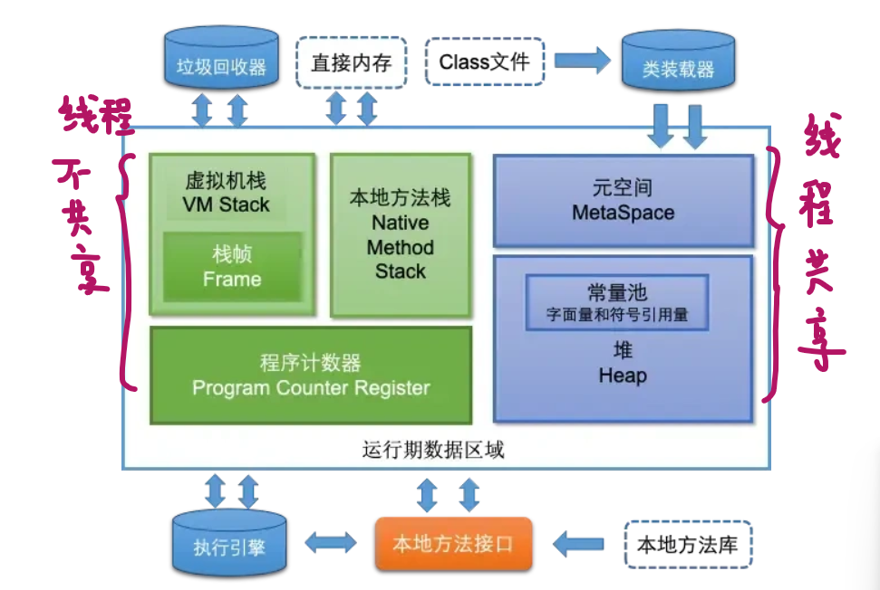

- 程序计数器（PC寄存器）：对于单线程环境，保存下一条需要执行的指令的内存地址。对于进程来说，用于保存上下文信息，方便切换。因为程序计数器在每个线程只存储一个固定长度的内存地址，所以程序计数器并不会溢出。

- java虚拟机栈：随着线程的创建而创建，随着线程的销毁而回收，所以每个线程都有一个自己的虚拟机栈。虚拟机栈由一个个栈帧组成，栈帧由局部变量表、操作数栈、帧数据组成。

  - 局部变量表存放方法执行的所有局部变量，静态方法没有this，实例方法的局部变量表里存着this。
  - 操作数栈：在执行指令过程中存放中间数据的一部分区域
  - 帧数据：动态链接、方法出口、异常表

  虚拟机栈超过栈内存分配的最大大小就会出现内存溢出，出现StackOverflowError的错误。大多数默认1MB的虚拟机栈内存大小。一般如果方法正常递归也就几百，可以通过`-Xss256k`来节省内存。

- 本地方法栈：存储native本地方法的栈帧。

- 堆：创建出来的对象都在堆上，成员变量存放在堆中，局部变量在虚拟机栈中局部变量表中。JDK8前，静态变量放在方法区，JDK8之后，静态变量也在堆中。

  - 堆内存分为三类，max，uesd，total，默认max是系统内存1/4，total默认是系统内存的1/64，用`-Xmx`设置最大值，用`-Xms`设置原始值，如果原始值和最大值一样的话，这样就减少了申请或者收缩的情况。

- 方法区：方法区存放着类的元信息、运行时常量池、字符串常量池

  - 元信息是类的基本信息（结构信息、访问标识符、父类及接口），在类的加载阶段完成
  - 运行时常量池是在解析阶段将常量池中的符号引用替换为直接引用。
  - 字符串常量池存放着常量字符串内容。在**JDK8之后字符串常量池移到堆中**。

  JDK7之前方法区是在堆区域之中的永久代里，堆的到校由虚拟机参数来控制，而JDK8后方法区在元空间中，元空间位于操作系统的直接内存中。**元空间的大小一定要设置**，`-XX:MaxMetaspaceSize`设置元空间大小，设置256M接口。

- 直接内存

## JVM中的堆和栈有什么区别

- 用途：虚拟机栈保存着局部变量表、操作数栈、帧数据（动态链接、方法出口、异常表）；堆负责保存创建出来的对象及字符串常量池。
- 声明周期：栈随着线程的创建而创建，线程的销毁而回收；堆则一直存在。
- 存储空间：栈空间一般只有1MB左右；堆空间最大默认为系统内存的1/4
- 是否共享：栈空间属于线程独有；堆空间线程共享。

##  栈中存的到底是指针还是对象？

所有实例化的对象都在堆中存储，栈只是保存着其引用。

## 在分代GC中堆的存储结构

在JDK8版本后，使用分代GC回收堆的内存对象，也同时对堆的存储结构进行了细分。

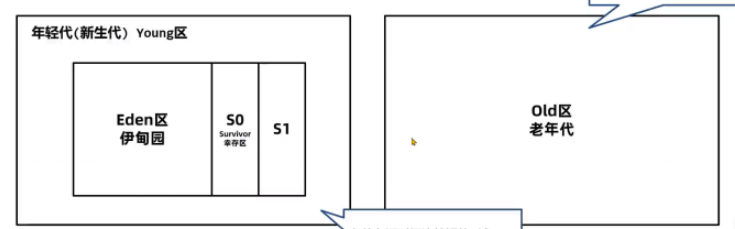

将堆分为新生代和老年代。默认容量比例为1：2。

新生代又细分为伊甸园区、幸存区S0和幸存区S1。默认容量比例为8：1：1。

在JDK9后，老年代又细分出一个Humongous区，用于存放一些大对象。

## StringTable字符串常量池案例

- 案例一：new出来的和直接常量

  ```java
  String s1=new String("abc");
  String s2="abc";
  System.out.println(s1==s2);//false
  ```

  s1因为是被new出来的，所以s1保存在堆中，s2是指向字符串常量池的。

- 案例二：隐式new和直接常量

  ```java
  String a="1";
  String b="2";
  String c="12";
  String d=a+b;
  System.out.println(c==d);//false
  ```

  这里为什么会出现隐式new呢？我们查看字节码文件

  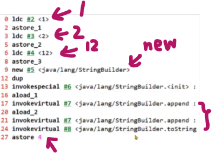

  `String d=a+b;`相当于new出来一个StringBuilder，然后分别把a和b指向的字符串常量`append`进去了。所以c和d是不一样的。

- 案例三：隐式常量相加

  ```java
  String a="1";
  String b="2";
  String c="12";
  String d="1"+"2";
  System.out.println(c==d);//true
  ```

  这里怎么又一样了？我们还是看字节码

  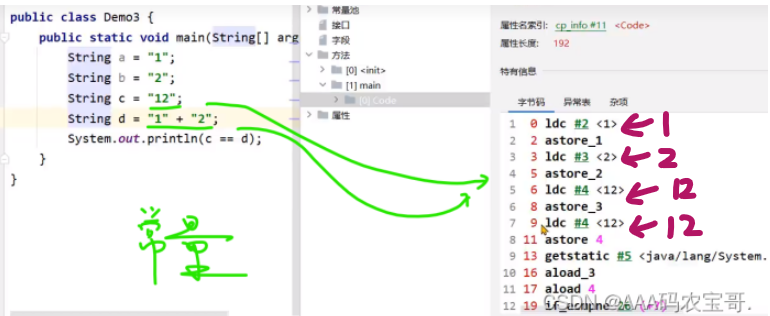

  取的都是字符串常量，常量字符串相加使用的是常量，而常量字符串的引用的相加是创建StringBuilder对象

## 引用类型

- 强引用：通常为GCRoot对象对普通对象有引用关系，也就是指new这种方式，只要不主动设置为null，都不会被回收。

- 软引用：软引用是一种比较弱的引用关系，如果一个对象只有软引用关联到它，当内存不足时，会回收软引用中的数据。

  - 软引用使用：将对象使用软引用包装起来，`new SoftReference<对象类型>(对象)`

    ```java
    public class SoftReferenceDemo2 {
        public static void main(String[] args) throws IOException {
            byte[] bytes = new byte[1024 * 1024 * 100];
            SoftReference<byte[]> softReference = new SoftReference<byte[]>(bytes);
            bytes = null;
            System.out.println(softReference.get());
            byte[] bytes2 = new byte[1024 * 1024 * 100];
            System.out.println(softReference.get());
    //      byte[] bytes3 = new byte[1024 * 1024 * 100];
    //      softReference = null;
            System.gc();
            System.in.read();
        }
    }
    ```

    ```
    [B@7ba4f24f
    null
    ```

    设置最大堆内存-`Xmx200m`，启动，总共200M实际能用不到200M，自然第一个放进去第二个放不进去，然后软引用就被释放回收了，打印null

    设置最大堆内存`-Xmx400m`，都能放进去，并且指向同一个软引用空间

    ```
    [B@7ba4f24f
    [B@7ba4f24f
    ```

    修改回200m，添加`byte[] bytes3 = new byte[1024 * 1024 * 100];`

    已经把软引用释放了，放进bytes2之后就不能添加了，自然报`OutOfMemoryError`。

  - 软引用回收：软引用使用引用队列进行依次回收

    ```java
    public class SoftReferenceDemo3 {
        public static void main(String[] args) throws IOException {
            ArrayList<SoftReference> softReferences = new ArrayList<>();
            ReferenceQueue<byte[]> queues = new ReferenceQueue<byte[]>();
            for (int i = 0; i < 10; i++) {
                byte[] bytes = new byte[1024 * 1024 * 100];
                SoftReference studentRef = new SoftReference<byte[]>(bytes,queues);
                softReferences.add(studentRef);
            }
            SoftReference<byte[]> ref = null;
            int count = 0;
            while ((ref = (SoftReference<byte[]>) queues.poll()) != null) {
                count++;
            }
            System.out.println(count);
        }
    }
    
    ```

    设置堆内存`200M`，只够存一个，后一个盒子把前一个盒子覆盖了，并且把前一个盒子放进queue中。所以最后一个存在，没有被回收，因此输出9

  - 软引用使用场景：缓存。例如缓存的对象是 `Student` 类的实例。通过使用软引用，缓存中的学生对象会在内存不足时被自动回收，从而避免内存溢出。每个缓存的 `Student` 对象被包装在 `StudentRef` 软引用中，并存储在一个 `HashMap` 中，软引用的回收会通过 `ReferenceQueue` 进行追踪。当垃圾回收发生时，回收的软引用会被放入队列，程序定期检查这些软引用并清理掉缓存中已被回收的对象，保证缓存中的数据始终是有效的。

- 弱引用：弱引用与软引用的整体机制与软引用类似，只不过内存够不够弱引用都会被回收。主要在ThreadLocal中使用。

- 虚引用：当对象被垃圾回收器回收的适合可以接收到对应的通知。

## 内存溢出与内存泄漏

- 内存泄漏是一个不再使用的对象仍然在GCRoot的引用链上，无法被垃圾回收器回收。绝大多数是由堆内存泄漏引起的。

- 内存泄漏原因：

  - 代码中：

    - **非正确的hashCode()和equals()方法编写**：导致多个相同id的对象保存多份。

      **解决方法：**

      1、在实体类中始终重写hashCode()和equals()方法。并使用唯一标识符区分id

      2、hashmap尽量使用id等数据作为key，避免使用实体对象。

      3、使用lombok注解@Data标注实体类。

    - **非静态的内部类引用外部类**：非静态的内部类或匿名内部类都会持有是由哪个外部类对象创建出来的，即使外部类不再被使用，这些非静态的内部类或匿名内部类也不会被垃圾回收器回收。

      **解决办法**：使用静态内部类或静态方法。

    - **线程池对ThreadLocal的使用**：使用线程池未使用remove对ThreadLocal清理对象，导致无法被回收。

      **解决办法**：单线程无需关心ThreadLocal，一旦使用线程池，应当使用remove对ThreadLocal中的对象进行手动删除。

    - **String的intern方法**：大量随机字符串被放入堆中

      **解决办法**：注意逻辑或增加堆空间

    - **静态变量的使用**：大量的数据在静态变量中被长期引用，长期不使用的话导致内存泄漏。

      **解决办法**：

      1、尽量减少对象长时间保存在静态变量中，如果不再使用将对象或静态变量设为null。

      2、使用单例模式时，使用懒汉模式而不是而饿汉模式。

      3、Spring中尽量不要长期存放大对象，缓存要设置过期时间定期失效。

    - **资源未正常关闭：**连接和流未关闭会占用资源。

      **解决办法**：使用finally块关闭资源。

  - 并发请求中：

    - 正常情况下，java会将一部分数据释放掉，但需要一些时间释放资源，但是如果用户请求并发量很大的的话，处理时间很长，就会一直存在于内存中，最终导致内存溢出，可能的原因为上述的任何一种都有可能。

# 类初始化及类加载

## 类的生命周期（类加载的过程）

类的生命周期分为加载、连接、初始化、使用、卸载

- 加载：
  - 类加载器根据类的全限定名通过不同的渠道以二进制流的方式获取字节码信息
  - 类加载器在加载完类后会将字节码信息放到方法区中，同时在堆中生成一份与方法区的数据类似的java.lang.Class的对象，包含静态字段的数据及方法。
- 连接：
  - 验证：验证内容是否满足jvm规范
  - 准备：给静态变量赋初值
  - 解析：将常量池中的符号引用（cp_info#1）替换成指向内存的直接引用（内存地址）
- 初始化：
  - 初始化阶段会执行静态代码中的代码，并为静态变量赋值
  - 初始化阶段会执行字节码文件中的clinit部分的字节码指令。
- 使用
- 卸载：垃圾回收器进行回收

## 类加载器有那些

类加载器是jvm提供给应用程序去实现获取类和接口字节码数据的技术。负责在类加载过程中的字节码获取并且加载到内存这一部分。通过加载字节码数据放入内存转换成byte[]，接下来调用虚拟机底层的方法将byte[]转换成方法区和堆中的数据。

- JDK8之前的分类

  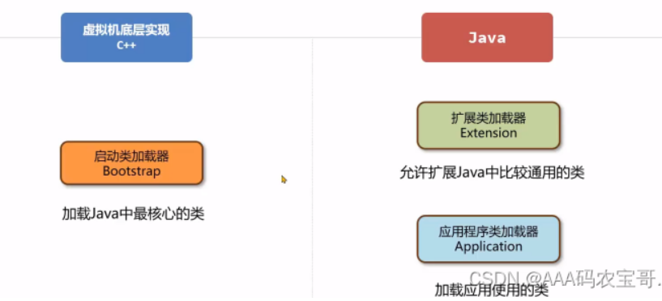

  - 引导类加载器 Bootstrap，加载属于JVM的一部分，由C++代码实现，负责加载`<JAVA_HOME\>\jre\lib`路径下的核心类库
  - 扩展类加载器 ExtClassLoader，扩展类加载器负责加载`<JAVA_HOME>\jre\lib\ext`目录下的类库。
  - 应用程序类加载器 AppClassLoader，应用程序类加载器负责加载 `classpath`环境变量所指定的类库，是用户自定义类的默认类加载器。既可以加载当前项目中创建的类，也可以加载maven依赖中包含的类。

## 类加载器的双亲委派机制

jvm中有多个类加载器，双亲委派机制的核心就是解决一个类到底由谁加载的问题。

- 双亲委派机制的作用：

  - 保证类加载的安全性：通过双亲委派机制避免恶意代码替换JDK的核心类库，比如Java.lang.String，确保核心类库的完整及安全性。
  - 避免重复加载，自下而上查找是否加载过，自上而下尝试加载，避免同一个类被重复加载。

  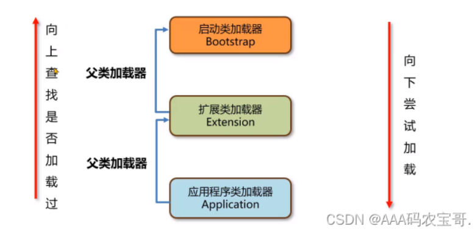

## 打破双亲委派机制

### 为什么？

因为如果一个应用程序要服务多个应用，那么在这些应用里可能出现相同限定名的类，但是又要加载成不同的类，比如tomcat要服务web应用中的Servlet类，那么就要打破双亲委派机制。

### 怎么做？

- 设置自定义类加载器，修改ClassLoader的loadClass方法或findClass方法

  ```java
  @Override
  public Class<?> loadClass(String name) throws ClassNotFoundException {
      if(name.startsWith("java.")){
          return super.loadClass(name);
      }
      byte[] data = loadClassData(name);
      return defineClass(name, data, 0, data.length);
  }
  
  public static void main(String[] args) throws ClassNotFoundException, InstantiationException, IllegalAccessException, IOException {
      BreakClassLoader1 classLoader1 = new BreakClassLoader1();
      classLoader1.setBasePath("D:\\lib\\");
      Class<?> clazz1 = classLoader1.loadClass("com.itheima.my.A");
      BreakClassLoader1 classLoader2 = new BreakClassLoader1();
      classLoader2.setBasePath("D:\\lib\\");
      Class<?> clazz2 = classLoader2.loadClass("com.itheima.my.A");
      System.out.println(clazz1 == clazz2);
      Thread.currentThread().setContextClassLoader(classLoader1);
      System.out.println(Thread.currentThread().getContextClassLoader());
      System.in.read();
   }
  ```

  重写loadClass方法，删除双亲委派机制，如果是java开头的jar包，就交给原先父类的loadClass，如果是自定义的，就自己直接加载。

  自定义类加载器没指定双亲的话，默认双亲为应用程序类加载器

- 线程上下文类加载器

  JDBC使用DriverManager来管理数据库驱动，DriverManager类位于rt.jar包中，由启动类加载器加载。但我们引入的maven依赖中的jar包中的驱动应由应用类加载器加载，这俩明显违反双亲委派机制。

  - SPI机制，全程Service Provider Interface，是JDK内置的一种服务提供发现的机制

    需要在resources目录下新建META-INF/services目录，并且在这个目录下新建一个与上述接口的全限定名一致的文件java.sql.Driver的接口，在这个文件中写入接口的实现类的全限定名com.mysql.cj.jdbc.Driver。

  - 工作原理：

    - 在ClassPath的路径下的META-INF/services文件夹中以接口的全限定名来命名文件名，对应文件里面写该接口的实现。

    - 使用ServiceLoadder加载实现类

      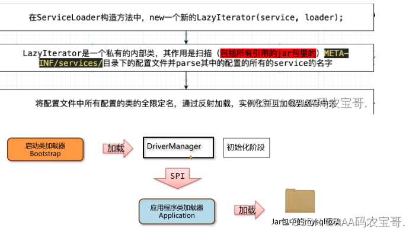

    - SPI中的ServiceLoadder中使用线程上下文类加载器进行加载，而这个类加载器一般是应用程序类。

      ```java
      public static <S> ServiceLoader<S> load(Class<S> service){
      	ClassLoader c1=Thread.currentThread().getContextClassLoader();
      	return ServiceLoader.load(service,c1);
      }
      ```

      

# 垃圾回收

## 什么是垃圾回收

Java为了简化对象释放及回收，引入自动垃圾回收机制（Garbage Collection GC）。通过垃圾回收器来对不再使用的对象进行自动回收，垃圾回收器主要负责对堆上的内存进行回收。

## 什么时候触发GC

- 内存不足：堆内存不足触发GC
- 手动触发：使用`System.gc()`，在不同的JVM表现出不同的情况，早期版本立刻触发Full GC，高阶JVM可能会触发Mixed GC或者Full GC，现在`System.gc()`只是建议JVM进行垃圾回收，并不能保证立刻进行。
- 元空间拓展：`-XX:MetaspaceSize`设置元空间初始阈值，到达这个值会触发FullGC，初始20M，后续JVM会自行计算阈值。`-XX:MaxMetaspaceSize`最大元空间值默认256M。
- JVM参数：`-Xms`设置初始堆大小，`-Xmx`设置最大堆内存，`-Xss`设置虚拟机栈大小，默认1M。到达这些阈值都会触发GC

## 判断垃圾回收的方法

- 引用计数法：C++使用引用计数法为每个对象维护一个引用计数器，当对象被引用时加1，取消引用减1。

  **缺点：**

  - 每次引用和取消都要维护计数器，对性能有影响
  - 存在循环引用问题。

- 可达性分析法：Java使用可达性分析法来判断对象是否可以被回收。可达性分析法将对象分为两类：垃圾回收的根对象（GC Root）和普通对象，GC Root不可被回收。

  GC Root对象：

  - 线程Thread对象
  - 系统类加载器（默认应用程序类加载器）所加载的java.lang.Class对象
  - 监视器对象，用来保存同步锁synchronized关键字持有的对象
  - 本地方法调用时使用的全局对象

## 垃圾回收算法的标准

因为垃圾回收通常是由一个单独的GC线程来完成的，所以无论那种GC算法，都会有部分阶段需要停止所有的用户线程。这个过程称之为Stop The Word，简称STW，如果STW时间过长则会影响用户的使用。

标准为：

- 最大吞吐量
- 最大暂停时间STW
- 堆使用效率

## 垃圾回收算法有哪些

- 标记清除算法：
  - 核心思想：
    - 标记阶段：使用可达性分析从GC Root开始通过引用链遍历出所有存活的对象。
    - 清除阶段：从内存中删除没有被标记的所有对象。
  - 优缺点：
    - 优点：实现简单，在一阶段维护一个标志位，二阶段删除即可
    - 缺点：会有大量外部碎片，因为要扫描空闲链表，所以分配速度也慢
- 复制算法：
  - 核心思想：将堆内存分为两块，from和to空间，GC开始阶段将GC Root搬运到to空间，再把GC Root关联的对象搬运到to空间。然后清理from空间，并且把俩名字交换。
  - 优缺点：
    - 优点：吞吐量高，只需要把活得复制到to空间即可；不会有碎片化问题相当于按顺序整理了一遍
    - 缺点：每次只能使用一半的空间来创建对象使用。
- 标记整理算法：
  - 核心思想：相当于对标记清除算法的一种优化
    - 标记阶段：同标记清除一阶段
    - 整理阶段：将存活对象移动到堆的另一端，清理掉存活对象的内存空间
  - 优缺点：
    - 优点：内存使用率高，没有碎片化问题
    - 缺点：整理阶段的性能不高。
- 分代GC。这个我们单独挑出来着重说。

### 分代垃圾回收算法

- 最初创建出来的对象默认会放在伊甸园区，如果伊甸园区放满，则会触发在新生代的GC回收，成为Minor GC。Minor GC会将伊甸园区和幸存区S0的对象进行回收，没回收的对象会放入幸存区S1。
- 接下来，幸存区S0和幸存区S1会交换名字，S0变为To区，也就是说，下一次触发Minor GC会回收的是伊甸园区和幸存区S1。每次Minor GC都会为对象记录他的年龄，初始为0，发生一次Minor GC年龄加1。
- 如果年龄超过最大阈值（一般为15），那么该对象就会送到老年代中。
- 如果老年代空间也不足，无法放入新的对象时，先尝试新一轮的Minor GC，如果还是不足，则会触发Full GC，Full GC会对整个堆进行垃圾回收，如果依然被不足，则会抛出`Out Of Memory`的异常。

### 为什么分代GC要把堆分成年轻代和老年代

系统中大部分对象都是创建出来后很快就可以释放的，比如获取到订单信息返回给用户就可以把订单信息回收了。老年代中存放长期存活的对象，比如Spring的大部分Bean对象，启动之后就不会回收了。新生代和老年代的默认比为1：2。

- 可以调整新生代老年代的比例来适应不同的应用程序，提高内存使用率及性能。
- 新生代和老年代可以使用不同的垃圾回收算法，新生代一般是复制算法，老年代可以选择标记清除或标记整理算法，灵活度高。
- 分代设计可以只回收新生代也就是触发Minor GC，减少对整个堆的Full GC次数，减少STW时间。

## 垃圾回收器有哪些

垃圾回收器是垃圾回收算法的具体实现。由于垃圾回收器分为年轻代和老年代，除了G1外的其他垃圾回收器必须成对组合进行使用。

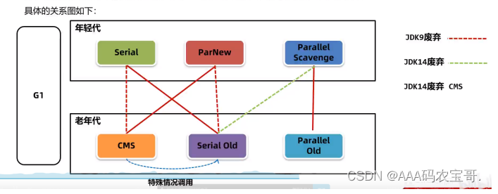

- Serial---Serial Old：

  - 新生代：Serial采用复制算法。

  - 老年代：Serial Old采用**标记整理**算法，均是单线程串行回收。
    - 两个垃圾回收器类似优缺点也一样
    - 优点：单CPU处理下吞吐量优秀
    - 缺点：多CPU下性能差，STW时间长
  - 适用场景：客户端程序或硬件配置有限的情况。

- ParNew---CMS：

  - 新生代：ParNew是针对Serial在多CPU下的优化版本，依旧采用复制算法，使用多线程进行垃圾回收。
    - 优点：多CPU下停顿时间短
    - 缺点：吞吐量和停顿时间不如G1，JDK9之后不建议使用

  - 老年代：CMS（Concurrent Mask Sweep）采用**标记清除**算法，可以进行并发标记，用户线程和垃圾回收线程在某些步骤可以同时执行，减少用户线程等待时间。
    - 优点：停顿时间短，用户体验好。
    - 缺点：
      - 内存碎片问题：因为采用标记清除算法，会产生大量内存碎片，CMS会在Full GC进行整理，会导致用户线程暂停
      - 浮动垃圾问题：无法处理并发清理过程的“浮动垃圾”；
      - 退化问题：如果老年代内存不足，会退化为Serial Old。
  - 使用场景：大型互联网系统中用户请求数据量大，频率高的场景，比如订单接口，商品接口。

- Parallel Scavenge---Parallel Old
  - 新生代：Parallel Scavenge采用复制算法，可以多线程并行回收，具备自动调整堆内存的能力。**JDK8默认**。
    - 优点：吞吐量高，手动可控，并且会动态调整堆参数。
    - 缺点：不能保证单次停顿时间。
  - 老年代：Parallel Old采用**标记整理**算法
    - 优点：可以并发收集，多核CPU效率高
    - 缺点：整理算法固有毛病暂停时间较长。
  - 使用场景：后台任务，不需要交互的，如大数据处理，大文件导出。
- **JDK9之后强烈要求使用的G1垃圾回收器**。我们单独跳出来说。‘

## G1垃圾回收器

JDK9之后的垃圾回收期默认是G1。

- 新生代：采用复制算法。
- 老年代：采用标记整理算法。

具有以下优点：

- 支持巨大的堆空间回收，有较高的吞吐量
- 支持多CPU并行回收
- 允许用户据设置最大暂停时间

### G1垃圾回收策略

G1之前的垃圾回收器内存结构一般都是连续的。类似于我们上一个图。但是G1垃圾回收器将整个堆分为多个大小相等的区域，成为Region，区域不要求是连续的，还是分为三类：伊甸园区、幸存者区、老年代。一般Region的个数为2048个，大小为堆内存/2048。

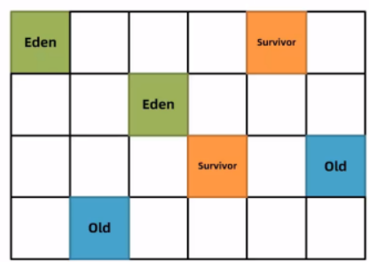

- 新创建的对象会放在伊甸园区，当G1判断年轻代不足时，默认为max的60%，则会触发Young GC，标记出伊甸园区和幸存区存活的对象，在最大暂停时间内选择这些对象放入新的幸存区并年龄加一。

- G1会在YoungGC的过程中记录每次垃圾回收时每个伊甸园区和幸存区的平均耗时，作为下次回收的参考依据，这样就能根据最大暂停时间计算出本次能回收多少个Region区域了。比如最大暂停时间200ms，平均耗时40ms，这样每次回收回收4个Region。

- 后序也是一样，未回收的对象不断地在幸存区里转移，直到年龄超过15，将被放进老年代。

- 如果要放进老年代的对象的大小超过Region的一半，会被直接放入老年代，这种直接放进老年代的叫Humongous区，比如堆内存是4G，除2048得到一个Region大小是2M，如果一个对象超过了1M就会被直接放入Humongous区，并且如果这个对象过大，允许该对象横跨多个Humongous区。

  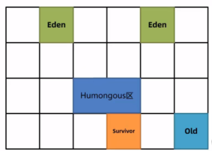

- 多次回收后，会出现很多的Old区，如果总堆的占有率超过默认45%，就会触发混合回收MixedGC，回收所有年轻代和部分老年代的对象及大对象区。G1对老年代的清理会选择存活度最低的区域来进行回收，这样可以保证回收效率最高，清理阶段使用复制算法，不会产生内存碎片。

  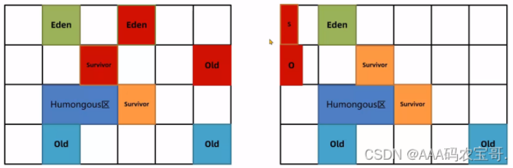

- 若清理过程中，没有足够的的空Region存放转移的对象，会发生FullGC，单线程执行标记-整理算法，会导致用户线程的暂停，所以尽量保证使用的堆内存有一定的多余空间。

## minorGC、majorGC、fullGC的区别，什么场景触发full GC

- minorGC是针对年轻代的回收，发生的非常频繁。
- majorGC是针对老年代的回收，发生的频率较低。
- fullGC是针对整个堆内存及**元空间**进行回收。
  - 触发条件：
    - 调用`System.gc()`后，JVM会尝试进行FullGC。
    - 当新生代存活对象无法放入老年代或老年代不足会进行FullGC。
    - 元空间不足也会发生FullGC。

# GC调优

## 核心流程

使用jmap及mat分析内存快照

- 监控是否出现连续的Full GC或者单次GC时间过长
- 诊断并解决：
  - 优化基础JVM参数。
    - `-Xms`设置初始堆大小，`-Xmx`设置最大堆内存，建议初始堆大小和最大堆大小一致。
    - `-Xss`设置虚拟机栈大小，默认1M，建议256K。
    - `-XX:MetaspaceSize`设置元空间初始阈值。初始20M，`-XX:MaxMetaspaceSize`最大元空间值默认256M。建议都设置256M。
  - 减少对象的产生：防止超大对象的复制等等
  - 更换垃圾回收器
  - 优化垃圾回收器参数
- 在测试环境验证问题是否解决再上线


