#  SQL基础

## NOSQL和SQL的区别？

| 特性     | SQL                        | NoSQL                              |
| -------- | -------------------------- | ---------------------------------- |
| 数据模型 | 关系型模型（表）           | 键值对、文档、列族、图等           |
| 扩展性   | 垂直扩展（不易横向扩展）   | 水平扩展（容易扩展）               |
| 一致性   | ACID（事务支持）           | 最终一致性（CAP 定理）             |
| 查询语言 | SQL（结构化查询语言）      | 根据数据库不同有不同查询方式       |
| 数据结构 | 固定模式（表结构）         | 灵活（JSON、XML、BSON等）          |
| 事务支持 | 强事务支持                 | 限制事务支持（大多数为最终一致性） |
| 使用场景 | 适合关系型数据，事务要求高 | 高并发、大数据量、非关系型数据     |

## NOSQL和SQL的代表数据库

- SQL代表数据库
  - MySQL
  - Oracle Database
  - Microsoft SQL Server
- NOSQL代表数据库
  - MongoDB：基于文档的数据库，使用 BSON 格式存储数据。非常适合存储半结构化和非结构化数据。
  - Redis：基于内存的键值存储数据库，支持高性能读写，广泛用于缓存和实时数据处理。
  - HBase：基于列族的分布式 NoSQL 数据库，运行在 Hadoop 生态系统中，适合处理海量数据。

## 数据库范式是什么

- **1NF第一范式**：关系中的每一个分量必须是不可分的数据项。

  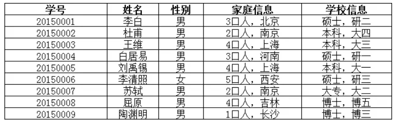

  家庭信息和学校信息可以再分为（家庭信息，户籍）和（学历，所在年级），这样才能符合1NF

  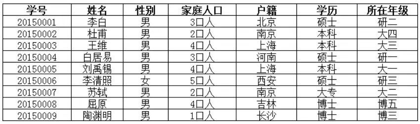

- **2NF第二范式：**在1NF的基础上，每一个非主属性完全函数依赖于任何一个候选码，也就是说第二范式是消除了非主属性对码的部分依赖。主要针对**联合主键**。

  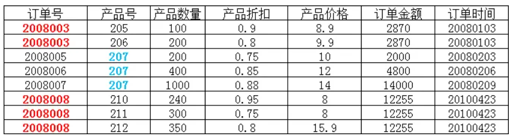

​	这里面一个订单号里可能有多个产品号，而一个产品号可能对应多个订单号，那么这俩就是联合主键。

​	产品数量、产品折扣、产品价格都与联合主键有关，而订单金额和订单时间只与订单号有关。不符合2NF范式，所以需要拆成两张表。

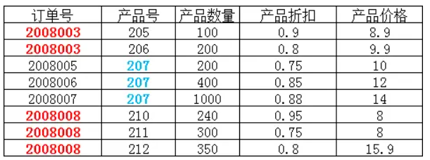

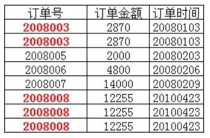

- **3NF第三范式**：每一个非主属性既不传递依赖于码，也不部分依赖于码，第三范式消除了非主属性对码的传递依赖。

  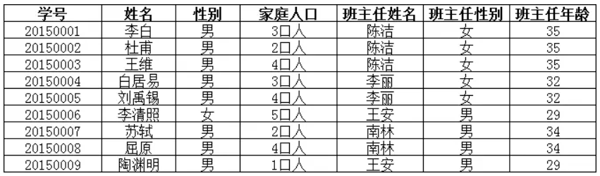

​	以上满足第二范式，明显这里面的主键也就是码是学号，但班主任性别和年龄只跟班主任姓名有关，所以为了消除这些非主属性通过班主任姓名间接对学号的传递依赖，需要拆成两张表。

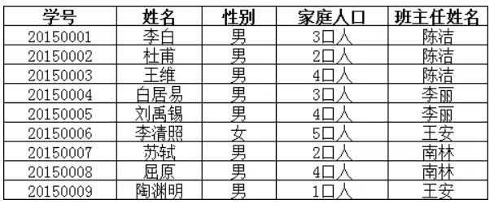

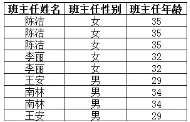

这样就消除班主任性别和年龄这些非主属性通过班主任姓名间接对学号的传递依赖，从而符合3NF。

## MySQL连表查询

- 内连接（INNER JOIN）：`INNER JOIN` 返回两个表中满足连接条件的记录。如果没有满足条件的记录，查询结果将为空。

  - 查询学生信息和他们所在班级的名称：

    ```mysql
    SELECT students.name, classes.class_name
    FROM students
    INNER JOIN classes
    ON students.class_id = classes.id;
    ```

- 左连接（LEFT JOIN）：`LEFT JOIN` 返回左表中的所有记录，即使右表中没有匹配的记录。如果右表没有匹配的记录，结果中右表的列将为 `NULL`。

  - 查询所有学生的姓名和他们所在班级的名称，如果学生没有班级，则班级名称为 `NULL`：

    ```mysql
    SELECT students.name, classes.class_name
    FROM students
    LEFT JOIN classes
    ON students.class_id = classes.id;
    ```

- 右连接（RIGHT JOIN）：`RIGHT JOIN` 返回右表中的所有记录，即使左表中没有匹配的记录。如果左表没有匹配的记录，结果中左表的列将为 `NULL`。

  - 查询所有班级的名称和属于该班级的学生姓名，如果班级没有学生，则学生姓名为 `NULL`：

    ```mysql
    SELECT students.name, classes.class_name
    FROM students
    RIGHT JOIN classes
    ON students.class_id = classes.id;
    ```

- 全连接（FULL JOIN）：MySQL 不直接支持 `FULL JOIN`，但是可以通过组合 `LEFT JOIN` 和 `RIGHT JOIN` 来实现类似的效果。`FULL JOIN` 返回两个表中所有的记录，匹配的部分返回实际数据，不匹配的部分返回 `NULL`。结合`UNION`来实现。

  - 查询所有班级和所有部门

    ```mysql
    SELECT students.name, classes.class_name
    FROM students
    LEFT JOIN classes
    ON students.class_id = classes.id;
    
    UNION
    
    SELECT students.name, classes.class_name
    FROM students
    RIGHT JOIN classes
    ON students.class_id = classes.id;
    ```

- 自连接（SELF JOIN）：自连接是表与表自身进行连接的情况，即同一个表与它自己连接。MySQL 语法要求我们使用 `INNER JOIN` 或 `LEFT JOIN` 来进行自连接。

  - 假设 `employees`（员工表）中有 `id`, `name`, `manager_id` 字段，`manager_id` 表示该员工的经理（也是员工）。查询每个员工和他们经理的名字：

    ```mysql
    SELECT e.name AS employee, m.name AS manager
    FROM employees e
    LEFT JOIN employees m
    ON e.manager_id = m.id;
    ```

## MySQL如何避免重复插入数据？

- **使用 `UNIQUE` 约束**:在表结构的相关列使用UNIQUE约束。例如：

  ```mysql
  CREATE TABLE users (
      id INT PRIMARY KEY,
      email VARCHAR(255) UNIQUE,
      username VARCHAR(255) UNIQUE
  );
  ```

- **使用 `ON DUPLICATE KEY UPDATE`**: 如果你希望在插入数据时，遇到重复主键或唯一索引时进行更新而不是插入新记录，可以使用 `ON DUPLICATE KEY UPDATE` 语法。例如：

  ```mysql
  INSERT INTO users (id, email, username)
  VALUES (1, 'user@example.com', 'username1')
  ON DUPLICATE KEY UPDATE email = VALUES(email), username = VALUES(username);
  ```

- **使用 `INSERT IGNORE`**: 使用 `INSERT IGNORE` 语句插入数据时，如果插入的记录违反了唯一约束（比如主键或唯一索引），MySQL 会忽略插入，而不会抛出错误。例如：

  ```mysql
  INSERT IGNORE INTO users (id, email, username) VALUES (1, 'user@example.com', 'username1');
  ```

## MySQL的关键字in和exist

在 MySQL 中，`IN` 和 `EXISTS` 都是用于子查询的操作符，它们的作用有些相似，但也有关键的区别。

- `IN` 子查询：`IN` 用于在查询中检查某个值是否存在于子查询返回的结果集中。它通常用于匹配某个字段的值是否在一组可能的值中。

  - 假设有两个表：`employees` 和 `departments`，我们想查询那些属于特定部门的员工。

    ```mysql
    SELECT name
    FROM employees
    WHERE department_id IN (SELECT id FROM departments WHERE name = 'Sales');
    ```

  - 适用场景：用于检查字段值是否在一组静态值或者子查询结果中。

  - 性能：当子查询结果集较大时，`IN` 可能效率较低，因为它需要加载整个子查询结果集到内存中。

- `EXISTS` 子查询：`EXISTS` 用于检查子查询是否返回至少一行结果。它是一个布尔值表达式，只有在子查询至少返回一行记录时才为 `TRUE`，否则为 `FALSE`。

  - 假设同样有 `employees` 和 `departments` 表，我们想查找那些所在的部门至少有一个员工的部门。

    ```mysql
    SELECT name
    FROM departments
    WHERE EXISTS (SELECT 1 FROM employees WHERE employees.department_id = departments.id);
    ```

  - 适用场景：用于判断子查询是否返回至少一行记录。常用于与主查询中的列关联。

  - 性能：当子查询中有 `EXISTS` 时，MySQL 通常会停止执行子查询一旦找到第一行匹配的记录，这通常会比 `IN` 更高效，特别是在子查询返回大量数据时。

## SQL查询语句的执行顺序是怎么样的？

1. `FROM` / `JOIN`：从表中获取数据。

2. `ON`（仅在 `JOIN` 时使用）

3. `WHERE`：筛选出符合条件的记录。
4. `GROUP BY`：将结果按指定列进行分组。
5. `HAVING`：在分组后的数据上进行过滤，可以使用聚合函数（例如 `COUNT(*)`）来过滤分组后的数据。
6. `SELECT`：选择需要的列，聚合函数计算的结果会出现在这里。
7. `DISTINCT`（如果有的话）：去重（如果使用）。
8. `ORDER BY`：排序。
9. `LIMIT`：限制返回的记录数。

举例：

```mysql
SELECT department, COUNT(*) AS num_employees
FROM employees
WHERE salary > 3000
GROUP BY department
HAVING num_employees > 5
ORDER BY num_employees DESC
LIMIT 10;
```

1. **`FROM employees`**：首先从 `employees` 表中获取数据。

2. **`WHERE salary > 3000`**：接着筛选出工资大于 3000 的员工。

3. **`GROUP BY department`**：然后将员工按 `department` 列进行分组。

4. **`HAVING num_employees > 5`**：接下来，筛选出每个部门员工数大于 5 的记录（`HAVING` 用于在分组后的数据中进行过滤）。

5. **`SELECT department, COUNT(\*) AS num_employees`**：然后选择部门和每个部门的员工数。

6. **`DISTINCT`**：如果使用了 `DISTINCT`，此时会去重。

7. **`ORDER BY num_employees DESC`**：接下来根据员工数降序排序。

8. **`LIMIT 10`**：最后返回前 10 条记录。

## SQL题

### 给学生表、课程成绩表，求不存在01课程但存在02课程的学生的成绩

假设我们有以下两张表：

1. `Student` 表，其中包含学生的`sid`（学生编号）和其他相关信息。
2. `Score` 表，其中包含`sid`（学生编号），`cid`（课程编号）和`score`（分数）。

```mysql
SELECT s1.sid, sc1.score
FROM Student s1
JOIN Score sc1 ON s1.sid = sc1.sid
WHERE sc1.cid = '02'
AND NOT EXISTS (
    SELECT 1
    FROM Score sc2
    WHERE sc2.sid = s1.sid
    AND sc2.cid = '01'
);
```

### 给定一个学生表 student_score（stu_id，subject_id，score），查询总分排名在5-10名的学生id及对应的总分

```mysql
SELECT RankedScores.stu_id, RankedScores.total_score
FROM (
    SELECT 
        stu_id, 
        SUM(score) AS total_score
    FROM student_score
    GROUP BY stu_id
    ORDER BY total_score DESC
    LIMIT 4, 6
) AS RankedScores;
```

## MySQL 的 NULL 值是怎么存放的？

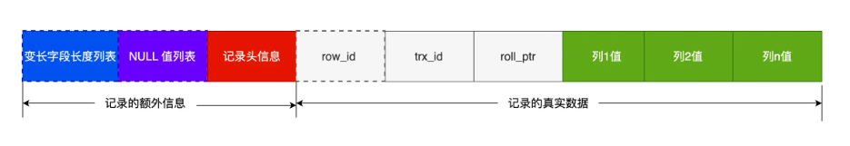

MySQL 的 Compact 行格式中会用「NULL值列表」来标记值为NULL 的列，NULL 值并不会存储在行格式中的真实数据部分。

NULL值列表会占用 1 字节空间，当表中所有字段都定义成 NOT NULL，行格式中就不会有 NULL值列表，这样可节省 1 字节的空间。

## varchar(n)中n最大取值是多少

如上图，我们的Compact行中变长字段长度列表，一行最多存储65535的字节数，但是：

- 如果变长字段最大字节数小于等于255字节，就会用1字节表示变长字段长度。
- 如果变长字段最大字节数大于255字节，就会用2字节表示变长字段长度。

所以我们要根据变长字节的字节长度来选择变长字段的长度。

- 如果数据库使用字符集ascii并且只有一个varchar(n)，那么n的最大长度应该减去[变长字段长度列表]和[NULL值列表]所占用的字节数。也就是65535-2-1=65532。
- 如果采用utf-8字符集，一个字符需要三个字节。那么n的取值就是65532/3=21844

## 行溢出后，MySQL 是怎么处理的？

mysql的表空间由段（segment）、区（extent）、页（page）、行（row）组成。InnoDB的数据页是按照页为单位来读写的。一个页的默认大小是16KB，也就是16384字节。

而如果一个varchar(n)的类型最多可以存储65532字节，那么一个页就存不了一条记录，会发生行一处，多的数据就会存到另外的溢出页中。

Compact 行格式针对行溢出的处理是这样的：当发生行溢出时，在记录的真实数据处只会保存该列的一部分数据，而把剩余的数据放在「溢出页」中，然后真实数据处用**20 字节**存储指向溢出页的地址，从而可以找到剩余数据所在的页。

# 存储引擎

## 一条SQL执行过程

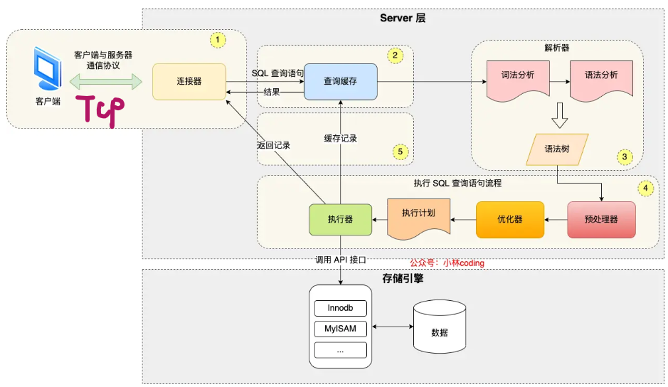

- **解析阶段**：
  - 语法分析：检查查询是否符合 SQL 语法，如果正确转化为抽象语法树
  - 语义分析：检查查询的语义，确保表、列、函数等元素存在并且符合预期。防止元素不存在。
- **优化阶段**：
  - 查询重现：优化器可能会对查询进行重写
  - 查询计划生成：检测是否有索引等等，从而制定执行计划
  - 选择执行策略：根据表的大小、索引选择从而选择最佳的执行路径
- **执行阶段**：
  - 根据执行计划执行sql预计，从存储引擎读取记录，返回给客户端

## mysql的引擎

- **InnoDB**（默认引擎）

  - 特点：
    - 事务支持（ACID）
    - 行级锁
    - 支持崩溃恢复
    - B-tree（聚集索引和非聚集索引）：在聚集索引中，叶子节点存储的是表的数据行，每个表只能有一个聚集索引。非聚集索引的叶子节点存储的是主键值（而不是数据行本身），通过主键值指向实际数据。双向链表为了方便倒序遍历或排序。

  - 适用场景：大多数场景，如电商、银行等

- MyISAM
  - 特点：
    - 不支持事务
    - 表级锁
    - B-tree（非聚集索引）：MyISAM 使用非聚集索引，数据的存储顺序与索引顺序无关。每个表可以有多个非聚集索引，索引的叶子节点存储的是数据的地址（指针），通过指针访问数据行。
  - 适用场景：适合读多写少的情景，如网站日志、数据仓库等。
- MEMORY
  - 特点：
    - 存储在内存中，速度快
    - 不持久化
    - B-tree（非聚集索引）+哈希索引（Hash Index）：哈希索引通过哈希算法将数据映射到内存中，以加快查找速度。
  - 适用场景：适用于临时表、缓存数据等。

# 索引

## 讲讲索引的分类是什么？

在数据库中，**索引**是一种加速查询操作的技术。它可以帮助数据库系统快速找到和检索特定的数据行，而不需要对整个表进行全表扫描。索引提高了数据检索的效率，但会牺牲一些写入操作的性能，因为每次对表进行插入、删除或更新时，索引也需要被更新。

- 按数据结构分类：
  - B+tree索引、Hash索引、Full-text索引。
- 按物理存储分类：
  - 聚簇索引（主键索引）、二级索引（辅助索引）。
- 按字段特性分类：
  - 主键索引、唯一索引、普通索引、前缀索引。
- 按字段个数分类：
  - 单列索引、联合索引

### 按数据结构分类

- B+ Tree 索引

  **定义**：B+ Tree 是一种自平衡的树形数据结构，每个节点都存储键值和指向其他节点的指针。它是B 树的一种变体，叶节点之间通过指针相连，可以更高效地执行范围查询。

  

  - 特点：
    - 支持范围查询
    - 因为平衡树的原因，所以无论查询还是删除的时间复杂度都是O(log N)

- hash索引

  **定义**：Hash 索引通过哈希函数对键值进行映射，生成一个哈希值，然后根据哈希值定位存储位置。Memory引擎支持。

  - 特点：
    - 等值查询效率高
    - 不支持范围查询

- Full-text 索引

  **定义**：全文索引是对文本进行分词处理，针对每个单词建立索引。适用于大文本字段的快速搜索。Memory引擎不支持。

  - 特点：
    - 支持模糊查询不支持精确查询
    - 适用于大文本字段

### 按物理存储分类

- 聚簇索引（Clustered Index）

  **定义**：聚簇索引是表中数据的存储顺序和索引顺序一致的索引。数据行本身按索引的顺序存储在磁盘中。

  - 特点
    - 每个表只能有一个聚簇索引。
    - 数据的物理存储顺序与索引的顺序相同。
    - **主键索引通常是聚簇索引**，也可以通过其他字段创建聚簇索引。

- 二级索引（Secondary Index）（或非聚簇索引）

  **定义**：二级索引（或非聚簇索引）是将索引结构与数据的存储顺序分离的索引。索引中保存了数据记录的指针，而不是数据本身。

  - 特点：
    - 一个表可以有多个二级索引。
    - 数据的物理存储顺序与索引的顺序无关。
    - 查询时，首先通过索引找到记录的指针，然后访问数据。

### 按字段特性分类

- 主键索引（Primary Key Index）

  **定义**：主键索引是由表的主键字段建立的索引。主键索引要求字段值唯一且不能为空。

  - 特点
    - 每个表只能有一个主键索引。
    - 自动创建聚簇索引（如果没有手动指定其他聚簇索引）。

- 唯一索引（Unique Index）

  **定义**：唯一索引保证索引列的值是唯一的，但允许 NULL 值。通常作用在UNIQUE字段上。

  - 特点：
    - 不允许重复的值，但允许多个 NULL 值。
    - 可以创建在非主键字段上，用于确保数据的唯一性。
    - 索引列可以是单列或多列。

- 普通索引（Regular Index）

- 前缀索引（Prefix Index）

  **定义**：前缀索引是只对字段的前几位创建索引，而不是整个字段值。适用于长文本字段。

  - 特点：
    - 节省空间：对于字符串类型的字段，通过前缀索引，可以节省存储空间。
    - 常用于处理大文本字段（如 URL、长字符串等）。

### 按字段个数分类

- 单列索引（Single-column Index）

- 联合索引（Composite Index）

  **定义**：联合索引是由多个列组成的索引，适用于包含多个字段的查询条件。

  - 特点：

    - 列的顺序很重要，索引的有效性通常依赖于查询条件的顺序。遵从**最左匹配原则**，也就是按照最左优先的方式进行索引的匹配。如果创建了一个 `(a, b, c)` 联合索引。`where a=1`、`where a=1 and b=2`是可以正常索引的。但如果是`where b=1`、`where b=1 and c=2`索引则会失效。
- 联合索引的最左匹配原则，在遇到范围查询（如 >、<）的时候，就会停止匹配，也就是范围查询的字段可以用到联合索引，但是在范围查询字段的后面的字段无法用到联合索引。注意，对于 >=、<=、BETWEEN、like 前缀匹配的范围查询，并不会停止匹配，前面我也用了四个例子说明了。

## 索引失效的情况

- 使用左或者左右模糊匹配的时候，也就是 `like %xx` 或者 `like %xx%`这两种方式都会造成索引失效；而右模糊匹配则不会失效，类似`like xx%`。
- 在查询条件中对索引列做了计算、函数、类型转换操作，这些情况下都会造成索引失效。
- 联合索引要能正确使用需要遵循最左匹配原则，也就是按照最左优先的方式进行索引的匹配，否则就会导致索引失效。
- 在 WHERE 子句中，如果在 OR 前的条件列是索引列，而在 OR后的条件列不是索引列，那么索引会失效。

以上只是常见的索引失效的场景，现实中我们用explain分析来判断查询语句是否使用了索引。

## 优化索引的方法

- **前缀优化：**将一些大字符串使用前缀索引来减小索引项的大小。
  - order by 无法使用前缀索引
  - 无法把前缀索引用作覆盖索引
- **覆盖索引优化：**如果从二级索引中查询到记录就可以避免通过聚簇索引回表查询。
  - 可以建立一个联合索引，即「商品ID、名称、价格」作为一个联合索引。如果索引中存在这些数据，查询将不会再次检索主键索引，从而避免回表。

- **主键索引最好是自增的：**使用自增主键我们的每一步在b+树上的操作都是追加。并且会使索引结构紧凑，减少页分裂的次数。并且主键的字段最好越短越好，相应的二级索引的空间也就越小。
- **索引列最好设置为NOT NULL**：如果索引列中有NULL，会占用物理空间且难以优化。
- **防止索引失效**

## MySQL 使用 like “%x“，索引一定会失效吗？

- 如果一个表有多个字段，name是索引字段，id是自增主键，其他为非索引
  - `name like "xxx"`会走name二级索引，type 是 `range`
  - `name like "xx%"`会走name二级索引，type 是 `range`
  - `name like "%xx"`左模糊匹配，索引失效
  - `name like "%xx%"`左右模糊匹配，索引失效

- 如果一个表有2个字段，name是索引字段，id是自增主键，没有非索引字段
  - `name like "xxx"`会走name二级索引，type 是 `range`
  - `name like "xx%"`会走name二级索引，type 是 `range`
  - `name like "%xx"`会走name二级索引，type 是 `index`
  - `name like "%xx%"`会走name二级索引，type 是 `index`

为什么都走name的二级索引呢？这张表的字段没有「非索引」字段，所以 `select *` 相当于 `select id,name`，然后这个查询的数据都在二级索引的 B+树，因为二级索引的 B+ 树的叶子节点包含「索引值+主键值」，所以查二级索引的 B+ 树就能查到全部结果了，这个就是覆盖索引。

但是第三第四条type 是 `index`，这代表着是通过全扫描二级索引的 B+ 树的方式查询到数据的，也就是遍历了整颗索引树。

而第一和第二条查询语句的执行计划中 type 是 `range`，表示对索引列进行范围查询，也就是利用了索引树的有序性的特点，通过查询比较的方式，快速定位到了数据行。

## 哪种 count 性能最好？

**count(*)=count(1)>count(主键字段)>count(字段)**

count() 是一个聚合函数，函数的参数不仅可以是字段名，也可以是其他任意表达式，该函数作用是统计符合查询条件的记录中，函数指定的参数不为 NULL 的记录有多少个。

- count(*)和count(1)的操作过程一样，如果没有二级索引，采用主键索引来统计，读到一条记录count+1。如果有二级索引，则会优先采用代价最小的二级索引来扫描
- count(id)也是一样，一级二级索引的判别和count(*)和count(1)一样，只不过多了一步，他会对id字段进行判断，如果不为 NULL，就将 count 变量加 1。所以性能差一点。
- count(字段)如果字段不是索引话，只能全表扫描，效率最差。

## 如何优化count(*)

-  使用`show table status`或者`explain`命令来表进行估算。
- 采用额外表保存计数值。当我们在数据表插入一条记录的同时，将计数表中的计数字段 +1。也就是说，在新增和删除操作时，我们需要额外维护这个计数表。

# 事务

## 事务特性ACID

- **原子性（Atomicity）：**要么全部成功，要么全部失败。
- **一致性（Consistency）：**事务执行前后，数据库必须从一个一致性状态转变到另一个一致性状态。
- **隔离性（Isolation）：**一个事务的执行不应受到其他事务的干扰。
- **持久性（Durability）：**一旦事务提交，其对数据库的修改是永久性的，即使系统崩溃或发生其他故障，数据也不会丢失。

## 并行事务会引发什么问题？

- **脏读：**读取到其他事务未提交的数据
- **不可重复读：**在同一个事务内，执行相同查询时，查询的单个数据（或行）发生了变化。
  - 读钱先读100，然后钱被别人改了，变成了200，然后读出来是200。侧重数据。
- **幻读：**在同一个事务内，执行相同查询时，查询条件对应的**结果集**发生了变化。即查询的行数或满足条件的数据发生了变化。
  - 先查钱大于100的个数有100个，然后再查变成了150个。侧重结果集。

## mysql是怎么解决并发问题的？

- **锁机制：**Mysql提供了多种锁机制来保证数据的一致性，包括行级锁、表级锁、页级锁等。通过锁机制，可以在读写操作时对数据进行加锁，确保同时只有一个操作能够访问或修改数据。
- **事务隔离级别：**Mysql提供了多种事务隔离级别，包括读未提交、读已提交、可重复读和串行化。设置合适的事务隔离级别，可以在多个事务并发执行时，控制事务之间的隔离程度，以避免数据不一致的问题。
- **MVCC（Multi-Version Concurrency Control 多版本并发控制）**，Mysql使用MVCC来管理并发访问，它通过在数据库中保存不同版本的数据来实现不同事务之间的隔离。在读取数据时，Mysql会根据事务的隔离级别来选择合适的数据版本，从而保证数据的一致性。

## 隔离级别

SQL 标准提出了四种隔离级别来规避这些现象，隔离级别越高，性能效率就越低，这四个隔离级别如下：

- 读未提交：一个事务可以读取到另一个事务未提交的数据。
- 读已提交：一个事务只能读取到另一个事务已经提交的数据。
- 可重复读：指一个事务执行过程中看到的数据，一直跟这个事务启动时看到的数据是一致的，**MySQL InnoDB 引擎的默认隔离级别**。可能会幻读。
- 串行化：事务完全隔离，事务之间按顺序执行，防止了“脏读”、“不可重复读”和“幻读”，但性能较差。

## MySQL InnoDB如何最大程度避免幻读？

- 针对于快照读（普通 select 语句），是通过 **MVCC** 方式解决了幻读，因为可重复读隔离级别下，事务执行过程中看到的数据一直跟这个事务启动时看到的数据是一致的，即使中途有其他事务插入了一条数据，是查询不出来这条数据的，所以就很好了避免幻读问题。
- 针对于当前读（select ... for update）是通过 next-key lock（记录锁+间隙锁）方式解决了幻读，因为当执行 select ... for update 语句的时候，会加上 next-key lock，如果有其他事务在 next-key lock 锁范围内插入了一条记录，那么这个插入语句就会被阻塞，无法成功插入，所以就很好了避免幻读问题。
- 在 MySQL 的可重复读隔离级别下，针对**当前读**的语句会对**索引**加记录锁+间隙锁，这样可以避免其他事务执行增、删、改时导致幻读的问题。
- 有一点要注意的是，在执行 update、delete、select ... for update 等具有加锁性质的语句，一定要检查语句是否走了索引，如果是全表扫描的话，会对每一个索引加 next-key 锁，相当于把整个表锁住了，这是挺严重的问题。

## 可重复读隔离级别下，A事务提交的数据，在B事务能看见吗？

可重复读隔离级是由 MVCC（多版本并发控制）实现的，实现的方式是开始事务后（执行 begin语句后），在执行第一个查询语句后，会创建一个 Read View，后续的查询语句利用这个 Read View，通过这个 Read View 就可以在 undo log 版本链找到事务开始时的数据，所以事务过程中每次查询的数据都是一样的，即使中途有其他事务插入了新纪录，是查询不出来这条数据的。

## 串行化隔离级别是通过什么实现的？

串行化隔离级别是通过 强制加锁 来实现的，确保事务按照顺序执行，避免并发访问造成的数据问题。具体来说：

- **行锁**：对每一行数据加锁，确保其他事务无法同时访问或修改相同的数据行。
- **范围锁（Gap Lock）**：锁定数据行之间的“间隙”，防止其他事务插入满足查询条件的新数据行，避免 幻读。
- **强制顺序执行**：事务必须一个接一个地执行，避免并发访问，确保事务之间不会相互影响。

## 介绍MVCC实现原理

**MVCC（多版本并发控制，Multiversion Concurrency Control）** 是一种用于数据库系统的并发控制机制，通过为每个数据项保留多个版本来允许多个事务并发执行，同时避免事务间的冲突。MVCC 的核心目标是提高数据库的并发性，同时保持数据一致性。

1. **InnoDB的MVCC实现**：
   - InnoDB 使用 **Undo Log**（回滚日志）和 **双重写（Double Write）** 日志来实现 MVCC。
   - 每行记录会有两个隐藏的字段：
     - **TRX_ID**：记录创建该版本的事务ID。
     - **ROLL_PTR**：指向上一版本的指针，通常为空，表示没有版本链。
2. **事务开始时**，InnoDB 会记录事务的 **事务ID**。
3. **更新时**，InnoDB 会生成新的记录，并标记旧记录为过期。
   - 在查询时，InnoDB 会检查每一行的事务ID，确保**只返回对当前事务可见的记录版本**。
4. **清理过时版本**：通过 **后台清理线程**（通常称为 **Purging**）清理不再需要的旧版本。

## 可重复读是如何实现的

**可重复读隔离级别是启动事务时生成一个 Read View，然后整个事务期间都在用这个 Read View**。

假设事务 A （事务 id 为51）启动后，紧接着事务 B （事务 id 为52）也启动了，那这两个事务创建的 Read View 如下：


事务 A 和 事务 B 的 Read View 具体内容如下：

- 在事务 A 的 Read View 中，它的事务 id 是 51，由于它是第一个启动的事务，在事务 A 的 Read View 中，它的事务 id 是 51，由于它是第一个启动的事务，下一个事务 id 则是 52。
- 在事务 B 的 Read View 中，它的事务 id 是 52，由于事务 A 是活跃的，在事务 B 的 Read View 中，它的事务 id 是 52，由于事务 A 是活跃的，下一个事务 id 应该是 53。

接着，在可重复读隔离级别下，事务 A 和事务 B 按顺序执行了以下操作：

- 事务 B 读取小林的账户余额记录，读到余额是 100 万；
- 事务 A 将小林的账户余额记录修改成 200 万，并没有提交事务；
- 事务 B 读取小林的账户余额记录，读到余额还是 100 万；
- 事务 A 提交事务；
- 事务 B 读取小林的账户余额记录，读到余额依然还是 100 万；

事务 B 第一次读小林的账户余额记录，在找到记录后，它会先看这条记录的 trx_id，此时发现 trx_id 为 50，比事务 B 的 Read View 中的 min_trx_id 值（51）还小，这意味着修改这条记录的事务早就在事务 B 启动前提交过了，所以该版本的记录对事务 B 可见的，也就是事务 B 可以获取到这条记录。

接着，事务 A 通过 update 语句将这条记录修改了（还未提交事务），将小林的余额改成 200 万，这时 MySQL 会记录相应的 undo log，并以链表的方式串联起来，形成**版本链**，如下图：


你可以在上图的「记录的字段」看到，由于事务 A 修改了该记录，以前的记录就变成旧版本记录了，于是最新记录和旧版本记录通过链表的方式串起来，而且最新记录的 trx_id 是事务 A 的事务 id（trx_id = 51）。

然后事务 B 第二次去读取该记录，发现这条记录的 trx_id 值为 51，在事务 B 的 Read View 的 min_trx_id 和 max_trx_id 之间，则需要判断 trx_id 值是否在 m_ids 范围内，判断的结果是在的，那么说明这条记录是被还未提交的事务修改的，这时事务 B 并不会读取这个版本的记录。而是沿着 undo log 链条往下找旧版本的记录，直到找到 trx_id 「小于」事务 B 的 Read View 中的 min_trx_id 值的第一条记录，所以事务B 能读取到的是 trx_id 为 50 的记录，也就是小林余额是 100 万的这条记录。

最后，当事物 A 提交事务后，由于隔离级别时「可重复读」，所以事务 B 再次读取记录时，还是基于启动事务时创建的 Read View 来判断当前版本的记录是否可见。所以，即使事物 A 将小林余额修改为 200万并提交了事务， 事务 B 第三次读取记录时，读到的记录都是小林余额是 100 万的这条记录。

就是通过这样的方式实现了，「可重复读」隔离级别下在事务期间读到的记录都是事务启动前的记录。

## 读已提交是如何实现的

**读提交隔离级别是在每次读取数据时，都会生成一个新的 Read View**。

与可重复提交的前两次读取的Read View都一样，唯一区别的是第三次读取，在A事务提交后，B事务再次读取时，会重新生成一个Read View


因为A事务已经提交，所以A事务会从m_ids中移除，这样min_trx_id就是52，而undo_log记录的trx_id是51，比事务 B 的 Read View 中的 min_trx_id 值（52）还小，这意味着修改这条记录的事务早就在创建 Read View 前提交过了，所以该版本的记录对事务 B 是可见的。

所以第三次读时会变成200W，与第一次第二次读的完全不一样。这就是读已提交所存在的隐患，不可重复读。

## 一条update是不是原子性的？为什么？

是原子性，主要通过锁+undolog 日志保证原子性的

- 执行 update 的时候，会加行级别锁，保证了一个事务更新一条记录的时候，不会被其他事务干扰。
- 事务执行过程中，会生成 undo log，如果事务执行失败，就可以通过 undolog 日志进行回滚。

## 滥用事务，或者一个事务里有特别多sql的弊端？

事务的资源在事务提交之后才会释放的，比如存储资源、锁。

- 如果一个事务特别多 sql，锁定的数据太多，容易造成大量的死锁和锁超时。
- 回滚记录会占用大量存储空间，事务回滚时间长。在MySQL中，实际上每条记录在更新的时

- 执行时间长，容易造成主从延迟，主库上必须等事务执行完成才会写入binlog，再传给备库。所以，如果一个主库上的语句执行10分钟，那这个事务很可能就会导致从库延迟10分钟。

# 锁

##  mysql有哪些锁

- **全局锁 (Global Lock)**：会锁定整个 MySQL 服务的所有数据库，通常用于备份（如 `FLUSH TABLES WITH READ LOCK`）等操作。这种锁在数据库级别生效，对所有数据库都有效。

  - 既然备份数据库数据的时候，使用全局锁会影响业务，那有什么其他方式可以避免？？

    InnoDB引擎支持的事务支持可重复读的隔离级别，那么在备份数据库之前先开启事务，会先创建 Read View，然后整个事务执行期间都在用这个 Read View，而且由于 MVCC 的支持，，备份期间业务依然可以对数据进行更新操作。

- **表级锁 (Table Lock)**：锁定整张表，其他事务无法对该表进行任何操作，直到锁释放。

  - 表锁：通过lock tables 语句可以对表加表锁，表锁除了会限制别的线程的读写外，也会限制本线程接下来的读写操作。
  - 元数据锁：当我们对数据库表进行操作时，会自动给这个表加上MDL，对一张表进行 CRUD 操作时，加的是 **MDL 读锁**；对一张表做结构变更操作的时候，加的是 **MDL 写锁**；MDL 是为了保证当用户对表执行 CRUD 操作时，防止其他线程对这个表结构做了变更。
  - 意向锁：当执行插入、更新、删除操作，需要先对表加上「意向独占锁」，然后对该记录加独占锁。意向锁的目的是为了快速判断表里是否有记录被加锁。

- **行级锁**：InnoDB 引擎是支持行级锁的，而 MyISAM 引擎并不支持行级锁。

- 记录锁（Record Lock）：锁住的是一条记录。而且记录锁是有 S 锁和 X 锁之分的，满足读写互斥，写写互斥

- 间隙锁（Gap Lock）：只存在于可重复读隔离级别，目的是为了解决可重复读隔离级别下幻读的现象。

- Next-Key Lock 称为临键锁，是 Record Lock + Gap Lock 的组合，锁定一个范围，并且锁定记录本身。

## update处理是否会锁住全表

- **MySQL两个线程的update语句同时处理一条数据，会不会有阻塞？**

  处理时next-key 锁会退化成记录锁，会锁住当前记录，会阻塞

- **两条update语句处理一张表的不同的主键范围的记录，一个<10，一个>15，会不会遇到阻塞？底层是为什么的？**

  不会，因为next-key锁住的范围不一样，不会形成冲突。

- **如果2个范围不是主键或索引？还会阻塞吗？**

  如果2个范围查询的字段不是索引的话，那就代表 update 没有用到索引，这时候触发了全表扫描，全部索引都会加行级锁，这时候第二条 update 执行的时候，就会阻塞了。

  因为如果 update 没有用到索引，在扫描过程中会对索引加锁，所以全表扫描的场景下，所有记录都会被加锁，也就是这条 update 语句产生了 4 个记录锁和 5 个间隙锁，相当于锁住了全表。

## MySQL死锁了怎么办？

死锁（Deadlock）是指在多线程或多进程的环境中，两个或多个事务或进程在执行过程中，因相互争夺资源而导致相互等待的情况，最终使得这些事务或进程都无法继续执行。

死锁的四个必要条件：**互斥、占有且等待、非剥夺、循环等待**。破坏一个即可。

- **设置事务等待锁的超时时间**。超过时间自动回滚。
- **开启主动死锁检测**。发现死锁后主动回滚死锁链上某一事务。

## 死锁案例

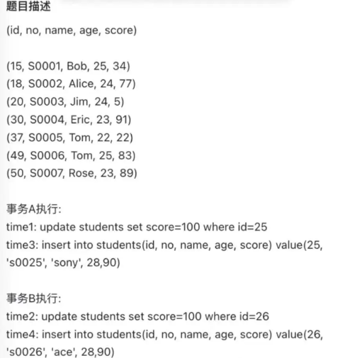

会发生什么？

本次案例中，事务 A 和事务 B 在执行完后 update 语句后都持有范围为`(20, 30）`的间隙锁，而接下来的插入操作为了获取到插入意向锁，都在等待对方事务的间隙锁释放，于是就造成了循环等待，满足了死锁的四个条件：互斥、占有且等待、不可强占用、循环等待，因此发生了死锁。

## insert怎么加行级锁

- **记录之间有间隙锁**

  举例，现在 t_order 表中，只有这些数据，**order_no 是二级索引**

  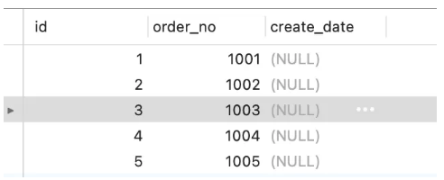

  事务A：

  ```mysql
  select * from t_order where order_no = 1006 for update;
  ```

  事务B：

  ```mysql
  insert into t_order(order_no, create_date) values(1010,now());
  ```

  事务 B向事务 A 生成的 next-key 锁（记录锁+间隙锁）范围`（1005, +∞]` 中插入了一条记录，所以事务 B 的插入操作生成了一个插入意向锁（`LOCK_MODE: X,INSERT_INTENTION`），锁的状态是等待状态，意味着事务 B 并没有成功获取到插入意向锁，因此事务 B 发生阻塞。

- **遇到唯一键冲突**

  如果在插入新记录时，插入了一个与「已有的记录的主键或者唯一二级索引列值相同」的记录，此时插入就会失败，然后对于这条记录加上了 **S 型的锁**。

  - 如果主键索引重复，插入新记录的事务会给已存在的主键值重复的聚簇索引记录**添加 S 型记录锁**。
  - 如果唯一二级索引重复，插入新记录的事务都会给已存在的二级索引列值重复的二级索引记录**添加 S 型 next-key 锁**。

# 日志

## 日志文件分为几种

- **Redo Log (重做日志)**
  - **用途**：Redo Log 是InnoDB存储引擎的一个关键日志，用于保证事务的持久性（Durability，ACID特性之一）。它记录了对数据的所有修改操作，这些操作是按顺序写入Redo Log的。Redo Log 关注的是事务数据修改的物理记录。是一组**循环写**的日志文件。
  - **工作原理**：在事务提交之前，所有的修改操作先记录到Redo Log中，然后再写入到数据文件（例如 `.ibd` 文件）。如果系统崩溃，MySQL可以通过Redo Log重新执行未写入数据文件的操作，从而保证数据不会丢失。记录数据变更并保存**在内存中**，在提交事务时会刷写到磁盘，确保事务的持久性。

- **Undo Log (撤销日志)**
  - **用途**：Undo Log 用于实现事务的原子性（Atomicity），当事务发生回滚（Rollback）时，通过Undo Log撤销已执行的操作。Undo Log 记录了对数据的反向操作。
  - **工作原理**：每当对数据进行修改时，Undo Log会记录下该数据修改前的值。这样，如果事务回滚，系统会使用Undo Log将数据恢复到事务开始之前的状态。
- **Bin Log (二进制日志)**：是 server 层的日志，用于数据备份和主从辅助，保存这是逻辑日志。Binlog 是持久化到磁盘的，它是一个**顺序追加**的日志文件。Binlog 关注的是**数据库操作**事件的记录，全量日志。
  - **用途**：Bin Log 记录了所有改变数据库状态的操作（如INSERT、UPDATE、DELETE等），并用于数据的复制（主从复制）和恢复。
- **relay Log (中继日志)**
  - **用途**：Relay Log 主要用于MySQL的主从复制架构中。从服务器会把主服务器的Bin Log事件写入到自己的Relay Log中，然后从服务器通过应用这些日志来更新自己的数据。
  - **工作原理**：在复制过程中，主服务器的Bin Log会被发送到从服务器并写入到Relay Log。从服务器再根据这些日志执行相应的数据库操作来保持和主服务器的数据同步。
- **慢查询日志 (Slow Query Log)**
  - **用途**：Slow Query Log 用于记录执行时间超过指定阈值的SQL查询。通过分析这些查询，可以找出数据库性能瓶颈，进行优化。
  - **工作原理**：MySQL会记录所有执行时间超过`long_query_time`参数指定阈值的查询。这个日志文件可以帮助数据库管理员发现并优化慢查询，以提高系统性能。

## redo log怎么保证持久性的？

- **Write-Ahead Logging（WAL）：**所有的修改（如插入、更新、删除）都会首先记录在Redo Log中，而后再写入到数据文件（例如InnoDB表空间）。
- **顺序写入：**Redo Log 是顺序写入的日志文件，因此写入速度较快。它保证所有的修改操作都能按顺序保存在磁盘中，防止数据丢失。

- **Checkpoint机制：**InnoDB 将 Redo Log 写入到内存中的缓冲区（即 **Log Buffer**）后，再异步写入磁盘。即使在内存中，它仍然保证数据不会丢失。

## redo log满了怎么办

Redo Log 文件写满了，InnoDB 会自动切换到下一个日志文件，并且按顺序回绕（即覆盖最早的日志文件）。回绕时，已经提交的事务日志不会丢失，因为它们已经被写入磁盘。未提交的事务日志会通过 Undo Log回滚，保持数据一致性。

## update更新的过程

当优化器分析出成本最小的执行计划后，执行器就按照执行计划开始进行更新操作。

具体更新一条记录`UPDATE t_user SET name = 'xiaolin' WHERE id = 1;`的流程如下：

1. 执行器负责具体执行，会调用存储引擎的接口，通过主键索引树搜索获取 id = 1这一行记录：
   - 如果 id=1 这一行所在的数据页本来就在 buffer pool 中，就直接返回给执行器更新；
   - 如果记录不在 buffer pool，将数据页从磁盘读入到 buffer pool，返回记录给执行器。
2. 执行器得到聚簇索引记录后，会看一下更新前的记录和更新后的记录是否一样：
   - 如果一样的话就不进行后续更新流程；
   - 如果不一样的话就把更新前的记录和更新后的记录都当作参数传给 InnoDB层，让 InnoDB 真正的执行更新记录的操作；
3. 开启事务， InnoDB 层更新记录前，首先要记录相应的 undo log，因为这是更新操作，需要把被更新的列的旧值记下来，也就是要生成一条 undo log。
4. InnoDB 层开始更新记录，会先更新内存（同时标记为脏页），然后将记录写到 redo log 里面，这个时候更新就算完成了。为了减少磁盘I/O，不会立即将脏页写入磁盘，后续由后台线程选择一个合适的时机将脏页写入到磁盘。
5. 至此，一条记录更新完了。
6. 在一条更新语句执行完成后，然后开始记录该语句对应的 binlog，此时记录的 binlog 会被保存到 binlog cache，并没有刷新到硬盘上的 binlog 文件，在事务提交时才会统一将该事务运行过程中的所有 binlog 刷新到硬盘。
7. 事务提交，接下来进行redo log和bin log的两阶段提交。

## binlog两阶段提交过程是怎样的？

在 MySQL 的 InnoDB 存储引擎中，开启 binlog 的情况下，MySQL 会同时维护 binlog 日志与 InnoDB 的 redo log，为了保证这两个日志的一致性，MySQL 使用了内部 XA 事务。

将 redo log 的写入拆成了两个步骤：prepare 和 commit，中间再穿插写入binlog

- **prepare 阶段**：将 XID（内部 XA 事务的 ID） 写入到 redo log，同时将 redo log对应的事务状态设置为 prepare，然后将 redo log 持久化到磁盘。
- **commit 阶段**：把 XID 写入到 binlog，然后将 binlog 持久化到磁盘，将 redo log 状态设置为 commit。只要 binlog 写磁盘成功，就算 redo log 的状态还是 prepare 也没有关系，一样会被认为事务已经执行成功。

**异常状态：**

不管是时刻 A（redo log 已经写入磁盘， binlog 还没写入磁盘），不管是时刻 A（redo log 已经写入磁盘， binlog 还没写入磁盘），**此时的 redo log 都处于 prepare 状态**。

- 如果 binlog 中没有当前内部 XA 事务的 XID，说明 redolog 完成刷盘，但是 binlog 还没有刷盘，则回滚事务。对应时刻 A 崩溃恢复的情况。
- 如果 binlog 中有当前内部 XA 事务的 XID，说明 redolog 和 binlog 都已经完成了刷盘，则提交事务。

所以说，两阶段提交是以 binlog 写成功为事务提交成功的标识，因为 binlog 写成功了，就意味着能在 binlog 中查找到与 redo log 相同的 XID。

## MySQL 磁盘 I/O 很高，有什么优化的方法？

总体的方向是延迟刷盘时机，减少刷盘次数

- 增加**InnoDB Buffer Pool**大小，让更多数据缓存在内存中，减少磁盘访问。比如设置成物理内存的60%-80%。
- 增加 **InnoDB Log Buffer** 的大小，避免频繁地将日志刷到磁盘。比如设置成64M。

# 性能调优

## 给你张表，发现查询速度很慢，你有那些解决方案？

- **查看执行计划（EXPLAIN）：**使用explain查看执行计划，确定优化方向
- **优化索引**：检查是否使用索引、是否全表扫描
- **优化查询语句**：
  - 避免使用 `SELECT *`，只查询需要的列。
  - 如果只需要部分数据，使用 `LIMIT` 限制返回的记录数。
  - 避免复杂的子查询，使用 `JOIN` 替代。
- **调整数据库配置**：增加InnoDB Buffer Pool大小
- **更换硬件：**将数据库迁移到 SSD 上，提升磁盘读写速度。
- **分库分表和读写分离**：
  - 对于非常大的表，考虑分库分表，将数据分散到多个表或数据库中。
  - 使用读写分离，将读操作分发到从库，减轻主库负担。

## 分库分表

- **水平分表**：把一个表的数据按某些规则（比如 ID 范围）分到多个表里。比如把用户表按用户 ID 分成 `users_1`, `users_2` 等表。
- **垂直分表**：把一个表的不同列拆成多个表，通常是频繁查询的列和不常用的列分开。比如，把用户表分成 `users_basic`（存储基本信息）和 `users_contact`（存储联系方式）。
- **水平分库**：把数据按某些规则分到多个数据库中。比如把用户数据分到 `db1`, `db2` 等多个数据库实例里。
- **垂直分库**：把不同业务模块的数据分到不同的数据库里。比如把用户数据放到 `user_db`，商品数据放到 `product_db`。
