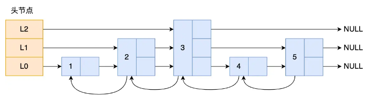

# Redis面试篇

# 认识redis

Redis 是一个高性能的内存数据库，它支持多种数据结构，在底层实现中通过多种精心设计的数据结构来实现其高效的操作。

## 为什么用 Redis 作为 MySQL 的缓存？

**redis特点：**

- **高性能**：数据存储在内存里，读取和写入都非常快，比硬盘上的 MySQL 快很多。响应速度在毫秒级别。
- **高并发**：Redis 能同时处理大量请求，支持高并发场景，避免了多线程的性能瓶颈。

**为什么用 Redis 缓存 MySQL：**

- **减轻 MySQL 压力**：频繁查询的数据放在 Redis 中，减少 MySQL 的负担。
- **提升读取速度**：热点数据可以直接从 Redis 获取，不用每次都查询数据库。
- **防止缓存问题**：Redis 有很多机制可以避免缓存穿透、击穿等问题，确保数据稳定。

# 数据结构

## 讲一下Redis底层的数据结构

- 字符串（String）：缓存对象、常规计数、分布式锁、共享 session 信息等。
  - 底层是一个简单的 **动态字符串（SDS）**。支持动态增长，可以容纳任意类型的数据（字符串、整数、浮点数、二进制数据等）。
- 哈希（Hash）：存储对象类型数据，如用户信息、商品属性等。
  - 底层是 **哈希表**，用来存储键值对。
- 列表（List）：队列、消息队列、任务调度等。
  - 底层是 **双向链表**
- 集合（Set）：去重、标签系统、好友关系等。
- 有序集合（ZSet）：排行榜、延迟队列、定时任务等。

## ZSet底层是由什么实现的

Zset 类型的底层数据结构是由**跳表**实现的：

跳表（SkipList）是一种用来保持有序元素的数据结构，它通过多个层次的链表加速查找操作。简单来说，跳表是一个由多个链表构成的结构，每一层链表都比上一层少一些元素，允许通过跳跃的方式快速查找。

- **多层结构**：通过多层链表，跳表减少了查找时需要遍历的节点数量，尤其是当数据量很大时，可以大大提高查找效率。
- **随机化**：跳表的随机化机制保证了插入和查找的时间复杂度平均为 **O(log N)**，即使数据量很大，查询效率仍然非常高。

# 线程模型

## Redis 是单线程吗？

Redis 单线程指的是「接收客户端请求->解析请求 ->进行数据读写等操作->发送数据给客户端」这个过程是由一个线程（主线程）来完成的，这也是我们常说 Redis 是单线程的原因。

但是，Redis 程序并不是单线程的，Redis 在启动的时候，为「关闭文件、AOF 刷盘、释放内存」这些任务创建单独的线程来处理。是因为这些任务的操作都是很耗时的，很容易发生阻塞，这样就无法处理后续的请求了。

并且在后续发展中，网络I/O也会限制Redis的性能，为了提高网络 I/O 的并行度，Redis 6.0 对于网络 I/O 采用多线程来处理。

因此在Redis6.0后，Redis 在启动的时候，默认情况下会**额外创建 6 个线程**（*这里的线程数不包括主线程*）：

- Redis-server ： Redis的主线程，主要负责执行命令。
- bio_close_file、bio_aof_fsync、bio_lazy_free：三个后台线程，分别异步处理关闭文件任务、AOF刷盘任务、释放内存任务；
- io_thd_1、io_thd_2、io_thd_3：三个 I/O 线程，io-threads 默认是 4 ，所以会启动 3（4-1）个 I/O 多线程，用来分担 Redis 网络 I/O 的压力。

## Redis怎么进行I/O多路复用的？

Redis 采用了 **事件驱动模型**，即使用一个单线程处理所有客户端连接的请求。这个线程会 **循环监听** 事件并响应相应的请求。

Redis 初始化的时候，会做下面这几件事情：

- 首先，调用 epoll_create() 创建一个 epoll 对象和调用 socket() 创建一个服务端 socket
- 然后，调用 bind() 绑定端口和调用 listen() 监听该 socket；
- 然后，将调用 epoll_ctl() 将 listen socket加入到 epoll，同时注册「连接事件」处理函数。

初始化完后，主线程就进入到一个**事件循环函数**，主要会做以下事情：

- **调用 `epoll_wait()`** 阻塞，等待事件。
- **处理连接事件**：接受新连接并将其加入到 `epoll` 中，监听该连接的读写事件。
- **处理数据读写**：如果有客户端的数据到达，读取并解析请求，然后返回响应数据。
  - **读取数据**：当客户端发送请求时，Redis 会使用非阻塞方式读取数据。如果没有数据，`recv()` 会立即返回。
  - **写入数据**：当 Redis 要返回响应时，它会使用非阻塞方式写数据。如果连接不可写，`send()` 会立即返回。
- **继续阻塞等待**：处理完当前的请求后，继续等待新的事件发生。

## Redis 采用单线程为什么还这么快？

- Redis 的大部分操作都在内存中完成，并且采用了高效的数据结构，redis的瓶颈一般是内存或者网络带宽，所以可以采用单线程。
- 单线程省去了多线程之间来回切换的性能开销。
- Redis采用I/O多路复用机制处理大量的客户端 Socket 请求。内核会一直监听这些 Socket 上的连接请求或数据请求。一旦有请求到达，就会交给 Redis 线程处理。

# 事务

## Redis锁有哪几种实现方式

- **基于 SETNX 实现分布式锁**
  - 通常称为**分布式锁**。这种方式是基于 Redis 的原子操作来确保一个客户端可以在 Redis 中创建一个独占的锁。SET if Not Exists，即只有在指定的键 **不存在** 时，才会设置该键的值。若键已经存在，则 `SETNX` 不会做任何操作。
-  **基于 `SET` 命令实现的带有超时的分布式锁**
  - Redis 5.0 版本引入了 `SET` 命令的 **NX** 和 **EX** 参数，可以用来在一个命令中同时实现 **设置键值**、**设置锁** 和 **设置超时** 的功能。
    - SET命令的NX参数与SETNX类似
    - EX是指超时时间
- **基于 Redisson 的分布式锁。**底层依然使用set的。
- **基于 Lua 脚本实现的分布式锁**

##  如何实现redis 原子性？

redis 执行一条命令的时候是具备原子性的，因为 redis 执行命令的时候是单线程来处理的，不存在多线程安全的问题。

**如果要保证 2 条命令的原子性的话，如何实现？**

- **可以考虑用 lua 脚本**

  将多个操作写到一个 Lua 脚本中，Redis 会把整个 Lua 脚本作为一个整体执行，在执行的过程中不会被其他命令打断，从而保证了 Lua 脚本中操作的原子性。

- **redis 事务**

  - 如果 redis 事务正常执行，使用 MULTI 和 EXEC 配合使用就可以保证多个操作都完成。
  - 如果 redis 事务发生错误了，就没办法保证原子性了。事务中执行失败的操作不会回滚，因为**redis没有回滚机制。**

## Redis中incr命令保证原子性的原理是什么

- Redis 是一个**单线程**的系统，所有操作（包括 `INCR`）都是通过单线程执行的。这意味着当 Redis 处理一个客户端的请求时，它不会同时处理其他客户端的请求。这就天然保证了在执行 `INCR` 命令时不会被其他命令打断，从而实现原子性。
- Redis 使用**事件循环机制来处理客户端的请求**。每一个客户端的请求都会被放入一个队列中，Redis 按照队列中的顺序逐一处理请求。

## redis分布式锁的时钟问题

在 Redis 分布式锁的场景中，时钟问题通常指的是**Redis 服务器和客户端的时钟不同步**，尤其是在锁的有效期（TTL）设置上。

- **原因：**

  - **客户端时钟漂移**：客户端和 Redis 服务器之间的时钟可能存在差异。如果客户端使用的时钟比 Redis 服务器快或者慢，可能导致锁的过期时间错误。

  - **Redis 服务器时钟漂移**：如果 Redis 服务器的时钟出现漂移，可能会导致 Redis 锁过期时间的计算错误，导致锁失效或者提前释放。

  - **网络延迟**：在某些情况下，客户端和 Redis 之间的网络延迟可能会导致客户端计算的 TTL 时间与实际过期时间不一致。

- **解决方法：**

  - 使用 `Redisson` 库
  - 使用 `SETNX` 命令

# 持久化及日志

## Redis有哪些持久化方式？分别的优缺点是什么？

- **RDB（快照存储）**

  RDB 持久化是 Redis 默认的持久化机制，它会定期将 Redis 内存中的数据 **快照** 保存到磁盘上的一个 `.rdb` 文件中。

  - **原理：**Redis 会根据配置的规则（例如每隔多少时间或者多少次写操作）定期生成 RDB 快照。生成快照时，Redis 会 fork 出一个子进程，将内存中的数据存储到磁盘文件中。
  - 优点：
    - **性能高**：由于 RDB 是基于快照的持久化方式，它通常不会影响 Redis 的正常读写性能。
    - **适用于大规模部署**：由于 RDB 文件是一个二进制的快照，它非常适合用于数据备份和恢复。
    - **较少磁盘 I/O 操作**：RDB 的数据写入磁盘是周期性发生的，不像 AOF 会每次写操作都执行 I/O。
  - 缺点：
    - **数据丢失**：RDB 的持久化是周期性的，因此在上次持久化之后到 Redis 崩溃期间的数据会丢失。
    - **持久化时间较长**：当 Redis 数据集很大时，生成 RDB 快照的过程可能会导致较长的阻塞时间。
  - **适用场景：**对数据丢失有一定容忍的场景，比如缓存系统。

- **AOF（追加日志文件）**

  AOF 持久化方式通过将每个写操作都记录到一个日志文件中来实现持久化。每次客户端执行写操作时，Redis 会把操作记录在 AOF 文件中。

  - **原理：**AOF 文件是一个日志文件，其中记录了所有的写操作。Redis 会把写操作追加到文件的末尾。AOF 文件在每次写操作后会被写入磁盘，可以根据配置的 `fsync` 策略来控制何时同步到磁盘。
  - 优点：
    - **数据持久性更强**：AOF 记录的是所有的写操作，因此可以在崩溃后恢复到上次写操作的状态
    - **更细粒度的控制**：通过 `fsync` 配置，AOF 可以实现多种持久化方式，包括“每次写操作后同步”（最强一致性），以及“每秒同步一次”等。
  - 缺点：
    - **写入性能差**：每次写操作都会产生磁盘 I/O。
    - **AOF 文件较大**：随着时间的推移，AOF 文件会不断增大。
  - **适用场景：**对数据持久化要求较高的领域，如金融应用等。

- **RDB 和 AOF 结合使用**

  - 优点：结合了 RDB 的快速恢复和 AOF 的高持久性。在恢复时，Redis 会先加载 RDB 文件，然后应用 AOF 中的操作。
  - 缺点：Redis 会额外占用磁盘空间，且可能会影响性能。

# 缓存淘汰及过期删除

##  过期删除策略和内存淘汰策略有什么区别？

- 内存淘汰策略是在内存满了的时候，redis 会触发内存淘汰策略，淘汰一些不必要的内存资源。
  - 常用淘汰策略：淘汰最近最少使用的数据LRU和随机选择。
  - 当 Redis 内存达到 `maxmemory` 限制时，就会触发内存淘汰机制，根据配置的策略删除一些数据。
- 过期键删除策略是将已过期的键值对进行删除，Redis 采用的删除策略是惰性删除+定期删除。
  - Redis 会定期扫描所有设置了过期时间的键（默认每 100 毫秒扫描一次）。在扫描过程中，它会检查每个键是否过期，如果过期，则删除该键。
  - Redis 在访问一个键时，会检查该键是否过期。如果过期，就删除它。这种方式被称为惰性删除。也就是说，Redis 只会删除那些被访问过的过期键。

## Redis 持久化时，对过期键会如何处理的？

Redis 持久化文件有两种格式：RDB（Redis Database）和 AOF（Append Only File）

- RDB模式
  - 在生成 RDB 文件时，**过期的键不会被保存**。
  - 加载 RDB 文件时，**主服务器不会加载过期键**，从服务器会加载所有键，但同步时会清除过期的键。
- AOF模式
  - 在写入 AOF 文件时，**过期的键会保存，当过期键删除时，但会有 DEL 命令删除它们**。
  - AOF 重写时，**过期的键不会被保存到新文件中**。

# Redis集群

## Redis 如何实现服务高可用？

Redis 通过 **主从复制** 实现读写分离和基本的数据冗余，通过 **哨兵机制** 实现自动故障转移，而通过 **集群模式** 实现更高规模的分布式数据存储与高可用性。结合这些机制，Redis 能确保服务在节点或主服务器故障时保持可用。

- 主从复制（Replication）

  **原理**：Redis 可以配置多个从服务器（Slave）来复制主服务器（Master）的数据。

  **高可用性**：从服务器实时同步主服务器的数据，当主服务器出现故障时，可以将一个从服务器提升为主服务器，保证服务继续提供。

  - **主从同步：**
    - **完全同步情况：**初次同步、从服务器请求全量同步、主从差异过大
    - **增量同步情况：**当主从偏移量位于环形缓冲区内，则是增量同步。

- 哨兵机制（Sentinel）

  **原理**：Redis Sentinel 是一种监控和故障转移机制，用于监控 Redis 实例的健康状态，并在主服务器宕机时自动进行故障转移

  **高可用性**：当 Sentinel 发现主服务器宕机时，它会自动选择一个从服务器提升为主服务器，并通知其他 Redis 实例进行更新。

- 集群模式（Cluster）

  **原理**：Redis 集群允许采用哈希槽（Hash Slot）将数据分布到多个节点上，每个节点负责存储数据的某一部分（通过分片）。Redis 集群具有自动分片和数据冗余功能。

  **高可用性**：集群模式支持每个数据分片有多个副本（主从复制），当某个节点发生故障时，集群会自动将该分片的副本提升为主节点。

## 在全量同步的时候，增量同步消息产生，怎么保证数据的一致性

## 集群脑裂导致数据丢失怎么办？

群脑裂（Split Brain）是指在分布式系统中，多个节点出现网络分区或失去联系，导致系统分为多个不相互通信的“脑”，这些“脑”可能独立地做出决策，造成数据不一致或丢失。

- **使用 Redis Sentinel**：监控主节点的健康，自动进行故障转移，确保主节点宕机时能自动选举新的主节点。

- **设置 `cluster-require-full-coverage` 为 `yes`**：这样在脑裂发生时，集群会停止接受写请求，避免数据不一致。

- **增加副本数量**：每个分片配置多个副本，即使发生脑裂，仍有副本可用来恢复数据。

- **定期备份（RDB 和 AOF）**：发生脑裂导致的数据丢失时，可以从备份中恢复。

# 缓存设计

## 如何避免缓存雪崩、缓存击穿、缓存穿透？

- **缓存雪崩**是指大量缓存同时失效，导致大量请求直接访问数据库，造成数据库压力过大，可能会引发系统宕机。
  - **避免办法：**
    - 设置缓存过期时间的随机性
    - 提前预热缓存
    - 使用多级缓存
- **缓存击穿**是指某个热点数据的缓存失效，而同时有大量请求访问该数据，导致请求直接打到数据库上，从而造成数据库负担过重。
  - **避免办法：**
    - **加锁机制**：当缓存失效时，使用分布式锁（如 Redis 锁）保证只有一个请求会去加载数据并更新缓存，其他请求等待加载完成后直接返回缓存数据。
    - 针对热点数据异步进行更新缓存
- **缓存穿透**是指请求的数据既不在缓存中，也不在数据库中（通常是恶意请求或无效数据），导致请求直接打到数据库上，造成数据库的无谓负担。
  - **避免办法：**
    - **缓存不存在的查询结果**：当查询的数据为空（例如数据库查询结果为 `null` 或空集合），也将该结果缓存一段时间，避免后续相同请求每次都查询数据库。
    - **使用 Bloom Filter**：在查询缓存前，先通过 Bloom Filter 判断请求的数据是否存在于数据库中。如果不存在，直接返回空数据或者错误，避免查询数据库。
    - **限制无效请求**：在接口层做合理的验证和过滤，避免无效请求（例如恶意攻击、过期数据）直接访问缓存和数据库。

## 布隆过滤器原理介绍一下

布隆过滤器（Bloom Filter）是一种空间效率极高的概率型数据结构，主要用于测试一个元素是否属于一个集合。它的核心特点是能够快速判断某个元素是否存在于集合中，但有一定的误判率（假阳性），即可能会错误地报告某个元素存在，但不会漏掉实际存在的元素。

布隆过滤器由「初始值都为 0 的位图数组」和「 N 个哈希函数」两部分组成。当我们在写入数据库数据时，在布隆过滤器里做个标记，这样下次查询数据是否在数据库时，只需要查询布隆过滤器，如果查询到数据没有被标记，说明不在数据库中。

- **添加元素**：通过多个哈希函数计算数组的位置，把对应的位设为 `1`。
- **查询元素**：用相同的哈希函数计算位置，如果所有位置都是 `1`，说明元素“可能”存在；如果有位置是 `0`，说明元素一定不存在。

## 常见的缓存更新策略

- Cache Aside（旁路缓存）策略

  - 读写策略
    - 写策略：先更新数据库再删除缓存
    - 读策略：先读缓存再读数据库

  - 适用场景：Cache Aside 策略适合读多写少的场景，不适合写多的场景
  - 缺点：存在缓存穿透的问题
- Read/Write Through（读穿 / 写穿）策略

  - 读写策略
    - 读穿（Read Through）：与旁路缓存一样
    - 写穿（Write Through）：如果缓存有，就缓存和数据库一块更新，如果缓存没有，直接更新数据。
- Write Back（写回）策略

  - 写回策略是与写穿策略相反的，写操作仅仅写入缓存，不立即写入数据库。然后后台会有一个定时任务，将缓存中的数据批量写入数据库。
  - 适用场景：适合大规模写操作且可以容忍一定延迟的数据更新场景
  - 缺点：会有一致性和数据缺失的风险。

## 数据库和缓存如何保证一致性？

保证缓存一致性需要根据具体的需求来定：

- 对数据实时性有一定要求

  对数据实时性有一定要求即数据库数据更新需要近实时查询到最新的数据，针对这种情况可采用**延迟双删**、**Canal+MQ异步同步**的方式。

- 对数据实时性要求不高

  使用定时任务的方式定时更新缓存，或者直接用redis查也行。

- 对数据实时性要求非常高

  此类场景不适合用缓存，直接使用数据库即可

# Redis实战

## Redis 如何实现延迟队列？

**Redis 可以通过Zset来实现延迟队列**。这个方法利用了有序集合的 **按分数排序** 特性来实现任务的延迟执行。

- 当一个任务需要延迟执行时，我们将它插入到 Sorted Set 中，**分数** 设置为未来的时间戳，**成员** 设置为任务标识。
- 消费者端进行监听，如果当前时间匹配到延迟队列的毫秒值就立刻消费。

**ttl+死信交换机怎么实现延迟队列？**

**TTL (Time-To-Live)**：指定消息在队列中存活的最大时间。当消息的 **TTL** 超过设置的时间后，消息就会被自动删除或转发到一个 **死信交换机**（DLX）。

- 生产者将消息发送到 `delay_queue`。
- 消息在 `delay_queue` 存活一段时间（TTL 到期后）。
- 消息转发到 **死信交换机 (DLX)**，再进入 **延迟队列 (delayed_queue)**。
- 消费者从 `delayed_queue` 获取到的消息就是经过延迟处理的。

## Redis 的大 key 如何处理？

大 key 并不是指 key 的值很大，而是 key 对应的 value 很大。

- 对大Key进行拆分。例如将含有数万成员的一个HASH Key拆分为多个HASH Key，并确保每个Key的成员数量在合理范围。
- 对大Key进行清理。将不适用Redis能力的数据存至其它存储，并在Redis中删除此类数据。注意，要使用异步删除。
- 监控Redis的内存水位。
- 对过期数据进行定期清。

## Redis 的热 key 如何处理？

- 在Redis集群架构中对热Key进行复制。

- 使用读写分离架构。

##  如何设计秒杀场景处理高并发以及超卖现象？

用分布式锁、Redis等技术都可以防止超卖，**Redisson** 和 **Lua** 可以配合使用来增强 Redis 操作的性能和原子性。

- 使用Redis分布式锁Redisson解决超卖问题，控制多个Jvm进程去争抢同一个锁，将并发操作库存改为同步执行。
- 使用Redis原子操作解决超卖问题，Redis命令具有原子性，将库存放在Redis中，使用decr命令去扣减库存。增加使用incr。

## Redis 分布式锁的原理

现实使用Redisson实现分布式锁。使用多线程从同步队列查询并处理数据时，同一个队列只允许一个线程去处理，这里我们用到了分布式锁，锁的粒度是每个同步队列。

- **加锁**：客户端通过 Redis 的 `SET` 命令加锁，要求锁的键不存在时才能设置，并且设置一个过期时间。
- **释放锁**：客户端通过 `DEL lock_key` 删除锁，但为了避免误删其他客户端的锁，通常需要先确认锁的值是否和自己加锁时存的值一样，确保自己是持有锁的客户端。
- **锁超时**：如果客户端持有锁的时间超过了设置的过期时间，锁会自动释放，避免死锁问题。

## Redis 管道有什么用？

Redis 管道（Pipeline）是将多个命令打包一起发送到 Redis，避免每个命令都等待响应，从而减少网络延迟，提高性能。这样可以一次性执行多个命令，而不用每次等待一个命令的结果，适合批量操作。

## Redis 事务支持回滚吗？

不支持，要么全部成功要么全部失败，即使是lua脚本，也只是回到运行脚本之前的情况。

- 如果 redis 事务正常执行，使用 MULTI 和 EXEC 配合使用就可以保证多个操作都完成。
- 如果 redis 事务发生错误了，就没办法保证原子性了。事务中执行失败的操作不会回滚，因为**redis没有回滚机制。**

## 怎么保证本地缓存和redis缓存一致

为了保证本地缓存和 Redis 缓存一致，可以采取以下几种策略：

- **双写一致性**：
  - 更新数据时，**同时更新 Redis 和本地缓存**，确保两者一致。
- **缓存失效**：
  - 设置相同的 **过期时间**（TTL），让缓存过期后重新加载，确保数据不会长时间不一致。
- **更新 Redis，删除本地缓存**：
  - 更新 Redis 后，**删除本地缓存**，下次读取时从 Redis 获取并更新本地缓存。
- **异步更新**：
  - 使用异步方式更新缓存，避免同步带来的性能问题，确保缓存能在后台更新。
