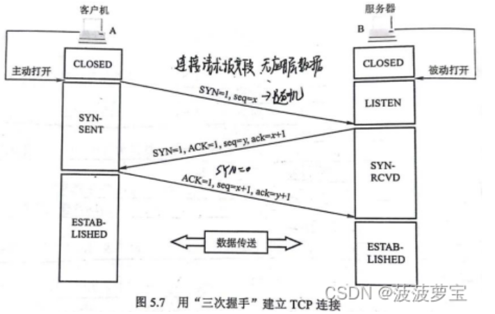
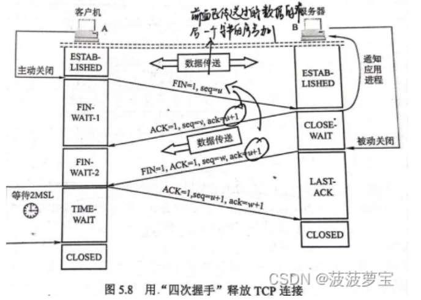

# 计算机网络面试篇

# 网络模型

## 网络OSI模型和TCP/IP模型分别介绍一下

- OSI分为：应用层、表示层、会话层、传输层、网络层、数据链路层以及物理层。

  - 应用层，负责给应用程序提供统一的接口；
  - 表示层，负责把数据转换成兼容另一个系统能识别的格式；
  - 会话层，负责建立、管理和终止表示层实体之间的通信会话；
  - 传输层，负责端到端的数据传输；
  - 网络层，负责数据的路由、转发、分片；
  - 数据链路层，负责数据的封帧和差错检测，以及 MAC 寻址；

  - 物理层，负责在物理网络中传输数据帧；

- TCP/IP分为：应用层、传输层、网络层、链路层

  - 应用层 支持 HTTP、SMTP 等最终用户进程
  - 传输层 处理主机到主机的通信（TCP、UDP）
  - 网络层 寻址和路由数据包（IP 协议）

  - 链路层 通过网络的物理电线、电缆或无线信道移动比特

## 键入网址到网页显示，期间发生了什么？

- **DNS 查找**：浏览器使用 DNS 协议查找你输入的网址url对应的服务器 IP 地址。
- **建立 TCP 连接**：浏览器通过 TCP 协议与服务器建立连接，确保数据能可靠地传输。
- **发送 HTTP 请求**：浏览器使用 HTTP 或 HTTPS 协议向服务器发送请求，请求网页数据。
- **获取数据**：服务器通过 HTTP 或 HTTPS 响应浏览器，返回网页内容（如 HTML、CSS、图片等资源）。
- **渲染页面**：浏览器解析并渲染网页，将内容显示在屏幕上。

# 应用层- HTTP

## 应用层有哪些协议？

HTTP、HTTPS、CDN、DNS、FTP、SMTP

## HTTP是什么及HTTP报文有哪些部分？

HTTP 是超文本传输协议。

报文分为：

- 请求报文：
  - **请求行**：包含请求方法、请求的资源路径和 HTTP 协议版本。`GET /index.html HTTP/1.1`
  
  - **请求头**：一组键值对，包含客户端和请求相关的附加信息。
  
    - `Host`: 请求的目标主机地址。
  
    - 客户端能够处理的内容类型`Accept`：`application/json`等
    - 认证信息`Authorization`
    - `Range`指定字节范围。
  
  - **空行**：请求头和请求体之间必须有一个空行。
  
  - **请求体**：可选部分，包含发送到服务器的数据（仅在一些请求方法如 `POST`、`PUT` 中存在）。
  
- 响应报文：
  - **状态行**：包含 HTTP 协议版本、状态码和状态说明。`HTTP/1.1 200 OK`
  - **响应头**：包含与响应相关的附加信息
    - 返回内容的类型`Content-Type`：`application/json`等
    - `Content-Length`：响应体的长度。
  - **空行**：响应头和响应体之间也有一个空行。
  - **响应体**：实际的内容部分，即服务器返回的资源（如 HTML 页面、图片、JSON 数据等）。

## HTTP是怎么传输数据的

1. **客户端发起请求：**当用户在浏览器中输入网址或点击链接时，浏览器会发起一个 HTTP 请求，向目标服务器请求数据，构建请求报文。
2. 浏览器首先将请求的域名通过 DNS（Domain Name System）解析为 IP 地址。
3. 建立 TCP 连接
4. 发送 HTTP 请求
5. **服务器处理请求**：服务器接收到请求后，根据请求的路径、方法等进行处理。例如，如果请求的是一个静态资源（如 HTML 文件、图片），服务器直接返回该资源。如果是动态内容（如数据库查询），服务器则可能会执行一些脚本（如 PHP、Node.js 或 Java）来生成响应内容。
6. **服务器响应请求**：构建响应报文。
7. 客户端接受响应，解析报文并渲染在浏览器。
8. 如果是长连接，则等待，如果连接不需要则四次挥手拜拜。

## HTTP常用的状态码？

- 2xx 类状态码表示服务器**成功**处理了客户端的请求，也是我们最愿意看到的状态。
- 3xx 类状态码表示客户端请求的资源发生了变动，需要客户端用新的 URL 重新发送请求获取资源，也就是**重定向**。
- 4xx 类状态码表示客户端发送的**报文有误**，服务器无法处理，也就是错误码的含义。
- 5xx 类状态码表示客户端请求报文正确，但是**服务器处理时内部发生了错误**，属于服务器端的错误码。

**常见的包括：**

- 200：请求成功；
- 301：永久重定向；302：临时重定向；
- 404：无法找到此页面；405：请求的方法类型不支持；
- 500：服务器内部出错。502 Bad Gateway（收到无效的响应）。504 Gateway Time-out（超时）。

## GET和POST的使用场景，有哪些区别？

- **幂等性**
  - GET：多次发送相同的 GET 请求，结果是相同的，不会对服务器的数据产生副作用。
  - POST：POST 请求可能会修改服务器上的资源，每次请求可能会产生不同的效果。

- **参数传递**
  - GET：参数通过 URL 传递，通常附加在 `?` 后面。
  - POST：参数放在请求体中，而不是 URL 中，可以传递大量数据
- **可缓存**：
  - GET：浏览器和中间代理服务器可以缓存 GET 请求的结果，以提高性能。
  - POST：POST 请求的结果通常不可缓存。
- **用途**：
  - GET：**适用于查询操作**：当请求只涉及查询数据时，应该使用 GET。
  - POST：**适用于提交操作**：当请求涉及创建或修改数据时，应该使用 POST。

## HTTP的长连接是什么（KeepAlive）

**HTTP 长连接**（也称为持久连接）指的是在一个 TCP 连接中，客户端和服务器可以多次发送和接收 HTTP 请求和响应，而不需要为每个请求都建立新的连接。这与传统的 **短连接**（每次请求都建立一个新的 TCP 连接）不同，长连接能够减少连接建立和关闭的开销，提高性能。

- **HTTP/1.1**：
  - 引入了持久连接的概念，默认情况下，HTTP/1.1 的连接是持久的，不再像 HTTP/1.0 中那样每次请求都关闭连接。
- **HTTP/2：**
  - 在长连接的基础上进行了优化，引入了多路复用机制。在一个连接上，多个请求和响应可以并行传输，而无需等待前一个请求完成。这进一步提升了效率。

HTTP/1.1默认使用长连接，也可以使用在请求或响应头中显示的使用`Connection: keep-alive`来开启长连接。

## HTTP和HTTPS的区别

- **安全性：**
  - HTTP是超文本传输协议，信息是明文传输，存在安全风险。
  - HTTPS在HTTP引入**SSL/TLS**安全协议，使得报文可以加密传输。
- **连接建立：**
  - HTTP建立相对简单，TCP三次握手即可进行HTTP报文传输。
  - HTTPS不仅需要TCP三次握手，还需要 SSL/TLS 的握手过程，才可进入加密报文传输。
- **默认端口：**
  - HTTP采用80，HTTPS采用443
- **安全验证：**
  - **HTTPS 协议需要向 CA（证书权威机构）申请数字证书，来保证服务器的身份是可信的。**CA 通过验证证书持有者的身份并签发证书，从而保证了服务器的身份。只有在 **证书由受信任的 CA 签发**，客户端（如浏览器）才会信任该证书，从而建立安全的 HTTPS 连接。**自签名证书**（即自己签发的证书）不需要 CA，但浏览器通常会显示警告，因为它不能验证该证书的合法性。

## HTTPS握手过程

HTTPS除了TCP三次握手外，还有TLS四次通信，我们这里着重讲一下tls四次握手

- **TLS 第一次握手：客户端Hello（Client Hello）**

  客户端向服务器发送一个**ClientHello**消息，消息中包含：

  - 支持的TLS版本（如TLS 1.2或TLS 1.3）
  - 支持的加密套件（如AES、RSA、ECDSA等）
  - 客户端随机数**Client Random**（用于后续的加密密钥生成）

- **TLS 第二次握手：服务器Hello（Server Hello）**

  服务器收到**ClientHello**消息后，选择一个TLS版本和加密套件，并向客户端发送**ServerHello**消息，内容包括：

  - 选择的TLS版本及加密套件
  - 服务器随机数**Server Random**（用于后续的加密密钥生成）
  - 服务器**数字证书（包括公钥等信息）**

- **TLS 第三次握手：客户端回应** 

  客户端收到服务器的回应之后，首先通过浏览器或者操作系统中的 CA 公钥，确认服务器的数字证书的真实性。如果证书没有问题，客户端会**从数字证书中取出服务器的公钥**，然后使用它加密报文，向服务器发送如下信息：
  
  - 一个随机数**pre-master key**，该随机数会被服务器公钥加密。
  - 加密通信算法改变通知，表示随后的信息都将用「会话秘钥」加密通信。
  - 客户端握手结束通知，表示客户端的握手阶段已经结束。
  
  服务器和客户端有了这三个随机数（Client Random、ServerRandom、pre-master key），接着就用双方协商的加密算法，各自生成本次通信的「会话秘钥」。
  
- **TLS 第四次握手：服务器的最后回应** 

  服务器收到客户端的第三个随机数（`pre-master key`）之后，通过协商的加密算法，计算出本次通信的「会话秘钥」。然后，向客户端发送最后的信息：

  - 加密通信算法改变通知，表示随后的信息都将用「会话秘钥」加密通信。
  - 服务器握手结束通知，表示服务器的握手阶段已经结束。

至此，整个 TLS 的握手阶段全部结束。接下来，客户端与服务器进入加密通信，就完全是使用普通的 HTTP 协议，只不过用「会话秘钥」加密内容。

## HTTPS一定安全可靠吗

HTTPS本身是没有任何漏洞的，即使成功被中间人进行网络攻击，本质上是利用了客户端的漏洞（用户点击继续访问或被恶意导入伪造的根证书），而这并不是HTTPS的问题。

抓包工具也是同理，也是一个中间人的角色。

- 中间人与真实服务端建立连接是正常的，因为服务端并不会校验客户端身份。
- 而中间人与客户端建立连接，这里会有信任的问题，也就是中间人作为服务端要有对应域名的私钥。而中间人能拿到对应域名的私钥只能通过：
  - 去网站服务端拿到私钥；
  - 去CA处拿域名签发私钥；
  - 自己签发证书，但是会被浏览器拦截，需要被信任；
- 很明显，抓包工具对HTTPS抓包使用私钥是第三种方式，需要在客户端安装 Fiddler 的根证书，这里实际上起认证中心（CA）的作用。
- 抓包工具会往系统受信任的根证书列表中导入抓包工具生成的证书，而这个证书会被浏览器信任，也就是抓包工具给自己创建了一个认证中心 CA，客户端拿着中间人签发的证书去中间人自己的 CA 去认证，当然认为这个证书是有效的。

## 平时使用什么来抓包

- **tcpdump**

​	linux使用tcpdump抓取和分析网络流量

- **fiddler**

  用于 Web 流量的抓包与分析。它提供图形化界面，适合开发者和测试人员使用。

## HTTP/1.1性能及特点

HTTP 最突出的优点是「简单、灵活和易于扩展、应用广泛和跨平台」。

HTTP 协议里有优缺点一体的**双刃剑**，分别是「无状态、明文传输」，同时还有一大缺点「不安全」。

- 无状态
  - 好处：不需要记录状态信息，服务器压力小
  - 坏处：完成关联操作需要其他组件帮助，比如cookie
- 明文：这个就显而易见了，方便调试但不安全。安全这个问题在HTTPS中引入**SSL/TLS** 层才得已解决。

**HTTP/1.1**

- 特点：
  - **持久连接（Keep-Alive）：**HTTP/1.1 默认支持持久连接
  - **管道化（Pipelining）**：允许客户端在发送请求时不必等待前一个请求的响应，可以同时发送多个请求。但是**HTTP/1.1 管道解决了请求的队头阻塞，但是没有解决响应的队头阻塞**。**但HTTP/1.1默认并没有使用管道化技术**。

##  /2 /3分别做了什么优化

**HTTP/1.1**

- 特点：
  - **持久连接（Keep-Alive）：**HTTP/1.1 默认支持持久连接
  - **管道化（Pipelining）**：允许客户端在发送请求时不必等待前一个请求的响应，可以同时发送多个请求。但是**HTTP/1.1 管道解决了请求的队头阻塞，但是没有解决响应的队头阻塞**。**但HTTP/1.1默认并没有使用管道化技术**。

**HTTP/2**

- 特点：
  - **二进制协议**：HTTP/2 将 HTTP/1.x 的文本协议改为二进制协议。二进制协议在解析和传输时更加高效。比如将`status: 200 OK `的编码改为`1000 1000`。
  - **头部压缩（Header Compression）**：HTTP/2 使用 HPACK 压缩头部信息，减少了由于重复头部数据（如 cookies、用户代理等）导致的带宽浪费。使用**静态表来减少重复传输，**静态表的目的是通过使用预定义的常见头部来减少重复传输。
  - **多路复用（Multiplexing）**：HTTP/2 通过允许在同一个连接中并行发送多个请求和响应，解决了 HTTP/1.x 中的队头阻塞问题。多个请求的响应可以交错地返回，不会相互阻塞。虽然解决了HTTP的队头阻塞问题，但还是**存在TCP的队头阻塞问题**，因为TCP是字节流协议，所以必须是完整且连续的，一旦发生丢包现象，会触发TCP的重传机制，那么这个TCP连接中的所有HTTP请求都会等待这个丢了的包被传回来。
  - **服务器推送（Server Push）**：HTTP/2 允许服务器在客户端请求之前主动推送资源。例如，当浏览器请求一个 HTML 页面时，服务器可以提前推送该页面依赖的 CSS 和 JavaScript 文件，减少客户端的请求次数。

**HTTP/3** 

- 特点：
  - **基于 QUIC 协议**：HTTP/3 放弃了传统的 TCP 协议，改为使用 QUIC（Quick UDP Internet Connections）协议，基于 UDP 传输。QUIC 本身解决了 TCP 中的许多问题，如连接建立时间长、丢包恢复慢等。
  - **减少连接建立延迟**：QUIC 实现了 0-RTT（零延迟连接），意味着客户端和服务器可以在一次往返（RTT）内完成握手，降低了延迟。
  - **多路复用不再受限于队头阻塞**：由于 QUIC 是基于 UDP 的，数据包的丢失不会导致其他请求的阻塞，因此解决了 HTTP/2 中可能出现的队头阻塞问题。                 
  - **内置加密**：QUIC 协议强制使用加密（TLS 1.3），提高了数据传输的安全性和隐私性。

## 如何优化HTTP/1.1

- **使用缓存技术：**保存相同请求的响应数据，如果缓存没有过期就直接读取本地缓存的响应数据。如果缓存过期，客户端发送请求的时候带上响应数据的摘要，服务器比对后发现资源没有变化就发出不带包体的 304 响应，告诉客户端缓存的响应仍然有效。
- **减少HTTP请求次数：**
  - 将交由客户端处理的重定向请求交由代理服务器，减少重定向次数。
  - 多个小资源合并成一个大资源减少HTTP请求次数。
  - 按需访问资源，只访问看得到的资源。
- **压缩响应资源，减少传输资源大小。**仿照HTTP2进行优化。

## 如何优化HTTPS

- **协议优化：**
  - 密钥交换算法选择安全性、性能更高的ECDHE算法，而不是RSA算法。
  - 升级TLS
- **证书优化：**
  - 服务器使用ECDSA证书，而不是RSA证书。
- **会话重用：**会话可以在1RTT的时间内恢复会话。会话虽好，但有风险，需要一个合理的而过期时间
  - Session ID
  - Session Ticket

## HTTP进行TCP连接之后，在什么情况下会中断

- 当服务端或者客户端执行 close 系统调用的时候，会发送FIN报文，就会进行四次挥手的过程
- 当发送方发送了数据之后，接收方超过一段时间没有响应ACK报文，发送方重传数据达到最大次数的时候，就会断开TCP连接
- 当HTTP长时间没有进行请求和响应的时候，超过一定的时间，就会释放连接

## HTTP、SOCKET和TCP的区别

- HTTP是一种用于传输超文本数据的应用层协议，用于在客户端和服务器之间传输和显示Web页面。
- Socket是计算机网络中的一种抽象，用于描述通信链路的一端，提供了底层的通信接口，可实现不同计算机之间的数据交换。
- TCP是一种面向连接的、可靠的传输层协议，负责在通信的两端之间建立可靠的数据传输连接。

## 既然有 HTTP 协议，为什么还要有 RPC？

早期的HTTP和RPC（远程过程调用）都来自于TCP协议，只不过是各式各样加了消息头消息体的TCP。

那为什么会有两个不同的协议呢？因为早期的网络结构，自己公司的服务器只用服务自己的客户即可，用RPC就可以满足这样的需求，也就是CS的架构。但是随着互联网的发展，浏览器出现了，要求不仅能访问自家服务器，还要能访问别家服务器，这时候BS架构出现了。

- HTTP主要用于B/S架构，RPC更多用于C/S架构，现在提倡多端融合，所以C/S，B/S架构也在慢慢融合。对外HTTP，对内RPC协议。
- RPC 本质上不算是协议，而是一种调用方式，而像 gRPC 和 Thrift 这样的具体实现，才是协议，它们是实现了 RPC 调用的协议。
- RPC出现早，比主流的HTTP/1.1性能还好，历史遗留问题。

## 既然有 HTTP 协议，为什么还要有 WebSocket？

- TCP 协议本身是**全双工**的，但我们最常用的HTTP/1.1，虽然是基于 TCP 的协议，但它是**半双工**的，对于大部分需要服务器主动推送数据到客户端的场景，都不太友好，因此我们需要使用支持全双工的 WebSocket 协议。
- 在 HTTP/1.1 里，只要客户端不问，服务端就不答。基于这样的特点，对于登录页面这样的简单场景，可以使用**定时轮询或者长轮询**的方式实现**服务器推送**(comet)的效果。
- 对于客户端和服务端之间需要频繁交互的复杂场景，比如网页游戏，都可以考虑使用WebSocket 协议。
- WebSocket 和 socket 几乎没有任何关系，只是叫法相似。
- 正因为各个浏览器都支持 HTTP协议，所以WebSocket 会先利用HTTP协议加上一些特殊的header头进行握手升级操作，升级成功后就跟HTTP 没有任何关系了，之后就用 WebSocket的数据格式进行收发数据。

## 如何监控WebSocket连接的存活情况

监控 WebSocket 连接存活情况的关键是通过心跳机制（Ping/Pong）、超时机制、连接状态检查、错误处理和客户端重连机制等多种手段，及时检测和处理失效的连接。你可以根据具体需求来选择和结合这些策略，确保 WebSocket 通信的稳定性和可靠性。

- **心跳机制 (Ping/Pong)**：定期发送 `Ping` 消息，客户端回复 `Pong`，如果在规定时间内没有回复，认为连接已断开。

**- 定时检查连接状态**：定期检查每个连接的状态，若发现连接不可用（如断开），则关闭并移除该连接。

**- 超时机制**：如果在一定时间内没有接收到消息或心跳，认为连接超时并关闭连接。

- **监听 `close` 和 `error` 事件**：通过监听 WebSocket 的 `close` 和 `error` 事件，及时捕获连接异常并处理。

**- 客户端重连机制**：当连接断开时，客户端可以自动尝试重新连接服务器。

## HTTPS 中 TLS 和 TCP 能同时握手吗？

**HTTPS 是先进行 TCP 三次握手，再进行 TLSv1.2 四次握手**

HTTPS 中的 TLS 握手过程可以同时进行三次握手只有在以下两个情景都满足的情况下才可以：

- **客户端和服务端都开启了 TCP Fast Open 功能，且 TLS 版本是 1.3**
- **客户端和服务端已经完成过一次通信**

## Nginx位于哪一层，负载均衡有哪些算法

Nginx位于应用层。其负载均衡算法包括：轮询、加权轮询、IP哈希、URL哈希、最少连接等等。
虽然Nginx工作在应用层，但进行TCP/UDP负载均衡时也会涉及到传输层。

# 应用层-安全

## 对称加密与非对称加密？

- **对称加密：**加密和解密用同一个密钥。
  - 速度快，但需要安全地交换密钥。
  - 如果密钥泄露，安全性就没保障。
- 非对称加密
  - 非对称加密使用**一对密钥**：一个是**公钥**（public key），另一个是**私钥**（private key）。**公钥**用于加密，**私钥**用于解密。公钥可以公开，任何人都可以使用公钥加密数据，但只有私钥持有者才能解密。
  - 反之，私钥加密的数据只能用公钥解密。
    - 私钥加密通常不是用于保密消息，而是用于**数字签名**。
    - **私钥加密**并不是加密消息内容，而是对消息的**数字签名**。**公钥解密**用于验证签名是否来自持有该私钥的人。

## SSL/TLS 用什么机制机制保证传输的安全

- **加密**：使用加密算法（如对称加密）来确保数据在传输过程中无法被窃听或篡改。

- **身份验证**：使用数字证书（由受信任的证书机构签发）来确认通信双方的身份，确保你与正确的服务器通信，而不是被攻击者冒充。

- **完整性校验**：通过消息认证码（MAC）确保传输的数据没有被篡改，接收方能验证数据的完整性。

- **密钥交换**：通过非对称加密算法（如RSA）安全地交换密钥，确保双方在建立连接时使用的加密密钥是安全的。

## https涉及对称加密及非对称加密是什么

- 在 HTTPS 中，对称加密通常用于实际的数据传输加密。因为对称加密的算法相对简单，速度较快，所以在连接建立后，所有的请求和响应数据都使用对称加密进行加密和解密。
- 在 HTTPS 中，非对称加密主要用于**密钥交换**和**身份验证**。在建立连接时，客户端和服务器通过非对称加密交换一个对称加密密钥（即称为“会话密钥”）。一旦会话密钥交换完成，后续的通信就会使用对称加密。

## cookie和session有什么区别？

- 存储位置：
  - Cookie：存储在客户端浏览器中。
  - Session：存储在服务器端。浏览器会存储一个唯一的 **Session ID**，这个 ID 会在每次请求时被发送到服务器，服务器根据这个 ID 来找到与之对应的会话数据。
- 生命周期：
  - Cookie：可以设置过期时间，过期后自动删除。也可以设置为会话Cookie，即浏览器关闭时自动删除。
  - Session：在默认情况下，当用户关闭浏览器时，Session结束。如果用户长时间没有活动，服务器通常会自动销毁 Session 或设置一个过期时间。
- 安全及存储：
  - Cookie 数据不安全，每个 Cookie 存储的内容是有限的。
  - Session 数据存储在服务器端，存储容量几乎没有限制。

## token，session，cookie的区别？

- session存储于服务器，可以理解为一个状态列表，拥有一个唯一识别符号sessionId，通常存放于cookie中。服务器收到cookie后解析出sessionId，再去session列表中查找，才能找到相应session，依赖cookie。
- cookie类似一个令牌，装有sessionId，存储在客户端，浏览器通常会自动添加。
- token也类似一个令牌，无状态，用户信息都被加密到token中，服务器收到token后解密就可知道是哪个用户，需要开发者手动添加。

## 什么数据应该存在到cookie，什么数据存放到 Localstorage

Cookie 适合用于在客户端和服务器之间传递数据、跨域访问和设置过期时间，而 LocalStorage适合用于在同一域名下的不同页面之间共享数据、存储大量数据和永久存储数据。

- 存储容量:
  - Cookie 的存储容量通常较小,每个 Cookie 的大小限制在几 KB 左右。
  - LocalStorage 的存储容量通常较大,一般限制在几 MB 左右。
- 数据发送:
  - Cookie 在每次 HTTP 请求中都会自动发送到服务器
  - localStorage 的数据不会自动发送到服务器,它仅在浏览器端存储数据,因此 LocalStorage 适合用于在同一域名下的不同页面之间共享数据;
- 生命周期：
  - Cookie 可以设置一个过期时间,使得数据在指定时间后自动过期。
  - LocalStorage 的数据将永久存储在浏览器中,除非通过JavaScript 代码手动删除
- 安全性：
  - Cookie 的安全性较低,因为 Cookie 在每次 HTTP 请求中都会自动发送到服务器,存在被窃取或篡改的风险。
  - LocalStorage 的数据仅在浏览器端存储，相对而言更安全一些。

## http的cookie有安全泄漏吗？

- **未加密的传输（不使用 HTTPS）**
  - 如果网站仅使用 HTTP（而不是 HTTPS）传输数据，Cookie 信息在网络中是明文传输的，容易被中间人攻击（MITM，Man-in-the-Middle Attack）。
- **跨站脚本攻击（XSS）**
  - XSS（Cross-Site Scripting）攻击使得恶意脚本能够注入到网站页面中。当攻击者能够将恶意 JavaScript 注入到页面时，恶意脚本可能访问存储在 Cookie 中的敏感信息，进而窃取用户的身份验证信息或其他重要数据。

一般**使用 Cookie 并设置 `Secure` 和 `HttpOnly` 标志**是一个较好的选择。

- 可以使用 `Secure` 标志确保 Cookie 仅通过 HTTPS 传输，防止中间人攻击。
- 可以使用 `HttpOnly` 标志，防止 JavaScript 访问 Cookie，提高安全性，减少 XSS 攻击风险。

## JWT 令牌和传统方式有什么区别?

- 无状态性：JWT是无状态的令牌，不需要在服务器端存储会话信息。JWT令牌中包含了所有必要的信息，如用户身份、权限等。这使得JWT在分布式系统中更加适用，可以方便地进行扩展和跨域访问。
- 安全性：JWT使用密钥对令牌进行签名，确保令牌的完整性和真实性。只有持有正确密钥的服务器才能对令牌进行验证和解析。
- 跨域支持：JWT令牌可以在不同域之间传递，适用于跨域访问的场景。通过在请求的头部或参数中携带JWT令牌，可以实现无需Cookie的跨域身份验证。

## JWT 令牌都有哪些字段？

JWT令牌由三个部分组成：**头部（Header）、载荷（Payload）和签名（Signature）**。头部和载荷均为JSON格式，使用Base64编码进行序列化，而签名部分是对头部、载荷和密钥进行签名后的结果。

## JWT 令牌为什么能解决集群部署，什么是集群部署？

在传统的基于会话和Cookie的身份验证方式中，会话信息通常存储在服务器的内存或数据库中。但在集群部署中，不同服务器之间没有共享的会话信息，这会导致用户在不同服务器之间切换时需要重新登录，或者需要引入额外的共享机制（如Redis），增加了复杂性和性能开销。

当用户进行登录认证后，服务器将生成一个JWT令牌并返回给客户端。客户端在后续的请求中携带该令牌，服务器可以通过对令牌进行验证和解析来获取用户身份和权限信息而无需访问共享的会话存储。

由于JWT令牌是自包含的，服务器可以独立地对令牌进行验证，而不需要依赖其他服务器或共享存储。这使得集群中的每个服务器都可以独立处理请求，提高了系统的可伸缩性和容错性。

## JWT 令牌如果泄露了，怎么解决，JWT是怎么做的？

- 黑名单制度或失效制度：因为JWT令牌派发后无法撤回，所以可以将泄露的令牌添加到黑名单或失效状态，在验证时先检查是否存在于黑名单或者是否失效。
- 刷新令牌：JWT令牌通常具有一定的有效期，过期后需要重新获取新的令牌。

## 前端是如何存储JWT的？

前端存储 JWT 令牌有几种常见的方式，主要包括 **localStorage**、**sessionStorage** 和 **cookie**。

一般**使用 Cookie 并设置 `Secure` 和 `HttpOnly` 标志**是一个较好的选择。

- 自动随每个请求发送，便于服务器进行身份验证。
- 可以使用 `Secure` 标志确保 Cookie 仅通过 HTTPS 传输，防止中间人攻击。
- 可以使用 `HttpOnly` 标志，防止 JavaScript 访问 Cookie，提高安全性，减少 XSS 攻击风险。

因为每次请求都携带Cookie，所以会导致额外的性能开销。

## 建立连接后，服务端怎么确认客户端发送的消息有没有被篡改过，恶意篡改怎么办

- **使用哈希校验：**对消息进行哈希处理，然后将哈希值发送给服务端。服务端收到消息后，重新计算消息的哈希值，并与客户端发送的哈希值进行比对。
  - 只能检测数据是否被篡改，但无法防止恶意用户伪造消息及其哈希值。因此需要对这个哈希值进行加密。

- **使用消息认证码**
  - 客户端和服务端共享一个秘密密钥,客户端在发送消息时，使用该密钥和消息内容生成 MAC 值（如 HMAC-SHA256）。

- **使用数字签名：**数字签名是一种更加安全的方法，广泛应用于消息认证、身份验证和防篡改。在数字签名中，**客户端使用自己的私钥对消息进行签名，服务端则使用客户端公钥验证签名的有效性。**
  - 客户端使用自己的私钥对消息进行签名，生成数字签名。
  - 客户端将消息和签名一起发送给服务端。
  - 服务端收到消息后，使用客户端的公钥验证签名。如果签名有效，说明消息是由客户端发送且未被篡改；如果签名无效，则说明消息被篡改或伪造。
- **加密通信（如 TLS/SSL）：**通过加密的方式（如 **TLS/SSL** 协议），可以确保消息的内容在传输过程中不被篡改，同时也能验证消息的完整性和来源。TLS/SSL 协议利用对称加密和公钥加密技术，在客户端与服务端之间建立一个安全的通道。
  - 客户端和服务端在建立连接时，通过 **握手协议** 协商加密算法和密钥。
  - 通过加密的通信通道传输消息，保证消息在传输过程中的机密性和完整性。
  - 如果消息在传输过程中被篡改，接收方会发现校验失败。

# 传输层-TCP连接

## TCP三次握手过程



- 一开始，客户端和服务端都处于 CLOSE 状态。先是服务端主动监听某个端口，处于 LISTEN 状态。
- 客户端会随机初始化序号（client_isn），将此序号置于 TCP 首部的「序号」字段中，同时把 SYN 标志位置为 1，表示 SYN 报文。接着把第一个 SYN报文发送给服务端，表示向服务端发起连接，该报文不包含应用层数据，之后客户端处于 SYN-SENT状态。
- 服务端收到客户端的 SYN 报文后，首先服务端也随机初始化自己的序号（server_isn）,将此序号填入 TCP 首部的「序号」字段中，其次把 TCP 首部的「确认应答号」字段填入 client_isn + 1, 接着把 SYN 和 ACK 标志位置为 1。最后把该报文发给客户端，该报文也不包含应用层数据，之后服务端处于 SYN-RCVD 状态。
- 客户端收到服务端报文后，还要向服务端回应最后一个应答报文，首先该应答报文 TCP 首部 ACK 标志位置为 1 ，其次「确认应答号」字段填入server_isn + 1 ，最后把报文发送给服务端，**这次报文可以携带客户到服务端的数据**，之后客户端处于 ESTABLISHED 状态。

从上面的过程可以发现**第三次握手是可以携带数据的，前两次握手是不可以携带数据的**，这也是面试常问的题。

## 客户端发送的第一个 SYN 报文，服务器没有收到怎么办？

- 当客户端想和服务端建立 TCP 连接的时候，首先第一个发的就是 SYN 报文，然后进入到 SYN_SENT 状态。

- 如果客户端迟迟收不到服务端的 SYN-ACK 报文（第二次握手）就会触发「超时重传」机制，重传 SYN 报文，而且**重传的 SYN 报文的序列号都是一样的**。**每次超时的时间是上一次的 2 倍**。

- 当客户端超时重传 3 次 SYN 报文后，如果还是没能收到服务端的第二次握手（SYN-ACK 报文），那么客户端就会断开连接。

## 服务器收到第一个 SYN 报文，回复的 SYN + ACK 报文丢失了怎么办？

- 当服务端收到客户端的第一次握手后，就会回 SYN-ACK 报文给客户端，这个就是第二次握手，此时服务端会进入 SYN_RCVD 状态。

- 因为第二次握手报文里是包含对客户端的第一次握手的 ACK 确认报文，所以，如果客户端迟迟没有收到第二次握手，那么客户端就觉得可能自己的 SYN 报文（第一次握手）丢失了，于是**客户端就会触发超时重传机制，重传 SYN 报文**。
- 因为第二次握手中包含服务端的 SYN 报文，所以当客户端收到后，需要给服务端发送 ACK 确认报文（第三次握手），服务端才会认为该 SYN 报文被客户端收到了。**服务端这边会触发超时重传机制，重传 SYN-ACK 报文**。

## TCP 三次握手，客户端第三次发送的确认包丢失了发生什么？

客户端收到服务端的 SYN-ACK 报文后，就会给服务端回一个 ACK 报文，也就是第三次握手，此时客户端状态进入到 ESTABLISH 状态。

因为这个第三次握手的 ACK 是对第二次握手的 SYN 的确认报文，所以当第三次握手丢失了，如果服务端那一方迟迟收不到这个确认报文，就会触发超时重传机制，重传 SYN-ACK 报文，直到收到第三次握手，或者达到最大重传次数。

注意，**ACK 报文是不会有重传的，当 ACK 丢失了，就由对方重传对应的报文**。

## 第一次握手，客户端发送SYN报后，服务端回复ACK报，那这个过程中服务端内部做了哪些工作？

- 服务端收到客户端发起的 SYN 请求后，**内核会把该连接存储到半连接队列**，并向客户端响应 SYN+ACK。

- 接着客户端会返回 ACK，服务端收到第三次握手的 ACK 后，**内核会把连接从半连接队列移除，然后创建新的完全的连接，并将其添加到 accept 队列**，等待进程调用 accept 函数时把连接取出来。

- 不管是半连接队列还是全连接队列，都有最大长度限制，超过限制时，内核会直接丢弃，或返回 RST 包。

## 如何防御 SYN 攻击？

- **增大半连接和全连接队列**
- **开启tcp_syncookies功能**
  - 客户端发来第一次握手SYN时，服务端不会将其放入半连接队列中，而是直接生成一个`cookies`，这个`cookies`会跟着第二次握手，发回客户端。客户端在发第三次握手的时候带上这个`cookies`，服务端验证到它就是当初发出去的那个，就会建立连接并放入到全连接队列中。可以看出整个过程不再需要半连接队列的参与。`cookies`并没有队列保存，而是实时计算的。同时因为cookie出现带来编码和解码的问题，比较耗CPU。
  - 也会带来ACK攻击，瞎编的`cookie`CPU也会进行解析，从而导致CPU资源耗尽。
- **减少 SYN+ACK 重传次数，限制只能重传一次**

## SYN报文什么时候会被丢弃

- 半连接队列满了（如果开启了tcp_syncookies，即使半连接队列满了也不会丢弃syn报文）
  - 解决方法：参考**如何防御SYN攻击**
- 全连接队伍满了
  - 解决方法：调大全连接队列。检查为啥调用accept()不及时。

## 已经建立连接的TCP，还收到SYN会发生什么？

客户端掉线了，服务器并不知道，客户端再上线时发起SYN握手，会发生什么？

**检查四元组（源 IP 地址、源端口号、目标 IP 地址、目标端口号）是否一样。**

- 如果端口号不同，会建立新的TCP连接，旧的TCP连接服务器发给客户端，客户端会回复RST报文，以让服务端断开旧的连接。
- 如果端口号相同
  - 判断SYN携带的序列号在不在窗口内，不在的话丢弃。
  - 如果 **RST** 标志被设置，则会丢弃并重置连接。
  - 如果 **SYN** 标志被设置且序列号合法，服务端可能会进入 **SYN Challenge** 状态，发送挑战 ACK 来进行验证。挑战成功则发送最终ACK完成三次握手，建立连接。

## 为什么 TCP 每次建立连接时，初始化序列号都要不一样呢？

**防止历史报文被下一个相同四元组的连接接收。**如果上一个连接中被网络阻塞的数据包正好抵达了服务端，刚好该数据包的序列号正好是在服务端的接收窗口内，所以该数据包会被服务端正常接收，就会造成数据错乱。

- 随机数是会基于时钟计时器递增的，基本不可能会随机成一样的初始化序列号。初始化序列号可被视为一个 32 位的计数器，该计数器的数值每 4 微秒加 1，循环一次需要 4.55 小时。
- 为了解决这个问题，就需要有 TCP 时间戳。

## TCP为什么需要三次握手建立连接？

- **防止旧的连接请求影响新的连接**：防止老的确认信息干扰新的连接，比如某些延迟的SYN报文。初始化序列的随机数是根据时间戳生成的，为了避免偶然事件的发生，可以把时间戳从32bit扩大到64bit。
- **三次握手才可以同步双方的初始序列号**
- **确保可靠性**

## 服务端没有 listen，客户端发起连接建立，会发生什么？

`listen` 是用于服务端监听指定端口的函数，告诉操作系统服务端将准备好接受连接请求。`listen` 还会启动一个 **队列** 来保存那些等待连接的请求，当应用程序通过 `accept` 来接受连接时，操作系统会从队列中取出一个请求。

如果服务端没有调用 `listen`，则操作系统不会将该端口标记为可接受连接的状态。即使该端口上有应用程序在运行，操作系统也不会将其分配给该应用程序进行后续的连接处理。在没有 `listen` 的情况下，当客户端发起连接时，服务端操作系统并不会处理这个连接请求。**客户端的 SYN 包会被丢弃，并会收到一个 RST（重置）包作为响应，表明服务端没有准备好接受连接。**

## 不使用 listen ，可以建立 TCP 连接吗？

不使用 listen **，客户端和服务端**是不可以建立 TCP 连接的。

但是**客户端与客户端是可以建立连接的**。

- **客户端是可以自己连自己的形成连接（TCP自连接）**：在没有调用 `listen` 的情况下，客户端程序仍然可以使用 `connect` 成功连接自己，因为操作系统在处理客户端请求时，会直接将请求转发到同一机器上的同一个端口。这里没有服务端监听，因此不会涉及 `accept`，但仍然能够通过操作系统的回环机制（即使用本地回环地址 `127.0.0.1`）完成连接。
- **两个客户端同时向对方发出请求建立连接（TCP同时打开）**：`listen` 函数是服务端监听连接请求时所必需的，它告诉操作系统该端口在等待接受客户端的连接。**客户端之间的连接**并不需要使用 `listen`，它们直接发起SYN连接，操作系统会在本地机器上处理这些请求，最终建立连接。

## TCP自连接或同时打开的情况下，那么客户端会有半连接队列吗？

没有，因为客户端没有执行listen，因为半连接队列和全连接队列都是在执行 listen 方法时，内核自动创建的。

但内核还有个全局 hash 表，可以用于存放 sock 连接的信息。

在 TCP 自连接的情况中，客户端在 connect 方法时，最后会将自己的连接信息放入到这个全局 hash 表中，然后将信息发出，消息在经过回环地址重新回到 TCP 传输层的时候，就会根据 IP + 端口信息，再一次从这个全局 hash 中取出信息。于是握手包一来一回，最后成功建立连接。

TCP 同时打开的情况也类似，只不过从一个客户端变成了两个客户端而已。

## 没有 accept，能建立 TCP 连接吗？

下面一段简化过的服务端伪代码。

```c
/*Step 1: 创建服务器端监听socket描述符listen_fd*/ 
listen_fd = socket(AF_INET, SOCK_STREAM, 0);
/*Step 2: bind绑定服务器端的IP和端口，所有客户端都向这个IP和端口发送和请求数据*/ 
bind(listen_fd, xxx);
/*Step 3: 服务端开启监听*/   
listen(listen_fd, 128);
/*Step 4: 服务器等待客户端的链接，返回值cfd为客户端的socket描述符*/  
cfd = accept(listen_fd, xxx);
/*Step 5: 读取客户端发来的数据*/
n = read(cfd, buf, sizeof(buf));
```

在执行`listen()`方法之后还会执行一个`accept()`方法。**一般情况**下，如果启动服务器，会发现最后程序会**阻塞在**`accept()`里。

- 对socket执行bind方法可以绑定监听端口，然后执行`listen方法`后，就会进入监听（`LISTEN`）状态。内核会为每一个处于`LISTEN`状态的`socket` **分配两个队列，分别叫半连接队列(哈希表)和全连接队列（链表）。**

**`accept方法`只是为了从全连接队列中拿出一条连接，本身跟三次握手几乎毫无关系。**

# 传输层-TCP断开

## TCP四次挥手过程



- 客户端主动调用关闭连接的函数，于是就会发送FIN 报文，这个 FIN 报文代表客户端不会再发送数据了，进入 FIN_WAIT_1 状态；
- 服务端收到了 FIN 报文，然后马上回复一个 ACK 确认报文，此时服务端进入 CLOSE_WAIT 状态。在收到 FIN 报文的时候，TCP 协议栈会为 FIN 包插入一个文件结束符 EOF 到接收缓冲区中，服务端应用程序可以通过 read 调用来感知这个 FIN 包，这个 EOF 会被放在已排队等候的其他已接收的数据之后，所以必须要得继续 read 接收缓冲区已接收的数据；
- 接着，当服务端在 read 数据的时候，最后自然就会读到 EOF，接着 read() 就会返回 0，这时服务端应用程序如果有数据要发送的话，就发完数据后才调用关闭连接的函数，如果服务端应用程序没有数据要发送的话，可以直接调用关闭连接的函数，这时服务端就会发一个 FIN 包，这个 FIN 报文代表服端不会再发送数据了，之后处于 LAST_ACK 状态；
- 客户端接收到服务端的 FIN 包，并发送 ACK 确认包给服务端，此时客户端将进入 TIME_WAIT 状态；
- 服务端收到 ACK 确认包后，就进入了最后的CLOSE 状态；
- 客户端经过 2MSL 时间之后，也进入 CLOSE 状态；

## 第一次挥手丢失了，会发生什么？

当客户端（主动关闭方）调用 close 函数后，就会向服务端发送 FIN 报文，试图与服务端断开连接，此时客户端的连接进入到 FIN_WAIT_1 状态。

正常情况下，如果能及时收到服务端（被动关闭方）的 ACK，则会很快变为 FIN_WAIT2状态。

- 如果第一次挥手丢失了，那么客户端迟迟收不到被动方的 ACK 的话，也就会触发超时重传机制，重传 FIN报文，重发次数由 tcp_orphan_retries 参数控制。

- 当客户端重传 FIN 报文的次数超过tcp_orphan_retries ，默认3次后，就不再发送 FIN 报文，则会在等待一段时间（时间为上一次超时时间的 2 倍），如果还是没能收到第二次挥手，那么客户端直接进入到 close 状态，而服务端还是ESTABLISHED状态。

## 第三次挥手一直没发，会发生什么？

当主动方收到 ACK 报文后，会处于 FIN_WAIT2 状态，就表示主动方的发送通道已经关闭，接下来将等待对方发送 FIN 报文，关闭对方的发送通道。

- 如果连接是用 shutdown 函数关闭的，连接可以一直处于 FIN_WAIT2 状态，因为它可能还可以发送或接收数据。。
- 对于 close 函数关闭的孤儿连接，由于无法再发送和接收数据，所以这个状态不可以持续太久，默认值是 60 秒。**如果在 60 秒后还没有收到 FIN 报文，连接就会直接关闭。**

## 第二次和第三次挥手能合并嘛

当被动关闭方在 TCP 挥手过程中，「**没有数据要发送**」并且「**开启了 TCP 延迟确认机制**」，那么第二和第三次挥手就会合并传输，这样就出现了三次挥手。

- 当有响应数据要发送时，ACK 会随着响应数据一起立刻发送给对方
- 当没有响应数据要发送时，ACK 将会延迟一段时间，以等待是否有响应数据可以一起发送
- 如果在延迟等待发送 ACK 期间，对方的第二个数据报文又到达了，这时就会立刻发送 ACK

## 为什么需要 TIME_WAIT 状态？

**tcp_tw_reuse 的作用是让客户端快速复用处于 TIME_WAIT 状态的端口，相当于跳过了 TIME_WAIT 状态。**好处是可以快速复用，但坏处也很多，所以默认是关闭的。

主动发起关闭连接的一方，才会有 `TIME-WAIT` 状态。需要 TIME-WAIT 状态，主要是两个原因：

- **防止历史连接中的数据，被后面相同四元组的连接错误的接收；**序列号和初试序列号不是无限递增的，会绕回初始值。不能单单依靠序列号来判断新老数据。TIME_WAIT 状态，状态会持续 `2MSL` 时长，足以让两个方向上的数据包都被丢弃，使得原来连接的数据包在网络中都自然消失，再出现的数据包一定都是新建立连接所产生的。
- **保证「被动关闭连接」的一方，能被正确的关闭；**如果第四次挥手的ACK丢失，那么被动关闭连接就无法进入close状态，而如果 TIME_WAIT 就等不到丢失一次的第四次挥手的ACK报文之前的第三次挥手的FIN报文的重传，那么就只能发RST报文来断开连接了，这属于非正常关闭。

## 为什么四次挥手之后的TIME_WAIT要等2MSL?

MSL 是 Maximum Segment Lifetime，**报文最大生存时间**，它是任何报文在网络上存在的最长时间，超过这个时间报文将被丢弃。因为 TCP 报文基于是 IP 协议的，而 IP 头中有一个 TTL 字段，是 IP 数据报可以经过的最大路由数，每经过一个处理他的路由器此值就减 1，当此值为 0 则数据报将被丢弃，同时发送ICMP 报文通知源主机。

- MSL 与 TTL 的区别： MSL 的单位是时间，而 TTL 是经过路由跳数。所以 MSL 应该要大于等于 TTL 消耗为 0 的时间，以确保报文已被自然消亡。
  - TTL 的值一般是 64，Linux 将 MSL 设置为 30 秒，意味着 Linux 认为数据报文经过 64 个路由器的时间不会超过 30 秒，如果超过了，就认为报文已经消失在网络中了。

- TIME_WAIT 等待 2 倍的 MSL，比较合理的解释是：网络中可能存在来自发送方的数据包，当这些发送方的数据包被接收方处理后又会向对方发送响应，所以一来一回需要等待 2 倍的时间。

- 2MSL时长 这其实是相当于至少允许报文丢失一次。比如，若 ACK 在一个 MSL 内丢失，这样被动方重发的 FIN 会在第 2 个 MSL 内到达，TIME_WAIT 状态的连接可以应对。

- **防止历史连接中的数据，被后面相同四元组的连接错误的接收；**

- **保证「被动关闭连接」的一方，能被正确的关闭；**


## 四次挥手中收到乱序的FIN包会如何处理

- 在四次挥手的过程中，乱序的 **FIN** 包会被 TCP 协议栈缓存并重新排序，确保按正确的顺序完成握手和连接关闭。
- 即使 **FIN** 包乱序，TCP 也能通过序列号和缓存机制确保连接的正常关闭，避免丢失数据或错误关闭连接。
- 如果超时或收不到必需的报文，TCP 可能会超时并终止连接。

## TIME_WAIT 过多有什么危害？

- 第一是占用系统资源，比如文件描述符、内存资源、CPU 资源、线程资源等；、
- 第二是占用端口资源，端口资源也是有限的

## 服务器出现大量 TIME_WAIT 状态的原因有哪些？

- **HTTP的短连接：**无论客户端还是服务端哪一方禁用了 HTTP Keep-Alive，都是由服务端主动关闭连接，那么此时服务端上就会出现 TIME_WAIT 状态的连接。
- **HTTP 长连接超时：** HTTP 长连接的超时时间是 60 秒，如果客户端在完后一个 HTTP 请求后，在 60 秒内都没有再发起新的请求，定时器的时间一到，nginx 就会触发回调函数来关闭该连接，那么此时服务端上就会出现 TIME_WAIT 状态的连接。
- **HTTP 长连接的请求数量达到上限：**如果达到这个参数设置的最大值时，则 nginx 会主动关闭这个长连接

## 服务器出现大量 CLOSE_WAIT 状态的原因有哪些？

CLOSE_WAIT 状态是「被动关闭方」才会有的状态，而且如果「被动关闭方」没有调用 close 函数关闭连接，那么就无法发出 FIN 报文，从而无法使得CLOSE_WAIT 状态的连接转变为 LAST_ACK 状态。

当服务端出现大量 CLOSE_WAIT 状态的连接的时候，说明服务端的程序**没有调用 close 函数关闭连接**。

## 在 TIME_WAIT 状态的 TCP 连接，收到 SYN 后会发生什么？

- **TIME_WAIT** 状态下，如果收到来自相同四元组且合法（时间戳大于期望的序列值）的 **SYN** 包，TCP 协议会视为一个新的连接请求，创建新的连接，并使连接从 **TIME_WAIT** 状态转换为 **SYN_RECV**。
  - 如果不合法，服务端会再发一次第四次挥手的ACK，这时候客户端收到的ACK并不是期望的ACK，则会发RST给服务端。
- 如果接收到的 **SYN** 包来自不同的四元组，**TIME_WAIT** 状态将继续保持不变，不会产生影响。

## 在 TIME_WAIT 状态，收到 RST 会断开连接吗？

- 如果 `net.ipv4.tcp_rfc1337` 参数为 0，则提前结束 TIME_WAIT 状态，释放连接。
- 如果 `net.ipv4.tcp_rfc1337` 参数为 1，则会丢掉该 RST 报文。

尽量让该参数为1，保证对应的TIME_WAIT时间足够。

## 客户端 TCP 连接 TIME_WAIT 状态过多，会导致端口资源耗尽而无法建立新的连接吗？

要看客户端是否都是与同一个服务器（目标地址和目标端口一样）建立连接。

- 如果客户端都是与同一个服务器（目标地址和目标端口一样）建立连接，那么如果客户端 TIME_WAIT 状态的连接过多，当端口资源被耗尽，就无法与这个服务器再建立连接了。
- 如果不是一个服务器，那么端口是重复使用的。

## 如果已经建立了连接，但是客户端突然出现故障了怎么办？

客户端出现故障指的是客户端的主机发生了宕机，或者断电的场景。服务端为了探测客户端是否存活，TCP 搞了个**保活机制**。这个机制的原理是这样的：

定义一个时间段，在这个时间段内，如果没有任何连接相关的活动，TCP 保活机制会开始作用，每隔一个时间间隔，发送一个探测报文，该探测报文包含的数据非常少，如果连续几个探测报文都没有得到响应，则认为当前的 TCP 连接已经死亡，系统内核将错误信息通知给上层应用程序。

包括：**保活时间（默认两小时）、保活探测的次数（默认9次）、保活探测的时间间隔（每次间隔75秒）。**

## 在没有开启 TCP keepalive，且双方一直没有数据交互的情况下，主机崩溃（主机宕机）或进程崩溃分别会发生什么？

**TCP 连接的管理**直接依赖于操作系统内核，内核会管理连接的状态，包括连接的创建、数据传输、以及连接的关闭过程。

**主机崩溃**是操作系统是意外的主机的操作系统或硬件发生故障，**主机宕机**是操作系统是可能是有计划的停机。大多数情况下两者可以互换使用。

- **没有数据交互的情况下主机崩溃**
  - 当主机崩溃了，进程无法正常调用`close()`关闭TCP连接，另外一段端是无法感知到的，在加上并没有开启 TCP keepalive，又没有数据交互的情况下，**另外一段端的 TCP 连接将会一直处于ESTABLISHED 连接状态**，直到另外一段端重启进程。
  - 所以，在没有使用 TCP 保活机制且双方不传输数据的情况下，一方的 TCP 连接处在ESTABLISHED 状态，并不代表另一方的连接还一定正常。
- **没有数据交互的情况下进程崩溃**
  - TCP 的连接信息是由内核维护的，所以当**某一端端进程**崩溃后，内核需要回收该进程的所有 TCP 连接资源，于是内核会发送第一次挥手 FIN 报文，后续的挥手过程也都是在内核完成，并不需要进程的参与，所以即使**这一端**的进程退出了，还是能与对方完成TCP 四次挥手的过程。

## 有数据传输的场景，客户端主机宕机，又迅速重启，会发生什么？

**注意，客户端重启会丢失内存中的TCP相关的结构体。**

- **如果客户端主机宕机，又迅速重启**
  - 服务端重传报文的过程中，客户端主机重启完成后，因为丢失了内存中的TCP连接的结构体，所以客户端会回复RST报文，重置该连接。**只要有一方重启完成后，收到之前 TCP 连接的报文，都会回复 RST 报文，用来断开连接后重置该 TCP 连接。**
- **如果客户端一直宕机**
  - 如果服务端向客户端发送的报文会得不到任何的响应，在一定时长后，服务端就会触发**超时重传**机制，重传未得到响应的报文，当重传总间隔时长达到一定阈值后，会断开 TCP 连接。
  - 如果服务端一直不会发送数据，再看服务端有没有开启 TCP keepalive 机制？
    - 如果有开启，服务端在一段时间没有进行数据交互时，会触发 TCP keepalive 机制，探测对方是否存在，如果探测到对方已经消亡，则会断开自身的 TCP 连接；
    - 如果没有开启，服务端的 TCP 连接会一直存在，并且一直保持在 ESTABLISHED 状态。

## 拔掉网线后， 原本的 TCP 连接还存在吗？

**注意，拔网线并不会丢失内存中的TCP相关的结构体。**

- **没有数据传输的情况：**
  - 如果双方都没有开启 TCP keepalive 机制，那么在客户端拔掉网线后，如果客户端一直不插回网线，那么客户端和服务端的 TCP 连接状态将会一直保持存在。
  - 如果双方都开启了 TCP keepalive 机制，那么在客户端拔掉网线后，如果客户端一直不插回网线，TCP keepalive 机制会探测到对方的 TCP 连接没有存活，于是就会断开 TCP 连接。而如果在 TCP 探测期间，客户端插回了网线，那么双方原本的 TCP连接还是能正常存在。

- **有数据传输的情况：**
  - 在客户端拔掉网线后，如果服务端发送了数据报文，那么在服务端**重传次数没有达到最大值之前**，客户端就插回了网线，那么双方原本的 TCP 连接还是能正常存在，就好像什么**事情都没有发生**。
  - 在客户端拔掉网线后，如果服务端发送了数据报文，在客户端插回网线之前，服务端**重传次数达到了最大值时**，服务端就会断开 TCP 连接。等到客户端插回网线后，向服务端发送了数据，因为服务端已经断开了与客户端相同四元组的 TCP 连接，所以就会**回 RST 报文**，客户端收到后就会断开 TCP连接。至此， 双方的 TCP 连接都断开了。

## 如何关闭一个TCP连接

- 最粗暴就是kill进程
- 使用工具
  - killcx：killcx 工具可以用来**关闭活跃和非活跃的 TCP 连接**，因为 killcx 工具是主动发送 SYN 报文，这时对方就会回复 Challenge ACK ，然后 killcx 工具就能从这个 ACK 获取到正确的序列号。从而给两端发RST来断开TCP连接。
  - tcpkill：只能用来**关闭活跃的 TCP 连接**，无法关闭非活跃的 TCP连接，因为 tcpkill 工具是等双方进行 TCP 通信后，才去获取正确的序列号，如果这条 TCP 连接一直没有任何数据传输，则就永远获取不到正确的序列号。也是发给两端发RST来断开TCP连接。

## TCP Keepalive 和 HTTP Keep-Alive 是一个东西吗？

- **HTTP 的 Keep-Alive 也叫 HTTP 长连接**，该功能是由「应用程序」实现的，可以使得用同一个 TCP 连接来发送和接收多个 HTTP 请求/应答，减少了 HTTP 短连接带来的多次 TCP 连接建立和释放的开销。
- **TCP 的 Keepalive 也叫 TCP 保活机制**，该功能是由「内核」实现的，当客户端和服务端长达一定时间没有进行数据交互时，内核为了确保该连接是否还有效，就会发送探测报文，来检测对方是否还在线，然后来决定是否要关闭该连接。

# 传输层-TCP与UDP

## TCP和UDP区别是什么？

- 连接：
  - TCP 是面向连接的传输层协议，传输数据前先要建立连接；
  - UDP 是不需要连接，即刻传输数据。
- 服务对象：
  - TCP 是一对一的两点服务，即一条连接只有两个端点。
  - UDP 支持一对一、一对多、多对多的交互通信。
- 可靠性：
  - TCP 是可靠交付数据的，数据可以无差错、不丢失、不重复、按序到达。
  - UDP 是尽最大努力交付，不保证可靠交付数据。
- 拥塞控制、流量控制：
  - TCP 有拥塞控制和流量控制机制，保证数据传输的安全性。
  - UDP 则没有，即使网络非常拥堵了，也不会影响 UDP 的发送速率。
- 首部开销：
  - TCP 首部长度较长，20字节
  - UDP 首部只有 8 个字节
- 传输方式：
  - TCP 是流式传输，没有边界，但保证顺序和可靠。
  - UDP 是一个包一个包的发送，是有边界的，但可能会丢包和乱序。

## TCP协议有什么缺点？

- 升级 TCP 的工作很困难
- TCP 建立连接的延迟
- TCP 存在队头阻塞问题
- 网络迁移需要重新建立 TCP 连接

## 如何基于 UDP 协议实现可靠传输？

基于 UDP 协议实现的可靠传输协议现在就是应用在HTTP/3上的QUIC协议。

**TCP 可靠传输的特性（序列号、确认应答、超时重传、流量控制、拥塞控制）**在应用层实现一遍。

- **连接迁移：**QUIC支持通过连接标识符在网络变化时快速迁移连接，例如从WiFi切换到移动数据网络，以保持连接的可靠性。
- **重传机制：**QUIC使用重传机制来确保丢失的数据包能够被重新发送，从而提高数据传输的可靠性。
- **前向纠错：**QUIC可以使用前向纠错技术，通过在数据中添加冗余信息，在接收端修复部分丢失的数据，降低重传的需求，提高可靠性和传输效率。
- **拥塞控制：**QUIC内置了拥塞控制机制，可以根据网络状况动态调整数据传输速率，以避免网络拥塞和丢包，提高可靠性。

## 如果在udp中设置超时重传需要注意什么

因为 UDP 本身是无连接、不可靠的协议，不会自动进行超时重传、流量控制或拥塞控制等机制。UDP 本身不提供重传机制，因此你需要在应用层设计超时重传的逻辑。通常实现时，你会根据发送数据的时间戳和接收确认（acknowledgment）来判断是否超时。

- **超时重传机制的实现**
  - 设置合理的超时时间
  - 使用动态超时
  - 避免无限重传，每次重传之间增加延迟时间（**退避策略**）

## 超时重传机制如何确定是超时了还是被接受了

- **发送数据时**，发送方会启动一个**定时器**，等待接收方的确认（ACK）。

- 如果定时器超时，且发送方没有收到确认，说明数据包可能丢失，这时就会**重传**数据包。

- 如果定时器还没有超时，且发送方收到确认（ACK），说明数据包已经成功接收，无需重传。

##  tcp粘包怎么解决？

**TCP 是流式传输，没有边界，但保证顺序和可靠，所以我们需要保证边界**

- **固定长度的消息**
- **特殊字符作为边界：**如果特殊字符出现在消息中，要进行转义。
- **自定义消息结构：**定义消息结构体，用四字节大小的变量表示数据长度，后面跟真正的数据。

## TCP流量控制

TCP 流量控制通过接收窗口和滑动窗口机制来确保发送方不会发送超过接收方处理能力的数据，防止缓冲区溢出和数据丢失。它与拥塞控制不同，侧重于接收方的能力，而不是网络拥塞状态。

## TCP的拥塞控制介绍一下？

- **慢启动：**TCP 连接刚开始时，发送的初始拥塞窗口很小。每收到一个确认包，窗口就会增大，以指数增长。
- **拥塞避免：**：当窗口大小达到阈值后，**慢启动** 阶段结束，进入 **拥塞避免** 阶段。在这个阶段，拥塞窗口以线性增长的方式增加。
- **快速重传：**如果一个数据包丢失，接收方会重复发送 **重复确认**（Duplicate ACK）。发送方会在收到三个重复的 ACK 后，认为数据包丢失，立即进行重传。
- **快速恢复：**当检测到丢包时，TCP 会将拥塞窗口减半（这是为了避免再次拥塞）。接着继续使用线性增长的方式逐步恢复数据的发送速率。

## 流量控制在可靠通信中是必须的吗

- **防止数据丢失**：如果接收方的缓冲区已满，发送方继续发送数据可能导致数据丢失。在没有流量控制的情况下，接收方可能无法及时处理数据，从而丢失数据包。
- **避免拥塞**：在高并发场景中，流量控制可以避免网络或系统过载，防止网络拥塞，从而影响其他通信的稳定性。
- **保证数据传输效率**：通过流量控制，可以使通信系统平稳运行，不会因为接收方过载而引起不必要的重传和延迟。


## TCP 和 UDP 可以使用同一个端口吗？

TCP 和 UDP 传输协议，在内核中是由两个完全独立的软件模块实现的。

当主机收到数据包后，可以在 IP 包头的「协议号」字段知道该数据包是 TCP/UDP，所以可以根据这个信息确定送给哪个模块送给 TCP/UDP 模块的报文根据「端口号」确定送给哪个应用程序处理。

因此， TCP/UDP 各自的端口号也相互独立，互不影响。

## 多个 TCP 服务进程可以同时绑定同一个端口吗？

- 如果两个 TCP 服务进程同时绑定的 IP 地址和端口都相同，那么执行 bind() 时候就会出错，错误是“Address already in use”。
- 如果两个 TCP 服务进程绑定的端口都相同，而 IP 地址不同，那么执行bind() 不会出错。

## 如何解决服务端重启时，报错“Address already in use”的问题？

当我们重启 TCP 服务进程的时候，意味着通过服务器端发起了关闭连接操作，于是就会经过四次挥手，而对于主动关闭方，会在TIME_WAIT 这个状态里停留一段时间，这个时间大约为 2MSL。

- 要么继续等待
- 要么对 socket 设置 SO_REUSEADDR 属性。这样即使存在一个和绑定 IP+PORT 一样的 TIME_WAIT 状态的连接，依然可以正常绑定成功，因此可以正常重启成功。

## 客户端的端口可以重复使用吗？

在客户端执行 connect 函数的时候，只要客户端连接的服务器不是同一个，内核允许端口重复使用。

TCP 连接是由四元组（源IP地址，源端口，目的IP地址，目的端口）唯一确认的，那么只要四元组中其中一个元素发生了变化，那么就表示不同的 TCP 连接的。

## 用了 TCP 协议，数据一定不会丢吗？

- **丢包不可避免。**
- **大部分时候TCP的重传机制保证了消息可靠性。**
- **TCP只保证传输层的消息可靠性，并不保证应用层的消息可靠性。**如果我们还想保证应用层的消息可靠性，就需要应用层自己去实现逻辑做保证。

## linux中的8080端口有多少个TCP连接，怎么看

使用`netstat`命令

`netstat` 命令可以列出所有的网络连接，包括 TCP 连接。你可以通过 `netstat` 查看 8080 端口的 TCP 连接数量。

```shell
netstat -an | grep ':8080' | grep 'TCP' | wc -l
```

- `netstat -an`：列出所有活动的网络连接，`-a` 显示所有连接和监听端口，`-n` 显示数字地址而不是域名。
- `grep ':8080'`：过滤出所有与 8080 端口相关的行。
- `grep 'TCP'`：进一步过滤出 TCP 连接。
- `wc -l`：计算过滤结果的行数，即当前与 8080 端口的 TCP 连接数。

## linux如何查看一个线程端口

`netstat` 是一个常用的网络工具，可以列出所有网络连接（包括监听的端口）。你可以结合 `grep` 命令查找特定进程的端口。

```shell
netstat -tuln | grep <PID>
```

`-tuln` 选项表示：

- `t`: 显示 TCP 连接。
- `u`: 显示 UDP 连接。
- `l`: 显示监听的端口。
- `n`: 显示数字形式的地址和端口。

## 数据包被劫持，TCP和UDP的反应

- **TCP**：由于其面向连接和可靠的数据传输特性，TCP 受到的攻击类型通常是会话劫持、数据篡改等。攻击者可能**伪造数据包、修改序列号**等方式进行攻击。通过 SSL/TLS 加密可以有效避免这些问题。

- **UDP**：由于 UDP 的无连接性和不可靠性，它更容易遭受伪造源地址、流量放大和数据篡改等攻击。为了应对 UDP 攻击，可以通过应用层加密、身份验证以及流量控制等方法加强安全性。

## 王者荣耀应该用tcp还是udp

《王者荣耀》使用 **UDP** 协议来保证游戏的实时性、低延迟和高效的数据传输，而 TCP 协议则通常用于对数据完整性要求较高的场景（如文件传输等）。因此，UDP 适合这种快速、实时互动性强的在线游戏。

# 网络层

## ping是如何工作的？

- **发送请求**：`ping` 发送一个ICMP回送请求包（Type 8）到目标地址（比如一个网站或IP）。
- **接收回复**：目标主机收到请求后，返回一个ICMP回送响应包（Type 0）。
- **计算时间**：`ping` 计算从发送请求到收到响应的时间（即网络延迟），并显示出来。
- **显示结果**：`ping` 会显示成功收到响应的时间，或者显示超时（如果没有响应）。

ICMP大致分为ICMP**差错报告**和**查询消息**。在 `ping` 中主要使用的是查询消息中的回送请求与回送响应。差错报告消息主要用于通知发送方网络中的问题。常见的差错报告类型包括：

- 目标不可达消息（Type 3）：分为网络（Code 0）、主机（Code 1）、协议（Code 2）、端口（Code 3）不可达。
- 重定向消息（Type 4）：用于告知发送方通过更优的路由器来发送数据包。
- 超时信息（Type 11）：当数据包在网络中停留的时间超过其生存时间（TTL）时，会返回此消息

 ## 断网了，还能 ping 通 127.0.0.1 吗？

即使计算机断网，只要操作系统和网络堆栈没有出现问题，`ping 127.0.0.1` 依然能成功响应。

- 本地回环地址 `127.0.0.1` 是计算机的一个虚拟接口，专门用于本机网络通信。
- 这个接口的作用是将计算机内部的通信请求发送到自己的网络堆栈中，不需要物理网卡的参与。

##  127.0.0.1 和 localhost 以及 0.0.0.0 有区别吗

- `localhost` 就不叫 `IP`，它是本地域名，默认会把它解析为 `127.0.0.1` ，当然这可以在 `/etc/hosts` 文件下进行修改。IPv6下默认 `::1` 
- `0.0.0.0`在`IPV4`中表示的是无效的**目标地址**。是一个特殊的 **通配符地址**，它通常表示“所有 IP 地址”或“未指定的地址”。
  - 在 **服务器端**，`0.0.0.0` 常常用于表示监听 **所有可用的网络接口**，不管是本地回环、局域网、还是外网接口。
  - 在 **客户端**，`0.0.0.0` 通常用于表示没有指定目标地址，通常与网络路由的配置和绑定相关。

## 服务器ping不通但是http能请求成功，会出现这种情况吗?什么原因造成的?

ping 走的是 icmp 协议，http 走的是 tcp 协议。

有可能服务器的防火墙禁止 icmp 协议，但是 tcp 协议没有禁止，就会出现服务器 ping 不通，但是 http 能请求成果。


