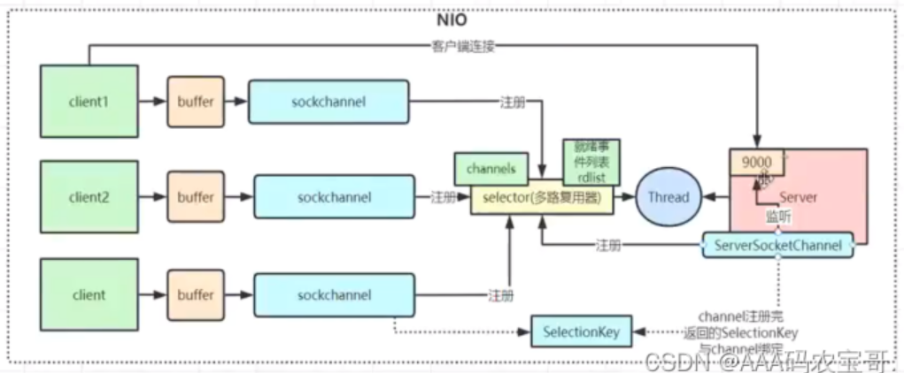
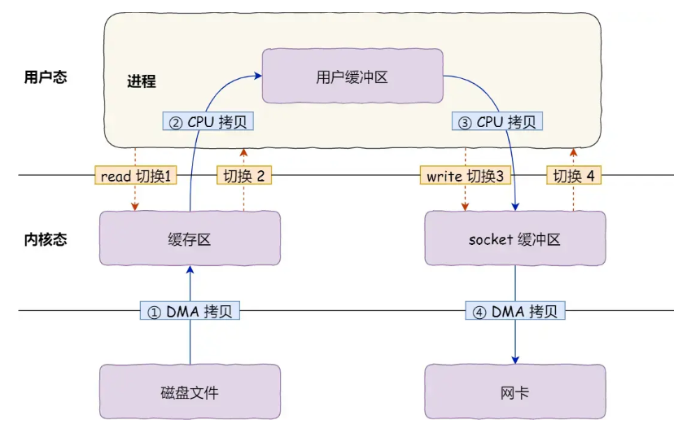
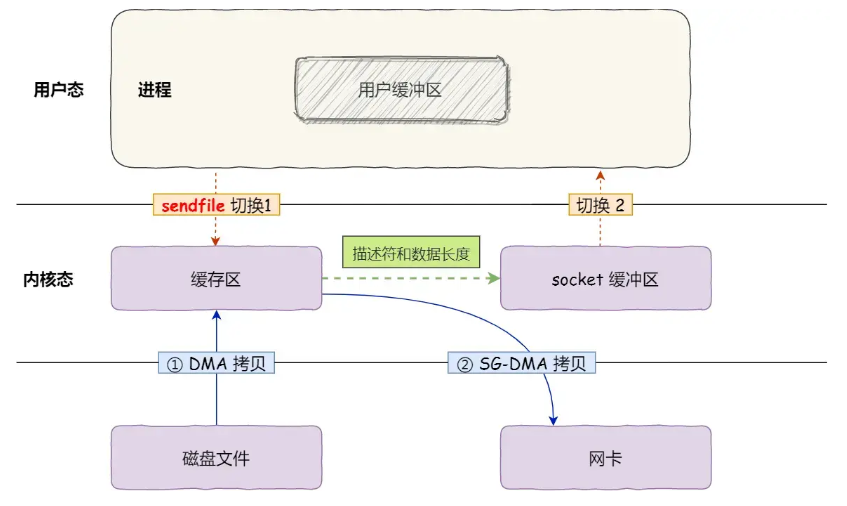

# 计算机操作系统面试篇

# 用户态和内核态的区别？

## 用户态和内核态的区别？

- 内核态（Kernel Mode）：在内核态下，CPU可以**执行所有的指令和访问所有的硬件资源**。这种模式下的操作具有更高的权限，主要用于操作系统内核的运行。
- 用户态（User Mode）：在用户态下，**CPU只能执行部分指令集，无法直接访问硬件资源**。这种模式下的操作权限较低，主要用于运行用户程序。

# 进程管理

## 线程和进程的区别是什么？

- **定义：**
  - 进程是操作系统资源分配的基本单位
  - 线程是任务调度和执行的基本单位。
- **调度及切换：**
  - 每个进程都有独立的代码和数据空间（程序上下文），程序之间的切换会有较大的开销。
  - 线程可以看做轻量级的进程，同一类线程共享代码和数据空间，每个线程都有**自己独立的运行栈和程序计数器（PC）**，线程之间切换的开销小。
- **内存分配：**
  - 系统在运行的时候会为每个进程分配不同的内存空间。
  - 对线程而言，除了CPU外，系统不会为线程分配内存（线程所使用的资源来自其所属进程的资源），线程组之间只能共享资源。
- **稳定性：**
  - 进程中某个线程如果崩溃了，可能会导致整个进程都崩溃。
  - 进程中的子进程崩溃，并不会影响其他进程。
- **包含关系：**
  - 没有线程的进程可以看做是单线程的。
  - 如果一个进程内有多个线程，则执行过程不是一条线的，而是多条线。

## 进程，线程，协程的区别是什么？

- 进程是操作系统中进行资源分配和调度的基本单位，它拥有自己的独立内存空间和系统资源。每个进程都有独立的堆和栈，不与其他进程共享。进程间通信需要通过特定的机制，如管道、消息队列、信号量等。由于进程拥有独立的内存空间，因此其稳定性和安全性相对较高，但同时上下文切换的开销也较大，因为需要保存和恢复整个进程的状态。
- 线程是进程内的一个执行单元，也是CPU调度和分派的基本单位。与进程不同，线程共享进程的内存空间，包括堆和全局变量。线程之间通信更加高效，因为它们可以直接读写共享内存。线程的上下文切换开销较小，因为只需要保存和恢复线程的上下文，而不是整个进程的状态。然而，由于多个线程共享内存空间，因此存在数据竞争和线程安全的问题，需要通过同步和互斥机制来解决。
- 协程是一种用户态的轻量级线程，其调度完全由用户程序控制，而不需要内核的参与。协程拥有自己的寄存器上下文和栈，但与其他协程共享堆内存。协程的切换开销非常小，因为只需要保存和恢复协程的上下文，而无需进行内核级的上下文切换。协程需要程序员显式地进行调度和管理，相对于线程和进程来说，其编程模型更为复杂。

## 创建一个协程的过程

使用 `CompletableFuture` 实现异步协程

在 Java 中，`CompletableFuture` 提供了对异步任务的支持。它允许你定义异步任务并在任务完成时做一些处理，从而实现类似协程的效果。 

## 线程运行过程中申请到的东西在切换时是否全部要保存，比如线程中有个循环，或者声明了很多对象，这些是否都要保存，也存在线程私有区吗？

- 线程运行过程中申请到的东西（如循环中的状态、声明的局部对象等）在切换时，不需要全部保存。线程切换时，操作系统只会保存和恢复线程的**上下文信息**（如栈指针、寄存器、程序计数器等）。
- 对于局部变量，它们存储在栈中，线程切换时会自动保存和恢复。**线程私有区**中的数据会保留，因为它是与线程相关联的。

## 多线程比单线程的优势，劣势？

- 优势：
  - 提高程序的运行效率，可以充分利用多核处理器的资源
  - 同时处理多个任务，加快程序的执行速度。
- 劣势：
  - 存在多线程数据竞争访问的问题，需要通过锁机制来保证线程安全，增加了加锁的开销，还有死锁的风险。

## 进程切换和线程切换的区别？

- **进程切换**：
  - **进程是由内核管理和调度的，所以进程的切换只能发生在内核态**。
  - 操作系统需要保存当前进程的状态（如寄存器值、程序计数器等），然后加载目标进程的状态。这不仅包括**虚拟内存的切换，还包括内核堆栈、文件描述符、信号处理等资源的切换**。
- **线程切换**：
  - 同一进程中的线程共享相同的 **虚拟内存**，所以内存切换的开销要比进程切换小。
  - 线程切换只需要**保存和加载线程的上下文（如寄存器、栈指针等）**，而不需要切换整个进程的内存空间。

## 进程上下文有哪些？

进程的上下文切换不仅包含了**虚拟内存、栈、全局变量**等用户空间的资源，还包括了**内核堆栈、寄存器等内核空间的资源。**

## 进程间通讯有哪些方式？

- **管道pipe：**用于在同一主机上的进程间传输数据的一种通信方式。通常在**父子进程之间**使用。
  - 使用**内存缓冲区**，数据写入一端后，从另一端读取。
- **消息队列：**
- **共享内存：**不同进程间共享一块内存区域的通信方式，允许进程直接读写这块共享内存。
  - 需要使用 **信号量** 或 **互斥锁** 等同步机制，避免并发访问时出现数据冲突。
- **信号signal：**信号是操作系统用来通知进程某个事件发生的一种机制。
- **信号量（Semaphore）：**信号量是一种用于同步和控制对共享资源的访问的计数器。它可以被视为一个整数，用于表示资源的数量。
- **socket：**套接字是一种跨网络的进程间通信方式，通常用于不同主机之间的通信。它支持面向连接（如 TCP）和无连接（如 UDP）通信。支持全双工通信。

## 说一下同步和异步

- **同步（Synchronous）：**同步是指任务的执行是按顺序进行的，后续任务必须等前一个任务完成后才能开始执行。
- **异步（Asynchronous）：**异步是指任务的执行不需要等待前一个任务完成，任务可以并行执行，后续任务可以在前一个任务未完成时开始。

## 异步过程中谁来通知谁

- 通常是由**事件循环**、**回调函数**或**Future对象**来“通知”A任务。具体来说，A任务可以通过`await`或回调机制来等待和接收结果。
- 如果A任务依赖于I/O操作或其他异步任务的完成，通常会使用上述机制来管理任务状态的切换，确保任务完成时，能够通知A任务并继续执行后续操作。

# 内存管理

## 堆和栈的区别？

- **分配方式**：堆是动态分配内存，由程序员手动申请和释放内存，通常用于存储动态数据结构和对象。栈是静态分配内存，由编译器自动分配和释放内存，用于存储函数的局部变量和函数调用信息。
- **内存管理**：堆需要程序员手动管理内存的分配和释放，如果管理不当可能会导致内存泄漏或内存溢出。栈由编译器自动管理内存，遵循后进先出的原则，变量的生命周期由其作用域决定，函数调用时分配内存，函数返回时释放内存。

- **大小和速度**：堆通常比栈大，内存空间较大，动态分配和释放内存需要时间开销。栈大小有限，通常比较小，内存分配和释放速度较快，因为是编译器自动管理。

## 虚拟内存

- **传统内存：**
  - **一次性：**作业必须一次性全部装入内存后才能开始运行。
  - **驻留性：**一旦作业被装入内存，就会一直驻留在内存中，直至作业运行结束。
- **虚拟内存：**虚拟内存的最大容量是由计算机的地址结构（CPU寻址范围）确定的。虚拟内存的实际容量= min{内存和外存容量之和，CPU寻址范围}。32位计算机地址结构为4GB。
  - **多次性：**无需在作业运行时一次性全部装入内存，而是允许被分成多次调入内存。
  - **对换性：**在作业运行时无需一直常驻内存，而是允许在作业运行过程中，将作业换入、换出。
  - **虚拟性：**从逻辑上扩充了内存的容量，使用户看到的内存容量，远大于实际的容量。

虚拟内存实现有3种方式：**请求分页存储管理、请求分段存储管理、请求段页式存储管理。**

无论哪种方式都需要一定的硬件支持：包括一定容量的内存与外存；页表机制、段表机制作为主要的数据结构；中断机制：当用户程序要访问的部分会调入内存时产生中断；地址转换机构逻辑地址到物理地址的转换。

## 32位与64位总线的操作系统的理论虚拟内存

虚拟内存大小=min{内存+外存，总线位数}

- 32位总线大小为4G

- Windows 64 位操作系统通常为每个进程分配 **8 TB** 的虚拟地址空间。
- Linux 在 x86_64 架构下，默认每个进程可以使用 **128 TB** 的虚拟内存。

## 分段，分页对比

- **存储特性：**
  - 页是信息的物理单位。分页的主要目的是为了实现离散分配，提高内存利用率。分页仅仅是系统管理上的需要，完全是系统行为，对用户是不可见的。
  - 段是信息的逻辑单位。分段的主要目的是更好地满足用户需求。一个段通常包含着一组属于一个逻辑模块的信息。

- **存储大小：**
  - 页的大小固定且由系统决定。
  - 段的长度却不固定，决定于用户编写的程序。
- **用户进程地址维度：**
  - 分页的用户进程地址空间是一维的，程序员只需给出一个记忆符即可表示一个地址。
  - 分段的用户进程地址空间是二维的，程序员在标识一个地址时，既要给出段名，也要给出段内地址。
- **碎片问题：**
  - 分页的内存利用率高，不会产生外部碎片，只会有少量内部碎片。
  - 如果段长过大，会产生外部碎片。

# 中断和异常

## 硬中断、软中断讲一下

**硬中断**（Hardware Interrupt）和**软中断**（Software Interrupt）是计算机系统中中断机制的两种基本类型，它们都是用来打断当前的程序执行，转而处理一些重要任务或事件。

- **硬中断（Hardware Interrupt）：**由外部**硬件设备发出的信号**，用来通知CPU有紧急的事件或任务需要处理。
  - **定时器中断**：CPU通过定时器定期中断自己，以便执行操作系统的任务调度。
  - **I/O设备中断**：例如，网络接口卡接收到数据包时，触发中断通知CPU进行处理。
- **软中断（Software Interrupt）：**软中断是由**程序中的软件指令触发的中断**，它通常用于程序之间的通讯、系统调用或实现某些特定功能。
  - **系统调用**：用户程序通过触发软中断向操作系统请求资源，如文件读写、进程管理等。

## 异常

异常（Exception），陷入，也成为内中断，来自于CPU内部的事件。

如非法操作码、地址越界、算术溢出、虚存系统缺页等等，异常不能被屏蔽，一旦出现应当立即处理。

# 网络IO

## BIO、和NIO、AIO区别

| 特性         | BIO                                | NIO                                         | AIO                              |
| ------------ | ---------------------------------- | ------------------------------------------- | -------------------------------- |
| **工作模式** | 阻塞 I/O，数据流模式               | 非阻塞 I/O，缓冲区 + 通道 + 选择器          | 异步 I/O，回调通知               |
| **线程模型** | 每个连接一个线程                   | 多个通道由单线程管理（通过 Selector）       | 异步 I/O，无需阻塞或轮询         |
| **I/O 操作** | 阻塞，直到 I/O 操作完成            | 非阻塞，可以轮询多个通道的事件              | 异步，不会阻塞，完成时回调通知   |
| **适用场景** | 并发连接数少，低性能需求           | 高并发、大量连接，I/O 密集型应用            | 超高并发、大数据量 I/O 操作      |
| **性能问题** | 并发连接数多时性能差（线程开销大） | 比 BIO 性能好，但需要轮询（高并发时更有效） | 性能非常高，尤其适用于高并发应用 |

## select、poll、epoll 的区别是什么？

- **select：**
  - `select` 是最早出现的一种 I/O 多路复用机制，它允许在多个文件描述符上监视是否有 I/O 事件发生（如可读、可写等）。`select` 调用会阻塞并等待直到文件描述符集中的某个或某些文件描述符准备就绪，之后就返回。
  - 缺点：
    - **文件描述符限制**：`select` 限制了每次监视的文件描述符数量，通常是 1024（可以通过修改编译时的宏来增大，但还是有限制）。
    - **性能问题**：每次调用 `select` 都需要遍历所有的文件描述符集合，这对于大规模的文件描述符集会导致性能瓶颈。
    - **重新设置**：每次调用 `select` 时，必须重设文件描述符集，带来了额外的开销。
- **poll：**
  - `poll` 是对 `select` 的改进，具有与 `select` 相似的功能，但没有文件描述符数量限制。`poll` 用一个 `pollfd` 结构体数组来表示多个文件描述符及其事件，它返回时会告知哪些文件描述符有 I/O 事件发生。
  - 优点：
    - **没有文件描述符限制**：相较于 `select`，`poll` 不再有最大文件描述符数量的限制。
    - **动态文件描述符集合**：`poll` 可以动态地管理文件描述符集合，而不需要像 `select` 一样每次都重设整个集合。
  - 缺点：
    - **性能瓶颈**：尽管去除了文件描述符的数量限制，但 `poll` 仍然需要遍历整个文件描述符集合，每次调用时都需要遍历整个数组，这对于大量文件描述符来说性能较差。
    - **返回值不够直观**：`poll` 只是返回哪些文件描述符有事件发生，没有直接告诉应用程序事件发生的位置，因此需要遍历 `pollfd` 数组进行判断。
- **epoll：**
  - `epoll` 是 Linux 中引入的 I/O 多路复用机制，是对 `select` 和 `poll` 的进一步优化，专门为高并发场景设计。`epoll` 使用事件驱动的机制，提供了更高效的事件通知方式。`epoll` 会通过内核级别的事件通知，不需要每次遍历所有的文件描述符，只有在某些文件描述符准备就绪时，内核才会通知用户进程。
  - 优点：
    - **无文件描述符数量限制**：`epoll` 不受文件描述符数量限制，可以处理成千上万的连接。
    - **高效的性能**：`epoll` 使用基于回调的机制，只在事件发生时通知用户程序，不需要每次都遍历文件描述符集合。
    - **边缘触发和水平触发**：`epoll` 支持两种触发模式，**水平触发（Level Triggered）和边缘触发（Edge Triggered）**，提供了更灵活的控制。
    - **内存管理**：`epoll` 在内核中维护一个事件通知队列，通过 `epoll_wait` 来通知应用程序哪些文件描述符有事件发生，效率较高。
  - 缺点:
    - **只能在 Linux 上使用**：`epoll` 是 Linux 特有的系统调用，无法在其他操作系统上使用。
    - **复杂度较高**：相较于 `select` 和 `poll`，`epoll` 需要更复杂的设置和管理，尤其是在使用边缘触发模式时。

## epoll过程

1. `lfd=socket()`创建lfd套接字—>`bind()`绑定地址—>`listen()`设置监听上限—>`epoll_create()`创建监听红黑树—>`epoll_ctl()`把lfd加入红黑树—>while(1) 服务器端上线等待连接。
2. `epoll_wait()`服务器监听—>有事件发生—>`epoll_wait()`返回监听满足数组—>一旦有事件发生则lfd一定在满足数组中，`lfd`进行`accept()`—>用lfd进行`accept()`返回的连接套接字`cfd`放到红黑树中—>执行读操作—>进行大小写转换操作—>把`cfd`节点的属性从`EPOLLIN`变为`EPOLLOUT`—>再把`cfd`重新挂上红黑树去监听写事件—>等待`epoll_wait()`返回—>有返回说明能写—>执行写操作—>把`cfd`从红黑树中拿下来—>再把`cfd`节点的属性从`EPOLLIN`变为`EPOLLOUT`—>再把cfd重新挂上红黑树去监听读事件—>`epoll_wait()`服务器监听。从而形成一个完美的闭环。

##  epoll 的 边缘触发和水平触发有什么区别？

epoll 支持两种事件触发模式，分别是**边缘触发（edge-triggered，ET）和水平触发（level-triggered，LT**）。

| 特性             | **水平触发 (LT)**                                  | **边缘触发 (ET)**                                |
| ---------------- | -------------------------------------------------- | ------------------------------------------------ |
| **通知方式**     | 当文件描述符的事件条件满足时，每次调用都会返回     | 只有文件描述符的事件从未就绪变为就绪时才通知一次 |
| **事件处理**     | 只要事件没有处理完，`epoll` 会继续返回该文件描述符 | 事件一旦通知后，必须完全处理，否则不会再次通知   |
| **是否重复通知** | 会重复通知，直到事件完全处理                       | 不会重复通知，只有状态变化时才通知一次           |
| **适用场景**     | 适合大多数简单应用，处理事件比较慢时使用           | 适合高性能、高并发应用，要求迅速处理事件         |
| **性能**         | 性能较低，重复通知会增加开销                       | 性能较高，因为不重复通知                         |
| **实现难度**     | 简单，容易实现                                     | 稍复杂，要求处理得当，否则可能错过事件通知       |

- 使用水平触发模式，当内核通知文件描述符可读写时，接下来还可以继续去检测它的状态，看它是否依然可读或可写。
- 使用边缘触发模式，I/O 事件发生时只会通知一次，而且我们不知道到底能读写多少数据，所以在收到通知后应尽可能地读写数据，以免错失读写的机会。因此，我们会**循环**从文件描述符读写数据，那么如果文件描述符是阻塞的，没有数据可读写时，进程会阻塞在读写函数那里，程序就没办法继续往下执行。所以，**边缘触发模式一般和非阻塞 I/O 搭配使用**，程序会一直执行 I/O 操作，直到系统调用返回错误，错误类型为 EAGAIN 或 EWOULDBLOCK。

## redis，nginx，netty 是依赖什么做的这么高性能？

主要是依赖**Reactor 模式**实现了高性能网络模式，这个是在i/o多路复用接口基础上实现的了网络模型。

Reactor 模式主要由 Reactor 和处理资源池这两个核心部分组成，它俩负责的事情如下：

- Reactor 负责监听和分发事件，事件类型包含连接事件、读写事件；
- 处理资源池负责处理事件，如 read -> 业务逻辑 -> send；

### Redis

**Redis 6.0 之前使用的 Reactor 模型就是单 Reactor 单进程模式。**

- 因为只有一个进程，**无法充分利用 多核 CPU 的性能**；
- Handler 对象在业务处理时，整个进程是无法处理其他连接的事件的，**如果业务处理耗时比较长，那么就造成响应的延迟**

单 Reactor 单进程的方案**不适用计算机密集型的场景，只适用于业务处理非常快速的场景**。所以Redis的瓶颈不在CPU上，网络IO才是瓶颈。

因此在Redis6.0后，Redis 在启动的时候，默认情况下会**额外创建 6 个线程**（*这里的线程数不包括主线程*）：

- Redis-server ： Redis的主线程，主要负责执行命令。
- bio_close_file、bio_aof_fsync、bio_lazy_free：三个后台线程，分别异步处理关闭文件任务、AOF刷盘任务、释放内存任务；
- io_thd_1、io_thd_2、io_thd_3：三个 I/O 线程，io-threads 默认是 4 ，所以会启动 3（4-1）个 I/O 多线程，用来分担 Redis 网络 I/O 的压力。

### Netty

Netty 是采用了多 Reactor 多线程方案

每个客户端通过通道（Channel）与服务端进行数据交互，客户端通过端口向服务端发送连接请求。服务端使用一个线程，通过多路复用器（Selector）来监听多个客户端的连接请求和数据事件，服务端会将每个客户端的通道注册到 Selector 上进行管理。

- 主线程和子线程分工明确，主线程只负责接收新连接，子线程负责完成后续的业务处理。
- 主线程和子线程的交互很简单，主线程只需要把新连接传给子线程，子线程无须返回数据，直接就可以在子线程将处理结果发送给客户端。

**Netty特点：**

- 事件驱动和异步机制：通过回调机制处理I/O结果
- boss-worker：boss只负责管理，具体处理交给worker，还有更加智能的线程管理
- 内存管理优化：采用内存池化区别于传统每次读取都会分配新的字节数组
- 支持多种协议：不仅有tcp、udp还有http、https、websocket等等

### Nginx

nginx 是多 Reactor 多进程方案，不过方案与标准的多 Reactor 多进程有些差异。

- 主进程中仅仅用来初始化 socket，并没有创建 mainReactor 来 accept 连接
- 由子进程的 Reactor 来 accept 连接，通过锁来控制一次只有一个子进程进行 accept（为了避免多个子进程同时响应同一个请求，也就是惊群现象），子进程 accept 新连接后就放到自己的 Reactor 进行处理，不会再分配给其他子进程。

## 零拷贝是什么？

- 传统 IO 的工作方式，从硬盘读取数据，然后再通过网卡向外发送，我们需要进行 4 上下文切换，和 4 次数据拷贝，其中 2 次数据拷贝发生在内存里的缓冲区和对应的硬件设备之间，这个是由 DMA 完成，另外2 次则发生在内核态和用户态之间，这个数据搬移工作是由 CPU 完成的。

  

- 零拷贝技术，它通过一次系统调用（sendfile 方法）合并了磁盘读取与网络发送两个操作，降低了上下文切换次数。另外，拷贝数据都是发生在内核中的，天然就降低了数据拷贝的次数。使用 `sendfile()`，内核直接将文件内容从磁盘缓冲区传输到网络接口，无需通过用户空间。

  

**适用场景：**

- **Web 服务器**：在 Web 服务器中，零拷贝可以用来提高大文件（如视频、图片等）的传输效率。例如，Nginx 使用了 `sendfile()` 实现零拷贝。
- **高性能网络应用**：零拷贝特别适用于需要频繁进行大规模数据传输的应用，如文件传输、数据库备份、视频流等。
- **数据库管理系统**：数据库的磁盘和网络传输操作常常使用零拷贝技术，以提高数据读取和写入的效率。