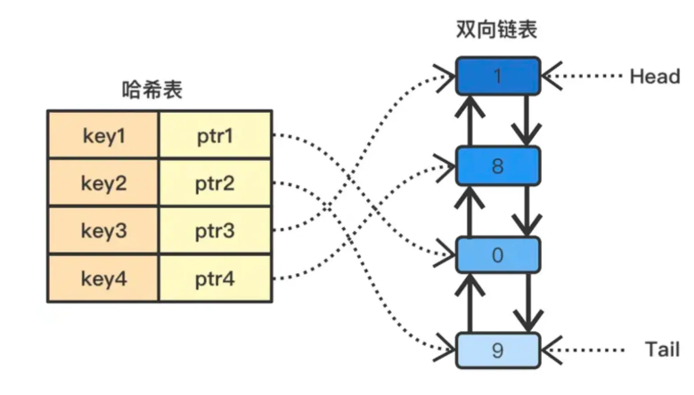

# 数据结构与算法面试题

# 数据结构

## 红黑树说一下

**红黑树（Red-Black Tree）**是一种自平衡的二叉搜索树，它在插入和删除操作后能够通过旋转和重新着色来保持树的平衡。红黑树的特点如下：

- 每个节点都有一个颜色，红色或黑色。
- 根节点是黑色的。
- 每个叶子节点（NIL节点）都是黑色的。
- 如果一个节点是红色的，则它的两个子节点都是黑色的。
- 从根节点到叶子节点或空子节点的每条路径上，黑色节点的数量是相同的。

红黑树通过这些特性来保持树的平衡，确保最长路径不超过最短路径的两倍，从而保证了在最坏情况下的搜索、插入和删除操作的时间复杂度都为O(logN)。**epoll 用了红黑树来保存监听的 socket。**

## 跳表说一下？

**跳表（Skip List）**是一种基于链表的数据结构，它通过添加多层索引来加速搜索操作。

- 跳表中的数据是有序的。
- 跳表中的每个节点都包含一个指向下一层和右侧节点的指针

跳表通过多层索引的方式来加速搜索操作。最底层是一个普通的有序链表，而上面的每一层都是前一层的子集，每个节点在上一层都有一个指针指向它在下一层的对应节点。这样，在搜索时可以通过跳过一些节点，直接进入目标区域，从而减少搜索的时间复杂度。

跳表的平均搜索、插入和删除操作的时间复杂度都为O(logN)，但空间复杂度稍高。跳表常用于需要高效搜索和插入操作的场景，如数据库、缓存等。**redis 用了跳表来实现 zset。**

##  LRU是什么？如何实现？

LRU 是一种缓存淘汰算法，当缓存空间已满时，优先淘汰最长时间未被访问的数据。

实现的方式是哈希表+双向链表结合。

- 使用哈希表存储数据的键值对，键为缓存的键，值为对应的节点。
- 使用双向链表存储数据节点，链表头部为最近访问的节点，链表尾部为最久未访问的节点。
- 当数据被访问时，如果数据存在于缓存中，则将对应节点移动到链表头部；如果数据不存在于缓存中，则将数据添加到缓存中，同时创建一个新节点并插入到链表头部。
- 当缓存空间已满时，需要淘汰最久未访问的节点，即链表尾部的节点。

上面这种思想方式，LRU 算法可以在 O(1) 的时间复杂度内实现数据的插入、查找和删除操作。

## 布隆过滤器怎么设计？时间复杂度？

「**布隆过滤器**」可以用来解决类似的问题，具有运行快速，内存占用小的特点，它是一个保存了很长的二级制向量，同时结合 Hash 函数实现的。

而高效插入和查询的代价就是，它是一个基于概率的数据结构，**只能告诉我们一个元素绝对不在集合内，对于存在集合内的元素有一定的误判率。**

- **初始化**：当我们创建一个布隆过滤器时，我们首先创建一个全由0组成的位数组（bit array)。同时，我们还需选择几个独立的哈希函数，每个函数都可以将集合中的元素映射到这个位数组的某个位置。
- **添加元素**：在布隆过滤器中添加一个元素时，我们会将此元素通过所有的哈希函数进行映射，得到在位数组中的几个位置，然后将这些位置标记为1。
- **查询元素**：如果我们要检查一个元素是否在集合中，我们同样使用这些哈希函数将元素映射到位数组中的几个位置，**如果所有的位置都被标记为1，那么我们就可以说该元素可能在集合中。如果有任何一个位置不为1，那么该元素肯定不在集合中**。

# 排序算法

## 排序算法及空间复杂度

- **插入类排序：**
  - **直接插入排序：**将待排序元素逐个插入到已排序序列的合适位置，形成有序序列。
    - 时间复杂度：平均为O(N^2)，最好情况下为O(N)，最坏情况下为O(N^2)。
    - 空间复杂度：因为每回只移动一个所以空间复杂度为O(1)。
    - 稳定性：稳定。
  - **折半插入排序：**将排好元素一分为二来进行查找插入的位置。
    - 时间复杂度：平均为O(N^2)，最好情况下为O(NlogN)，最坏情况下为O(N2)。
    - 空间复杂度：因为每回只移动一个所以空间复杂度为O(1)。
    - 稳定性：稳定。
  - **希尔排序：**将待排数组分成若干个稀疏的子序列，分别进行直接插入排序，使得稀疏的子序列较为有序，然后再全部进行次直接插入排序，即可完成。
    - 时间复杂度：业界统一认为为O(N^1.3)。
    - 空间复杂度：因为每回只移动一个所以空间复杂度为O(1)
    - 稳定性：不稳定。
- **交换类排序：**
  - **冒泡排序：**在扫描的过程中顺次比较相邻的两个元素的大小，若逆序就交换位置。
    - 时间复杂度：平均为O(N^2)，最好情况下为O(N)，最坏情况下为O(N^2)。
    - 空间复杂度：因为每回只移动一个所以空间复杂度为O(1)。
    - 稳定性：稳定。
  - **快速排序：**
    - 时间复杂度：平均为O(NlogN)，最好情况下为O(NlogN)，最坏情况下为O(N^2)。
    - 空间复杂度：使用递归进行深搜，所以为O(NlogN)。
    - 稳定性：不稳定。
- **选择排序：**
  - **简单选择排序：**从第一个记录开始，通过n-1次关键字比较，从n个记录中选择出关键字最小的记录，并和第一个记录进行比较。
    - 时间复杂度：平均为O(N^2)，最好情况下为O(N^2)，最坏情况下为O(N^2)。
    - 空间复杂度：因为每回只移动一个所以空间复杂度为O(1)。
    - 稳定性：不稳定。
  - **堆排序：**把待排序的数字看成一颗完全二叉树的顺序表示，每个结点表示一个记录，第一个记录作为二叉树的根，对剩下的记录依次逐层从左到右顺序排序，（i从0开始）任意节点r[i]的左孩子是r[2r+1]，右孩子是r[2i+2]，双亲是r[(i+1)/2-1]。对这颗完全二叉树进行调整。**大根堆：** r[i]>r[2i+1]且r[i]>r[2i+2]，也就是父节点大于孩子节点的完全二叉树称为大根堆。
    - 时间复杂度：平均为O(NlogN)，最好情况下为O(NlogN)，最坏情况下为O(NlogN)。
    - 空间复杂度：因为每回只移动一个所以空间复杂度为O(1)。
    - 稳定性：不稳定。

