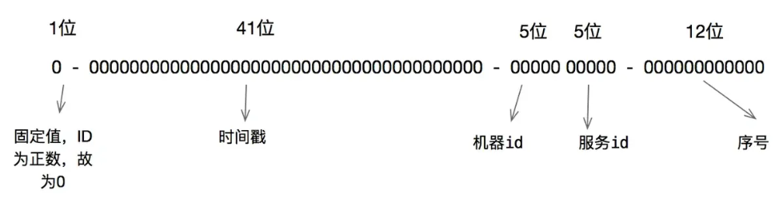
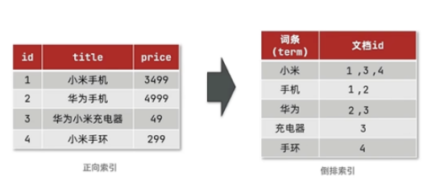

# 消息队列

## 你的项目为什么要用消息队列？

- **解耦系统**：让系统的各部分之间不直接依赖，通过消息传递进行沟通，提升系统的灵活性和可维护性。
- **异步处理**：让一些耗时操作（比如发送邮件、扣库存等）可以异步执行，不影响用户体验。

- **流量控制**：当系统流量激增时，消息队列可以暂时存储消息，等系统有空闲时再处理，避免系统崩溃。
- **提高可靠性**：即使某些部分出问题，消息队列可以暂存信息，等恢复后再处理，减少数据丢失。
- **负载均衡**：多个消费者可以并行处理队列中的消息，平衡系统负载，提高处理效率。
- **扩展性**：当业务增长时，可以方便地增加消费者来处理更多消息，支持系统扩展。

## 你说说 Kafka 为什么是高性能的？

- **顺序写入**：它将消息按顺序写入磁盘，避免了随机写入带来的性能瓶颈。
- **零拷贝**：Kafka 使用零拷贝技术，直接从磁盘传输数据到网络，减少了内存复制，提高了效率。
- **分区并行**：数据分成多个分区，多个消费者可以并行读取，提升处理速度。
- **批量处理**：Kafka 支持批量消息写入和读取，减少了网络和磁盘操作的开销。

## kafka的使用场景，是否有消息丢失的情况

- **实时数据流处理**：Kafka 常用于处理实时数据流，如日志收集、监控数据传输、点击流分析等。

- **日志聚合**：它可以收集来自不同系统的日志，统一传输到中心化的日志存储或分析系统。

- **事件源架构**：用于在微服务架构中传递事件，确保不同服务之间的通信。

- **消息队列**：作为高吞吐量、高可用性的消息队列，支持异步消息处理。

- **数据管道**：Kafka 作为流数据平台，通常用于将数据从一个系统传输到另一个系统，像数据库同步、ETL等。


## RocketMQ、Kafka 和 RabbitMQ

- **Kafka**：Kafka 是基于 **分区**（Partition）和 **副本**（Replication）设计的分布式消息队列。它使用一个 **发布-订阅** 模型，生产者将消息写入到主题（Topic）中的分区，消费者可以根据分区消费消息。**只支持 发布-订阅 模式**。
  - **优点**：超高吞吐量，适合大规模数据流和实时处理。
  - **适用场景**：日志聚合、流处理、大数据分析。
  - **缺点**：不支持复杂的路由机制，消息顺序只保证在分区内。
- **RocketMQ**：RocketMQ 也采用分布式架构，支持 **主题（Topic）** 和 **队列（Queue）**。消息可以被多个消费者消费，也支持严格的 **顺序消息**、**事务消息** 和 **定时消息**。支持 **发布-订阅** 和 **点对点** 两种模式，允许同一个消息被多个消费者消费，适合广播消息。
  - **优点**：支持事务消息、顺序消息、消息精确一次投递。
  - **适用场景**：金融、电商等需要高可靠性、顺序消费和事务的场景。
  - **缺点**：性能稍逊于 Kafka，配置较复杂。
- **RabbitMQ**：RabbitMQ 使用 **AMQP（Advanced Message Queuing Protocol）** 协议，采用 **交换机（Exchange）** 和 **队列（Queue）** 的模式，消息通过交换机路由到队列，消费者从队列中获取消息。支持 **发布-订阅**、**点对点** 和 **工作队列** 等多种消息模型，适用于各种灵活的消息传递场景。
  - **优点**：支持多种协议，灵活的消息路由（如交换机），适合多种消费模式。
  - **适用场景**：小到中规模应用，微服务架构，复杂路由需求。
  - **缺点**：吞吐量和性能不如 Kafka 和 RocketMQ，延迟稍高。

## RabbitMq怎么消息被消费

**消息持久化**：确保消息不丢失。

**消息确认**：确保消息被成功消费。

**死信队列**：处理消费失败的消息。

**重试机制**：为消费失败的消息提供重试功能。

**并发和负载均衡**：提高消息消费效率。

# 系统设计

## 你项目是怎么存密码的？

原先使用一些很简单的加密算法，比如MD5、SHA-1。直接用 MD5 加密存储的，因为 MD5 是不可逆的，也就是不能从MD5加密后的结果转换回加密之前的结果，所以当时就想当然的认为这是安全的。听说 MD5 虽然不可逆，但是破解起来也是相对容易的，比如碰撞攻击和彩虹表攻击，都有可能将 MD5 解密。

- **碰撞攻击**是指通过找到两个不同的输入，得出相同的输出值（即哈希值）。对于 MD5 和 SHA-1，这种攻击相对容易实现。随着计算机性能的提高，攻击者可以生成大量的哈希值，寻找碰撞。
- **彩虹表**是一种预计算的哈希值字典，它能够通过存储大量常见密码的哈希值来加速破解过程。如果密码没有加盐，攻击者只需要在彩虹表中查找对应的哈希值，迅速得到原密码。

后来采用**密码加盐**

- **加盐**是指在用户的密码之前或之后加入一个随机生成的字符串（盐值，salt）。然后，再对包含盐值的密码进行哈希计算。由于每个密码都加上不同的盐值，即使两个用户的密码相同，它们的哈希结果也会不同。

或者采用多因素认证（MFA）或更权威的第三方认证。

手机验证码或者把登录交由更加权威的第三方认证。

## 如何设计一个分布式ID？

- 如果对性能和顺序性有较高要求，且有分布式系统的需求，**Snowflake算法**是一个常用且有效的方案。

  

  - 雪花算法生成步骤：
    - **获取当前时间戳**：记录当前时间（精确到毫秒）。
    - **时间回拨处理**：如果当前时间小于上次生成 ID 的时间，发生了回拨（时钟回退）。
    - **计算 ID 生成的各个部分**：
      - **时间戳**：计算当前时间与自定义起始时间（Epoch）之间的差值，得到时间戳。**41位**
      - **机器 ID+服务ID**：由机器/节点的标识决定，通常是由配置文件或其他方式分配的。**这个可以自由组合，只要能区分开就行。**
      - **序列号**：如果同一毫秒内生成多个 ID，序列号会递增。当同一毫秒内生成超过最大数量时，算法会等待下一毫秒。**12位**
    - **拼接生成唯一 ID**：将以上的各个部分拼接起来，形成一个 64 位的唯一 ID。

- 如果只需要保证全局唯一性，并且ID长度不敏感，可以选择**UUID**。

- 如果希望数据库生成ID并且控制分布式锁的使用，可以选择**数据库自增ID + 分布式锁**。

## 单点登录是怎么工作的？

单点登录（SSO，Single Sign-On）是一种认证机制，它允许用户在一次登录后就能访问多个相互关联的应用系统，无需在每个应用中重复登录。SSO的基本原理是将用户身份认证的过程集中管理，用户只需在一个地方登录，其他需要认证的系统通过某种机制知道用户已通过认证。

JWT是一个由三部分组成的字符串，分别为：**头部**（Header）、**负载**（Payload）和**签名**（Signature）。它们之间通过 `.` 分隔。`<Header>.<Payload>.<Signature>`

- 用户在登录界面提供用户名和密码，提交给认证服务器。认证服务器验证用户身份后，生成一个JWT，通常会将一些用户信息（如用户ID、角色、权限）存放在负载部分，同时设置过期时间等。认证服务器使用密钥对JWT进行签名，生成最终的JWT令牌并返回给用户。
- 用户在访问需要身份验证的资源时，会在请求头中携带JWT令牌。通常会使用 `Authorization` 头部字段，格式为：`Authorization: Bearer <jwt_token>`
- 服务器收到请求后，首先从请求中提取JWT令牌。服务器使用预先共享的密钥（或者公钥）验证JWT的签名。如果签名有效，表示JWT没有被篡改，服务器会从JWT中提取用户信息（如用户ID、角色等），并允许用户访问资源。

**JWT优点：**

- **无状态**：JWT令牌是自包含的，它在令牌中就携带了所有需要的信息（如用户身份），不需要查询数据库或维护会话，节省了服务器的存储。
- **跨平台**：JWT基于JSON格式，可以在不同平台（如Web、移动端、微服务等）之间传输，兼容性好。
- **支持跨域认证**：由于JWT通常存储在浏览器的 `localStorage` 或 `sessionStorage` 中，且JWT为无状态认证，不依赖于服务端的会话，可以在多个域间传递JWT。
- **灵活性**：JWT的负载部分可以存储用户的自定义信息（如角色、权限等），便于服务端进行授权控制。

**JWT缺点：**

- **过期问题**：JWT通常有一个有效期，过期后需要重新获取。对于长时间登录的用户，可能需要实现刷新令牌机制。
- **安全性问题**：如果私钥泄露，攻击者可以伪造JWT，因此需要妥善保护签名密钥。
- **无法撤销**：一旦JWT被发放，直到过期前都无法撤销，除非通过特定的机制（如黑名单）来标记无效JWT。

## 分布式中CAP理论

三个主要特性之间的权衡关系：**一致性**（Consistency）、**可用性**（Availability）和 **分区容错性**（Partition Tolerance）。

- **一致性 (Consistency)**：
  - 所有节点在同一时刻看到的数据是一样的，也就是说，所有读操作返回的结果都是最新写入的数据。
  - 一致性要求：无论在任何节点进行数据读取，所读取到的数据都是完全一致的。
- **可用性 (Availability)**：
  - 系统在每个请求到来时，都能够返回一个有效的响应（即使数据未更新），即使部分节点不可用。
  - 可用性要求：系统始终能响应客户端请求，保证服务不被中断。
- **分区容错性 (Partition Tolerance)**：
  - 系统能够继续正常工作，即使网络分区或者节点间的通信出现问题（网络延迟、节点失联等）。
  - 分区容错性要求：系统能够应对在某些节点之间失联的情况下继续正常运行。

多数组合为CA、CP、AP

- **CA（一致性 + 可用性）**：传统的单节点数据库或集群中没有网络分区的情况。例如，**MySQL**、PostgreSQL 通过主从复制可以保证一致性和可用性，但如果网络出现问题，它们会丢失一些请求。
- **CP（一致性 + 分区容错性）**：**HBase、Zookeeper** 等，它们会在网络分区时牺牲可用性，保证数据的一致性。某些请求会被延迟或丢失，但数据的正确性是被保证的。
- **AP（可用性 + 分区容错性）**：Cassandra、**MongoDB**、Couchbase 等，优先保证系统始终能够响应请求，即使在网络分区发生时，数据也可能是最终一致的。这些系统通常会容忍数据不一致，直到网络恢复后进行数据同步。

## 某个分片上传失败，重试机制是如何设计的

- **检测失败**：如果上传失败，记录错误并判断是否可以重试。

- **限制重试次数**：设置最大重试次数，避免无限重试。

- **指数退避**：每次重试时，增加等待时间（如第一次1秒，第二次2秒）。

- **错误分类**：根据错误类型（暂时性或永久性）决定是否重试。

- **幂等性**：确保重复上传时数据一致，不会产生重复。

- **进度记录**：记录已上传的分片，失败时从最后成功的分片继续上传。

# 场景提问

## CPU 100% 问题怎么排查？

1. 使用 `top` 或 `htop` 检查 CPU 使用情况：
   - `top` 命令可以显示 CPU 使用最多的进程，`htop` 是 `top` 的一个增强版本，具有更好的界面。**指定单个进程使用`top -p <pid>`**
   - 如果发现 `java` 进程占用了大量 CPU 资源，可以进一步进行分析。
2. **硬盘 I/O**：硬盘故障或 I/O 阻塞也可能导致 CPU 占用过高。
3. 检查是否有异常的守护进程（如 cron、systemd 服务等）消耗了过多资源。
4. 是否面临大量的流量（例如 DDoS 攻击），可能会导致 CPU 高负荷。

## 是java的问题

1. 使用 `jstack` 或 `jmap` 获取 Java 堆栈和内存信息。
2. 使用 Arthas 进行更详细的分析。

## 给个十亿个qq号，设计一个数据结构来管理

- 如果对存储和查询效率要求较高，可以选择 **哈希表** 或 **Trie 树**。
- 如果内存非常有限且只需要存在性检测，可以使用 **布隆过滤器**。
- 如果数据集超过内存容量，考虑使用 **数据库** 或 **分布式存储**。

## windows和linux创建空文件

- windows

  ```shell
  type nul > filename.txt
  ```

- linux

  ```shell
  touch filename.txt
  ```

## 有个java的服务，现在发现其中有个服务延迟很高，要你排查的话怎么解决这个事情

1. **确认延迟发生的具体服务**：确保是哪个具体的服务或接口发生了延迟。你可以通过日志、监控工具（如 **Prometheus**等）来确定。
2. **检查服务端日志：**检查该服务的日志文件，看是否有异常（如错误堆栈、警告信息、连接问题等）。
3. **查看性能监控工具：**使用如 **JVM监控**（例如：JVisualVM、JProfiler 或通过 Prometheus 的 Java Agent）来查看服务的内存使用、GC 频率、线程使用情况等，是否有内存泄漏或过度的垃圾回收造成延迟。
4. **网络层面排查：**使用 **tcpdump**抓包，检查服务间的网络通信是否存在问题（如超时、丢包等）。如果服务之间通过HTTP调用，可以使用 **Fiddler** 检查API请求/响应的延迟。
5.  **数据库查询性能：**如果服务与数据库进行交互，检查数据库查询性能，检查慢查询日志。
6. **分析线程和锁：**查看是否存在线程池饱和、线程阻塞或死锁的情况。可以使用线程 dump 工具（如 jstack）来查看线程状态，找出可能的瓶颈。
7. **资源瓶颈分析：**查看服务是否存在 CPU 饱和的情况，使用 `top` 或 `htop` 工具查看资源使用情况。
8. **负载测试：**使用工具（如 **JMeter** 或 **Gatling**）对该服务进行负载测试，观察在高并发时的表现，帮助定位是否是由于负载过高导致的延迟。

# 数据库

## MySQL 的架构是怎么样的？

**客户端**：发起数据库请求的地方，比如应用程序或命令行工具。

**连接管理**：管理客户端和服务器之间的连接。

**查询解析**：解析客户端发来的 SQL 请求，确保语法正确。

**查询优化**：选择最优的执行计划来提高查询效率。

**执行引擎**：实际执行查询操作，访问数据并进行处理。

**存储引擎**：管理数据存储和检索的模块。常见的存储引擎有 InnoDB（支持事务）和 MyISAM（不支持事务）。

**缓冲池**：缓存数据以减少磁盘读取，提高查询速度。

**日志**：记录操作日志，用于数据恢复、复制和性能调优。

**复制**：支持将数据从主数据库复制到多个从数据库，实现数据同步。

**管理和监控工具**：用于数据库的管理、监控和性能优化。

## Redis 除了用作缓存还能干嘛？

- **消息队列**：支持异步任务处理，通过列表（List）和发布/订阅（Pub/Sub）机制实现消息传递。或者Zset做延迟队列。
- **实时统计**：可以用来统计点击量、访问量等，支持高效的计数器。
- **排行榜**：通过排序集合（Sorted Set）实现游戏得分或文章点赞等排名功能。
- **分布式锁**：保证多个进程间的资源访问互斥。
- **去重**：通过集合（Set）去重，防止重复数据操作。

## ES倒排索引说一下？

倒排索引（Inverted Index）是搜索引擎中常用的一种数据结构，目的是为了高效地进行文本搜索。具体到 Elasticsearch（ES），倒排索引用于存储文档中各个词项（词语）及其出现位置，以便快速查找包含某个词的文档。

**倒排索引的基本原理：**

- **词项（Term）**：文档中的每个单词或短语。

- **文档（Document）**：可以理解为一个包含多个词项的内容单元（如一篇文章、一条记录等）。

  

## 倒排索引构建过程

- **文档索引**：每个文档被拆分成多个词项，这些词项会被映射到文档上。
- **查询**：当你执行查询时，ES 会通过倒排索引找到包含查询词项的文档，快速返回搜索结果。
- **反向分析**：ES 在搜索时，首先将查询的词进行分析和分词，然后用倒排索引查找匹配的文档。

# 云原生

## Docker和传统虚拟机有什么区别？

- **架构：**
  - **虚拟机**：虚拟机在物理服务器上运行一个完整的操作系统，每个虚拟机都有自己的操作系统（包括内核）。
  - **Docker**：Docker 是基于容器的，容器共享宿主操作系统的内核，但它们运行自己的用户空间。
- **资源利用**：
  - **虚拟机**：虚拟机需要分配一部分硬件资源（如 CPU、内存、硬盘等）给每个虚拟机操作系统
  - **Docker**：Docker 容器利用宿主机的操作系统内核，资源消耗相对较少。
- **启动时间**：
  - **虚拟机**：启动虚拟机需要加载完整的操作系统，通常需要几分钟时间。
  - **Docker**：Docker 容器利用宿主操作系统内核，启动速度非常快，通常只需要几秒钟。
- **隔离性**：
  - **虚拟机**：虚拟机提供更强的隔离性，因为每个虚拟机都有独立的操作系统和内核。
  - **Docker**：Docker 容器提供了相对较弱的隔离性，因为容器共享宿主机的内核，但容器之间通过命名空间和控制组进行隔离。
- **灵活性和可移植性**：
  - **虚拟机**：虚拟机的迁移和部署较为复杂，因为每个虚拟机都是一个完整的操作系统，迁移时需要确保目标主机的资源和配置匹配。
  - **Docker**：Docker 容器是独立于操作系统的，它们可以在任何支持 Docker 的平台上运行，极大地提高了应用的可移植性和灵活性。
- **使用场景**：
  - **虚拟机**：适用于需要完全隔离的环境，或者需要不同操作系统的场景。常用于数据中心、虚拟化环境。
  - **Docker**：适用于微服务架构、开发和测试环境。由于 Docker 容器更轻便，广泛应用于 DevOps、持续集成/持续部署（CI/CD）等场景。

## Docker 和 k8s 之间是什么关系？

Docker 和 Kubernetes（K8s）是密切相关的，但它们的功能不同：

- **Docker**：是一个容器化平台，用于打包、分发和运行应用。它提供了创建、管理和运行容器的工具。容器可以理解为轻量级的虚拟机，但它们共享宿主操作系统的内核。
- **Kubernetes（K8s）**：是一个容器编排平台，用于自动化容器的部署、扩展和管理。它可以帮助管理多个 Docker 容器，处理容器的生命周期、调度、负载均衡等任务。

Docker 是 K8s 使用的容器运行时（container runtime）。也就是说，K8s 管理和调度的是 Docker 容器的实例。K8s 可以启动、停止和扩展 Docker 容器，但它不提供容器创建的功能，那个是由 Docker 提供的。

Docker 用于创建和运行容器，K8s 用于管理多个 Docker 容器的集群。 

## Dockerfile和Dockercompose

- Dockerfile就是一个文本文件，其中包含一个个的指令(Instruction),用指令来说明要执行什么操作来构建镜像。每一个指令都会形成一层Layer。

  - `FROM` 指定基础镜像 `From Ubuntu:22.04`

  - `ENV` 指令用来设置环境变量。这些环境变量将在容器中运行时保持有效。

  - `COPY`：将本地文件复制到镜像中。

  - `RUN`：用于执行命令，通常用于安装软件包或者执行其他操作来构建镜像。

  - `EXPOSE`：声明容器需要开放的端口。

  - `ENTRYPOINT` 指令用于设置容器启动时默认执行的命令。

    ```dockerfile
    # 指定基础镜像
    FROM java:8-alpine
    # # 配置环境变量，JDK的安装目录
    # ENV JAVA_DIR=/usr/local
    
    # # 拷贝jdk和java项目的包
    # COPY ./jdk8.tar.gz $JAVA_DIR/ 
    
    # # 安装JDK
    # RUN cd $JAVA_DIR \
    #  && tar -xf ./jdk8.tar.gz \
    #  && mv ./jdk1.8.0_144 ./java8
    
    # # 配置环境变量
    # ENV JAVA_HOME=$JAVA_DIR/java8
    # ENV PATH=$PATH:$JAVA_HOME/bin
    
    COPY ./docker-demo.jar /tmp/app.jar
    
    # 暴露端口
    EXPOSE 8090
    # 入口，java项目的启动命令
    ENTRYPOINT java -jar /tmp/app.jar
    ```

- Docker Compose可以基于Compose文件帮我们快速的部署分布式应用，而无需手动一个个创建和运行容器！

  Compose文件是一个文本文件，通过指令定义集群中的每个容器如何运行。

  ```properties
  version: "3.2"
  
  services:
    nacos:
      image: nacos/nacos-server
      environment:
        MODE: standalone
      ports:
        - "8848:8848"
    mysql:
      image: mysql:5.7.25
      environment:
        MYSQL_ROOT_PASSWORD: 123sjbsjb
      volumes:
        - "$PWD/mysql/data:/var/lib/mysql"
        - "$PWD/mysql/conf:/etc/mysql/conf.d/"
    userservice:
      build: ./user-service
    orderservice:
      build: ./order-service
    gateway:
      build: ./gateway
      ports:
        - "10010:10010"
  
  ```

# 部署

## java源码打包成jar包括什么

- 编译后的 `.class` 文件。
- `META-INF/MANIFEST.MF` 文件。
- 任何项目中的资源文件（如 `.properties`、`.xml` 等）。
- 根据构建配置，可能还会包含外部依赖（如果使用了 Maven Shade 插件等）。\

## git使用工作流程

**工作流程步骤**：

1. 从 `master` 分支创建一个新的功能分支

   ```shell
   git checkout -b feature-branch
   ```

2. 在功能分支上进行开发和提交

   ```shell
   git add .                # 添加更改
   git commit -m "feature: add new feature"  # 提交更改
   ```

3. 保持功能分支与 `master` 分支同步在功能开发过程中，定期将 master分支的最新更改合并到功能分支，以防止冲突。

   ```shell
   git checkout master      # 切换到主分支
   git pull origin master   # 拉取最新的 master
   git checkout feature-branch
   git merge master         # 将 master 的更新合并到 feature 分支
   ```

4. 功能完成后将功能分支合并到 `master` 分支

   ```shell
   git checkout master
   git merge feature-branch
   ```

5. 推送到远程仓库并删除功能分支

   ```shell
   git push origin master    # 推送更新到远程仓库
   git branch -d feature-branch  # 删除本地功能分支
   git push origin --delete feature-branch  # 删除远程功能分支
   ```

**优点**：每个功能开发都在独立的分支中进行，避免了不同功能的代码干扰。 

**缺点**：需要频繁合并，管理多个分支可能稍显复杂。

## git merge 、git rebase、 git fetch的区别

| 命令         | 作用                               | 特点                                 |
| ------------ | ---------------------------------- | ------------------------------------ |
| `git merge`  | 将两个分支的更改合并               | 保留分支历史，产生合并提交           |
| `git rebase` | 将一个分支的提交重放到另一个分支上 | 重写历史，产生线性历史               |
| `git fetch`  | 从远程仓库拉取最新的提交和元数据   | 不修改本地工作区，只更新远程跟踪分支 |

- 使用 `git merge` 时，你的分支历史会保留原样，适合保留不同开发路径的痕迹。
- 使用 `git rebase` 时，历史会变得更整洁，适合在合并前清理历史。
- 使用 `git fetch` 时，只有从远程仓库拉取数据，并不会对本地分支产生直接影响。
